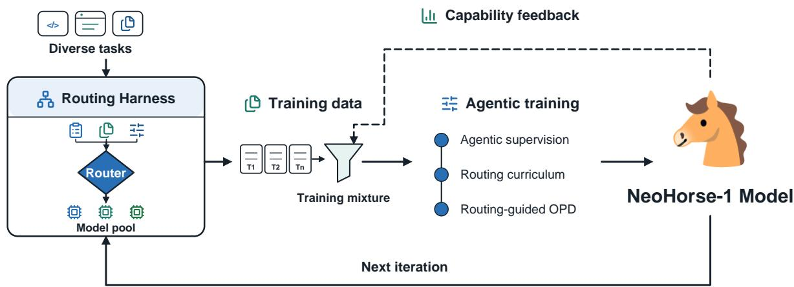
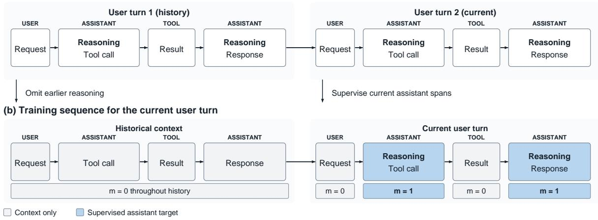
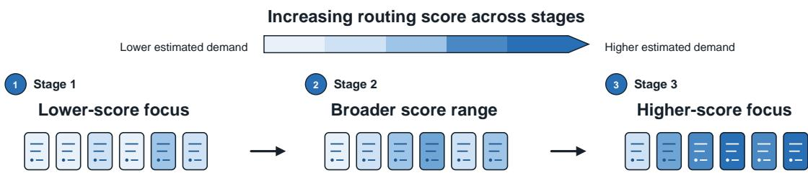
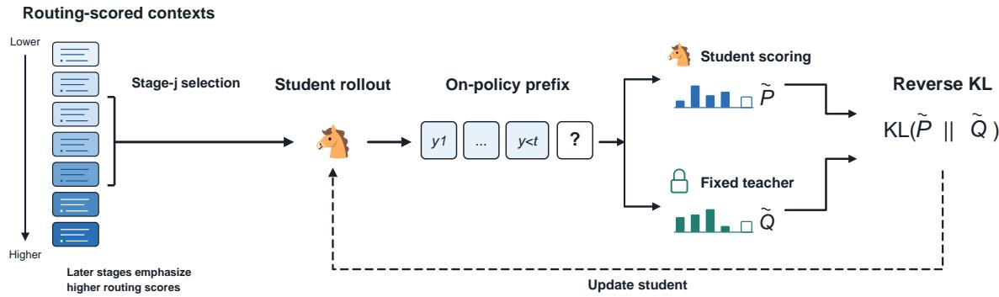
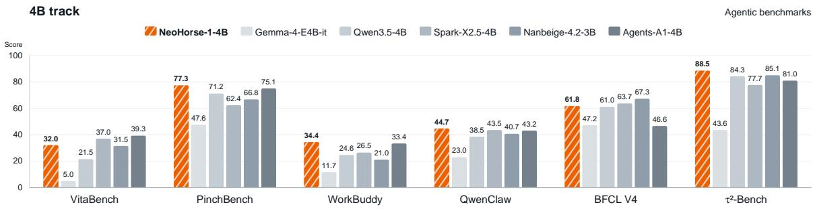
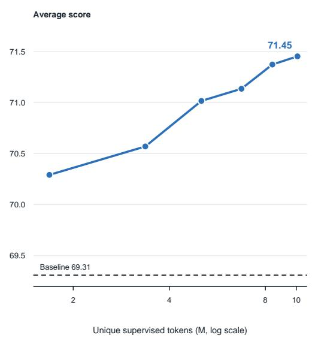

> **论文**：NeoHorse-1: Towards Recursive Self-Improvement via Agentic Post-Training with Routing Harness
> **作者**：NeoHorse Team。Core Contributors（按姓氏字母序）：Guoliang Cao、Guohao Dai、Tianyu Guo、Kai Han、Hailin Hu、Zihan Jiang、Xiang Kuang、Boxun Li、Yulong Li、Zehua Pei、Yuchuan Tian、Jiamin Wang、Yu Wang\*、Yunhe Wang\*、Yihong Wu、Haiyang Xu、Shuo Zhang、Hang Zhou；Contributors：Siyang Cheng、Jiayu Fan、Wei He、Qingrui Jiao、Hongguang Li、Zhiyuan Li、Runke Liu、Xi Liu、Xinchen Liu、Sinno Jialin Pan、Yi Ren、Liuyang Song、Chenyu Wang、Bei Yu、Quanlu Zhang、Xiangyu Zhang、Mengyu Zheng、Yingjie Zong（\* 通讯作者）
> **机构**：TokenRhythm Technologies、Infinigence AI（无问芯穹）、清华大学、北京大学、香港中文大学、Visionplus Capital、WX Capital、阿里巴巴集团
> **arXiv ID**：2609.08183
> **发表时间**：2026-09-10
> **许可协议**：Apache 2.0（代码与权重）
> **代码仓库**：https://github.com/TokenRhythm/NeoHorse

## 第 1 章 概述

### 1.1 一句话定位

NeoHorse-1 提出把**部署侧的 routing harness** 当作递归自我改进（RSI）的观测装置——harness 在服务用户的同时留下的执行轨迹、路由能力估计与可验证结果，被系统化地转为后训练数据，由此闭合一个 evaluation–selection–update 循环，并以 4B/9B 两个开源模型验证该配方在 10 项 agentic/coding/指令遵循基准上的有效性。

### 论文图表总览

| 编号 | 内容 | 所在章节 |
|:-----|:-----|:---------|
| **Figure 1** | 4B 与 9B 轨道在六项 agentic 基准上的柱状对比（本报告嵌入其 4B 轨道上半部分） | 第 5 章（5.2 主结果） |
| **Figure 2** | routing harness 驱动的 RSI 闭环与后训练栈总览 | 第 3 章（章首，本报告正文图） |
| **Figure 3** | subscene 级 Scene/Goal/Outcome 场景刻画 | 第 3 章（未嵌入，见 3.4 节文字说明） |
| **Figure 4** | user turn 内的 agentic 监督构造（损失掩码示意） | 第 4 章（4.1 节） |
| **Figure 5** | routing-guided 三阶段课程调度 | 第 4 章（4.2 节） |
| **Figure 6** | routing-guided on-policy distillation 流水线 | 第 4 章（4.3 节） |
| **Figure 7** | 受监督数据规模 vs 五基准开发集平均 | 第 5 章（5.4 节） |
| **Figure 8** | Gomoku 双人交互案例的原始页面截图 | 第 5 章（5.3 节，未嵌入） |
| **Table 1** | 4B 轨道主结果（10 项基准、6 个模型） | 第 5 章（表1） |
| **Table 2** | 9B 轨道主结果（10 项基准、6 个模型） | 第 5 章（表2） |
| **Table 3** | routing-harness 数据 vs 公开 Toucan 数据 | 第 5 章（5.4.1） |
| **Table 4–6** | 附录三段案例（排期报告、时间泄漏审计、Gomoku）的执行与产物证据 | 第 5 章（5.3 节文字归纳） |

### 1.2 核心贡献

1. **把 RSI 落到可操作的机制上**：论文主张「已部署的 routing harness 本身就包含自我改进所需的观测机制」。harness 除服务请求外还产出三类此前未被利用的信号——执行轨迹（可学习的经验）、路由记录（能力需求的估计）、可验证 outcome（能力缺口的证据），三者共同支撑一个 evaluation–selection–update 闭环。

2. **数据侧：三层粒度 + 三级准入的质量管线**。把语料组织为 trajectory / user turn / subscene 三个相互链接的粒度；准入经过精确与近重复去重、与评测集去污染、规则化结构校验（internally complete / partially recoverable / quarantined 三种处置）、六维语义评估（goal attainment、instruction adherence、tool use、evidence consistency、error recovery、termination，每维 PASS/WARN/FAIL/NOT_EVALUATED 并单独记录覆盖率），并在 subscene 级做 Scene/Goal/Outcome 三轴标注。论文刻意保留结构化质量表示，而不压缩成单一启发式总分。

3. **方法侧：路由信号组织课程与蒸馏**。路由预测的能力需求分数 $s_i$（支持 hard/soft 两种排序）把 SFT 样本组织成三阶段课程（各阶段约三分之一样本，低分样本预留至后期阶段，不在阶段间重置优化器与学习率）；同一排序进一步用于 on-policy distillation 的起始上下文调度，形成 routing-guided OPD——学生在记录的上下文上自生成响应，教师在这些 student-visited 前缀上以粗化分布的反向 KL 提供逐位置监督，并随训练刷新 rollout checkpoint。

4. **闭环侧：capability-guided allocation**。把当前 checkpoint 在分层评测套件上的结果聚合成能力缺口画像，据此调整下一轮训练数据混合（改变数据构成，而非引入专门的失败目标函数），使「系统学到什么」影响「下一步从什么数据学」。

5. **开源交付**：发布 NeoHorse-1-4B / 9B 权重（含 GGUF）与仓库（Apache-2.0），底座为 Qwen3.5-4B / Qwen3.5-9B。

### 1.3 关键结果速览

- **10 项基准**（agentic 端到端执行、工具使用与交互、coding、指令遵循）无权重宏平均：**4B 从 58.94% 提升到 64.87%（+5.93 pp）**，**9B 从 65.60% 提升到 69.04%（+3.44 pp）**。
- 两个规模上增益最集中的是**交互与执行密集**的任务：VitaBench（4B +10.50 pp、9B +11.00 pp）、PinchBench（+6.14 / +7.70 pp）、WorkBuddy（4B +9.79 pp）、QwenClaw（+6.21 / +4.69 pp）；而静态指令遵循几乎没有增益（IFEval：4B +1.29 pp、9B −0.37 pp，是 9B 轨道唯一的负增量）。
- **NeoHorse-1-4B 在 4/10 项基准上取得该列最优**（$\tau^2$-Bench 88.46%、PinchBench 77.33%、WorkBuddy 34.41%、QwenClaw 44.68%）并取得 4B 轨道最佳平均分；**NeoHorse-1-9B 同样在 4/10 项取得最优**（BFCL v4 67.43%、$\tau^2$-Bench 90.82%、PinchBench 82.25%、QwenClaw 48.73%），平均分 69.04% 为全部 11 个被评模型中最高（领先次优的 Muse-Glimmer-30B 1.18 pp）。
- **同尺寸基座差距被大幅压缩**：NeoHorse-1-4B（64.87%）与 Qwen3.5-9B（65.60%）的平均分差仅 0.73 pp，而训练前的 Qwen3.5-4B 与 Qwen3.5-9B 相差 6.66 pp；逐项看，4B 后训练模型在 10 项中有 5 项高于 9B 基座。
- **数据来源对比**：在相同的路由引导配方下，自采 routing-harness 轨迹在五项可比基准上的平均为 70.57%，公开合成工具 agent 数据集 Toucan 为 64.32%，**高出 6.26 pp**。
- **数据规模**：五基准开发集平均随唯一受监督 token 数从 69.31%（基座）升至 71.45%（最大规模），**+2.14 pp**。

## 第 2 章 研究背景与动机

### 2.1 RSI 的问题设定：缺的是机制，不是愿景

论文开篇把递归自我改进（RSI）拆解为一个**结构性条件**：一旦模型改进过程本身被部分自动化，每一代模型就能参与生产下一代，训练不再完全受人手构造的数据与人工监督约束。但论文指出，这一愿景的落地点是一个很具体的问题——**系统通过什么机制观测自身能力，并把该观测转换为下一轮学习信号**。

论文的回答不是新造一套自评流程，而是观察到一个常被忽略的事实：**agentic 系统天然携带这种机制**。当 agent 写代码、查资料或操作软件时，它留下的不只是最终答案，还有决策序列、工具交互与任务结果；既有工作（FireAct、AgentTuning、Agent-FLAN、AgentBank 等）已经把这类轨迹当作静态监督使用，而论文要更进一步——轨迹同时暴露了模型的强项与短板，而后者正是下一轮该学什么的依据。

### 2.2 为什么是 routing harness

论文的关键站队发生在「用什么系统承载 RSI」上。harness 是管理 agent 上下文、工具与环境的执行层；**加上 agentic routing 后，这一层可以按请求与交互状态选择模型**。论文的组合是：异构模型池 + 多个 harness（包括 OpenSquilla）+ 真实任务流。这一结构的价值有两点：

- **训练经验跨越不同模型行为与执行环境**：因为路由会把请求分发给不同能力的模型，池中模型各自贡献了不同的行为分布，训练数据因此天然多样。
- **路由记录天然把「能力需求—被选中的模型—随后发生的交互」绑定在一起**：这种 prediction–action–outcome 三元组使「需求估计」与「实际执行」可以分开分析，从而能在后续的课程构造中只使用**预测的需求**，而不用把「实际服务层级」误当成难度标签（后者会混入用户覆盖、服务可用性与部署策略）。

按论文的说法，它沿用了 Agentic Routing 提出的「harness-native data flywheel」思路，但把重心从服务侧扩展到**训练侧的反馈闭环**：能力反馈决定下一轮数据分配，harness 继续运行产出新经验，更新后的 checkpoint 回到 harness 则暴露新的能力图景——这正是把「被使用」变成「被改进」的一步。

### 2.3 技术谱系中的位置

论文在相关工作里把自身放进三条脉络，并明确了与它们的差异：

| 脉络 | 代表工作 | 论文的差异点 |
|:-----|:---------|:-------------|
| 轨迹 SFT | FireAct、AgentTuning、Agent-FLAN、AgentBank、Llama 3 的迭代 SFT + 拒绝采样 + DPO | 不把轨迹当固定教师策略的模仿对象，而是按能力需求组织成课程 |
| On-policy distillation | OPD（学生在自生成状态上接受教师 logits）、教师轨迹蒸馏 | 把 OPD 接在路由引导的阶段化材料上，教师随学生刷新，使蒸馏成为递归改进而非一次性压缩 |
| Agentic RL / harness 研究 | Search-R1、ReTool、RAGEN、Agent Lightning v1.0、Co-Harness、SWE-agent、Terminal-Lego | 不引入额外 reward 目标，而是改变数据构成；把 harness 从「交互容器」提升为「监督信号源」 |

值得注意的一个选择是：论文**没有走 RL 路线**（既非 RLVR 也非 agentic RL），而是停留在监督式配方（掩码 SFT + OPD）加数据侧闭环。这既有工程上的理由（SFT/蒸馏的信号密度与稳定性优于稀疏的结果奖励），也带来方法上的代价——第 7 章会指出，论文因此缺少一个明确的「能力上限提升」机制，其增益更接近「把已有能力对齐到部署形态」。

### 2.4 本文要回答的问题

把动机收敛成可检验的问题，论文实际上在验证三件事：

1. **数据来源是否重要**：部署 harness 的真实交互轨迹，是否比公开合成 agent 数据在同等配方下更有迁移价值？（→ 5.4.1，答案 +6.26 pp）
2. **同尺度与跨尺度上增益如何分布**：后训练在固定规模上是否普遍有效？规模在 post-training 之后是否仍然重要？（→ 5.2，答案：普遍有效，规模仍有价值，但增益集中在交互密集型任务）
3. **数据量能否继续换来性能**：在保持数据选择策略不变的前提下追加唯一监督，聚合性能是否继续上升？（→ 5.4.2，答案：在观测范围内稳步上升，未显示饱和）

第 3–5 章即按这条线索展开：数据管线（第 3 章）→ 训练方法（第 4 章）→ 实证结果（第 5 章）。
## 第 3 章 数据管线：从部署轨迹到训练语料

NeoHorse-1 的数据侧不是「收集指令-回答对」，而是把**部署侧已经存在的运行记录**转换为监督信号。论文的出发点是：一个带路由的 harness 在服务用户的同构，顺带产出了三类此前被丢弃的信号——执行轨迹（体验）、路由记录（能力需求估计）、可验证 outcome（能力缺口）。第 3 章描述如何把这三类信号组织成可用于后训练的语料。



*图2：论文 Figure 2。左侧是任务经 routing harness 分发到异构模型池、产生交互体验；中部把体验整理成 NeoHorse-1 的训练混合；右侧表明能力反馈会反过来重塑下一轮训练分布，更新后的模型再回到 harness 中服务——这条回到 harness 的箭头就是「自我改进」闭环的物理载体，也是本报告第 3–5 章的组织线索。*

### 3.1 三层数据粒度

论文将语料组织为三个相互链接的粒度，避免在执行历史与学习样本之间丢失 provenance：

| 粒度 | 定义 | 作用 |
|:-----|:-----|:-----|
| **trajectory（轨迹）** | harness 执行的一次完整交互：用户请求、模型响应、工具调用、环境观测、恢复尝试、终止结果 | 保留端到端执行语境 |
| **user turn（用户轮）** | 从一次用户请求开始，到下一次用户请求或任务终止结束 | **基本序列化训练单元** |
| **subscene（子场景）** | 共享局部目标的相邻 user turn 组合，可跨一个或多个用户请求 | 语义刻画单元（Scene/Goal/Outcome 标注落点） |

在单个 user turn 记录内部，当前请求及其交错的推理、工具调用、观测被完整保留，以维持 reasoning–action–feedback 链条；更早轮次的**可见响应与工具交互**作为上下文保留，但**更早轮次的推理被丢弃**。论文指出这一上下文策略与 DeepSeek-V3.2 的做法类似。主语料规模为 $10^5$–$10^6$ 量级的 harness 生成轨迹，另外补充公开的指令、推理、工具使用与代码、Agent 交互、偏好数据以扩展能力覆盖面；语料规模以轨迹数 $N_{\mathrm{traj}}$ 与统一序列化、去重、tokenizer 冻结后的 token 数 $N_{\mathrm{tok}}$ 统计。

### 3.2 质量门：去重、去污染与结构校验

论文把数据准入拆成三级，并在设计上刻意区分「确定性的结构事实」与「模型判断的语义事实」：

1. **去重与去污染**：在精确重复与近重复两个粒度上做去重；同一套匹配基础设施会把每个训练候选与评测集比对，**凡与评测项重叠的记录一律从训练侧移除**，保证训练语料与评测数据不相交。
2. **结构校验（rule-based）**：重建请求、模型响应、工具调用、工具观测与终止事件，检查 payload 可读性、消息结构合法性、请求与响应是否齐全、事件因果顺序，以及通过标识符与执行分支验证工具调用/结果配对是否闭合。该阶段还会检出缺失响应、孤立观测、重复或冲突的工具调用 ID、未解析的内部调用与含糊的终止分支。产出三种处置结果：
   - **internally complete**：结构完整，直接进入语义评估；
   - **partially recoverable**：仅保留因果闭合的子轨迹；
   - **quarantined**：事件归属含糊或无可用监督目标，隔离。
3. 论文明确强调：结构有效只保证可序列化与可重放，**不蕴含**工具选择正确或任务成功——后者交由语义评估判断。

### 3.3 六维语义评估

对结构可用的轨迹，论文构建归一化的语义事件流，在**六个相互独立的维度**上做质量判定：

| 维度 | 判定内容 |
|:-----|:---------|
| goal attainment | 是否达成用户目标 |
| instruction adherence | 是否遵守指令约束 |
| tool use | 工具选择与参数是否正确 |
| evidence consistency | 结论与证据是否一致 |
| error recovery | 失败后是否有效恢复 |
| termination | 终止是否合理 |

每个维度给出 `PASS` / `WARN` / `FAIL` / `NOT_EVALUATED`，并**单独记录评估覆盖率**。论文在此处给出两条明确的反幻觉约定：高确定性的失败（缺失最终响应、未解析的工具调用、未恢复的终止错误）由确定性规则检出；需要任务级解释的情形才交给语义 judge，且 judge 只能依据轨迹中显式存在的证据，每条结论必须落在对应事件上。长轨迹分段评估后再按轮聚合，以便区分「中途失败」与「后期成功恢复」。此外，缺失证据或 judge 调用中断**永不**被转换为正向判定。

值得注意的是论文对质量表示的取舍：它保留了结构状态、六个质量维度与证据覆盖率，而**不把它们压缩成一个启发式总分**。训练准入、复核与隔离策略都定义在这个结构化表示之上——这使「为什么这条数据被拒」可追溯，而不是被一个标量分数抹平。

### 3.4 场景刻画：Scene / Goal / Outcome

除质量维度之外，论文在 subscene 级别做三轴属性标注，用于把语料按「用户想做什么」分层：

- **Scene**：任务类型与应用领域的闭集分类，每个 subscene 一个主值、至多两个次值；再用 Use Context 与 Asking/Doing 刻画使用场景，以及请求是寻求信息还是执行动作。
- **Goal**：把用户目标分解为验收标准（acceptance criteria），并用跨轮关系标注目标是新出现、延续、修改、恢复还是含糊。
- **Outcome**：记录尝试相对目标的可验证结果，从而把「任务是否真被满足」与「流程是否跑完」区分开。

为控制模型辅助标注的噪声，每条属性都保留其**推导方式与置信度**；由来源或确定性规则确立的结构性事实**不可被语义 judge 覆盖**。这一设计与 3.3 节的处理方式一致：确定性事实与模型判断分层存放，互不污染。

### 3.5 路由信号：prediction–action–outcome

harness 的路由器在 user turn 级别估计能力需求，依据当前请求、近期对话、此前的路由决策以及可用执行状态，把每一轮分配到**四个服务层级**：

| 层级 | 定位 |
|:-----|:-----|
| C0 | 有界的低风险请求 |
| C1 | 通用默认路径 |
| C2 | 支持多步推理与执行 |
| C3 | 最高能力/可靠性路径（可能由多个 proposer 加聚合器组成） |

策略控制可以基于风险、上下文压力、此前的失败或服务约束调整分配结果。因此论文为每一轮**同时保留三个字段**：路由器的原始预测、策略调整后的决策、实际服务的层级。这种 prediction–action–outcome 的分离有两个作用：其一，评估路由行为本身（用任务完成、验证反馈、恢复成本）；其二，第 4.2 节的课程排序只用**预测的能力需求**，而**不把实际服务的层级当作难度标签**——因为实际执行的路线还受用户覆盖、服务可用性与部署策略影响。论文特别指出层级语义是版本化的：模型、定价与推理配置可能随部署变化，所以 tier 的含义必须跟随服务栈演进才能保持可解释。

### 3.6 Capability-Guided Allocation：把评估反馈变成数据配方

闭环的最后一块是数据配方的更新。质量维度、语义属性与路由信号共同构成一个分层空间；每一轮迭代时，当前 checkpoint 在与训练集不相交的分层评测套件上评估，结果按属性、质量维度、outcome 状态与路由层级聚合，形成**模型能力缺口画像（model-deficiency profile）**。该画像把下一轮训练混合推向表现不足的区域，同时保留广覆盖：验证成功的轨迹提供正向监督，有信息量的失败则标识出需要追加或重新平衡覆盖的区域。论文强调这些分配决策**改变的是训练数据的构成，而不是引入一个专门的失败目标函数**——这一点与 PPO/GRPO 式的奖励整形形成对照。

随着 harness 持续产生新轨迹，存量与新增数据一起被重新分配，使语料跟随使用模式与系统能力的变化。当更新后的 checkpoint 回到 harness 服务，新轨迹暴露出下一批能力缺口，从而闭合 evaluation–selection–update 循环。

## 第 4 章 Agentic Post-Training：课程、蒸馏与闭环

### 4.1 user turn 级监督与掩码 SFT 目标

第 4 章的起点是把 agent 轨迹当作监督数据时的两个具体问题：**上下文怎么切**、**损失加在哪里**。

- **训练单元**：一次 user 请求加上其后跟随的 assistant 响应与工具交互，直到下一次用户请求或记录结束。工具结果与 harness 注入的消息不开启新的 user turn。一个 turn 内可能有多个 assistant 响应与工具结果交错，论文把这些保留的 assistant 目标片段放在**一条序列**里监督。
- **序列化与上下文**：使用 Qwen3.5 的 chat template 与工具调用格式；当前轮次内的推理予以保留、更早轮次的推理省略；更早的用户请求、可见 assistant 响应、工具调用与工具结果作为上下文保留；同时保留记录到的系统指令与 harness 提供的上下文，使 assistant 目标始终与产生它的条件配对。
- **损失掩码**：历史消息与所有非 assistant 片段（系统指令、工具规格、保留的 harness 上下文、用户消息、工具结果）**不接收预测损失**；正因使用因果注意力，每个 assistant 响应可以使用序列中更早的动作与工具结果，但看不到更晚的。

设 $x_i=(x_{i,1},\dots,x_{i,T_i})$ 为一条序列化训练序列（含历史前缀与当前轮），$m_{i,t}\in\{0,1\}$ 为 token 级损失掩码，仅在当前轮保留的 assistant 目标片段的 token 上取 1，则批 $\mathcal{B}$ 上的 SFT 目标为：

$$\mathcal{L}_{\mathrm{SFT}}(\theta;\mathcal{B})=-\frac{\sum_{i\in\mathcal{B}}\sum_{t=2}^{T_i}m_{i,t}\log p_\theta(x_{i,t}\mid x_{i,<t})}{\sum_{i\in\mathcal{B}}\sum_{t=2}^{T_i}m_{i,t}}$$

该目标对受监督 token 等权，并**按批内受监督 token 总数归一化**，而不是按序列总长度或轮数归一化。这一归一化选择直接决定长轨迹（工具结果占多数的样本）与短样本在梯度中的相对权重：按总长度归一化会稀释 agentic 数据的贡献，按受监督 token 归一化则把权重集中在真正的决策 token 上。



*图4：论文 Figure 4。上半是原始记录的一次交互，下半是转换后的训练序列：早期推理被删除、可见响应与工具交互保留为上下文；在当前 user turn 内，只有 assistant 目标片段（推理、序列化工具调用及其参数、可见响应、end-of-response token）接收预测损失，用户消息与工具结果不接收。该图是理解公式(1)中掩码 $m_{i,t}$ 的直接依据，也解释了为什么论文把训练单元定义在 user turn 而非整条轨迹上：交叉注意力不可用的情况下，只有把同一 turn 内的动作与工具反馈放在同一条因果序列中，才能让每个 assistant 响应「看到」它真正依赖的执行结果。*

### 4.2 Routing-Guided Curriculum Learning

agentic 交互所需能力差异极大，从例行回应到复杂规划与工具协调。论文用路由估计的能力需求把 SFT 样本组织成课程，但**明确拒绝把「实际服务的模型身份」当作难度标签**（因为其中混入了用户覆盖、服务可用性与部署策略）。替代方案是：在首条受监督 assistant 响应之前、依据请求与可用交互历史**重新估计**能力需求，并把该估计赋予整条样本 $x_i$，作为 turn 级排序代理而非逐步难度标签。它改变的是样本**何时出现**，不改变样本记录的 assistant 目标。

对每条样本，路由器给出层级分配 $k_i\in\{0,1,2,3\}$ 与归一化分数向量 $\pi_{i,k}$（$\pi_{i,k}\geqslant 0$，$\sum_{k=0}^{3}\pi_{i,k}=1$）。论文同时给出硬排序与软排序两种分数：

$$s_i=\begin{cases}k_i, & \text{hard ordering},\\[4pt] \displaystyle\sum_{k=0}^{3}k\,\pi_{i,k}, & \text{soft ordering}.\end{cases}$$

软分数通过引入对其他层级的支持度，把**被分配同一层级**的样本进一步区分开。论文强调 $s_i$ 只用于构造课程，**不用于重加权 SFT 损失**。

课程本身分三阶段，逐步引入更高路由分数的样本：每阶段约含三分之一样本，并把一部分**低分样本保留到后面的阶段**，以避免训练末期被高需求交互独占；每个样本每轮只使用一次；三阶段**沿用同一个掩码 SFT 目标，不在阶段之间重置优化器或重启学习率计划**。



*图5：论文 Figure 5。路由分数作为能力需求的代理，训练混合在三个规模大致相等的阶段中向高分样本迁移，同时预留部分低分样本到后期阶段；色块深浅示意各阶段内路由分数分布。图中「预留低分样本」的斜向拖尾是课程设计的关键细节——它防止训练终态只看高难度交互而丢掉基础覆盖。*

### 4.3 Routing-Guided On-Policy Distillation

SFT 学的是**记录下来的** assistant 响应，而部署时学生条件于**自己生成的**前缀——这正是 on-policy distillation（OPD）要弥合的分布差。论文把 4.2 的课程机制延伸到蒸馏的**起始上下文调度**上：用记录中「assistant 响应之前的上下文」作为生成起点，按同一套三阶段分配逐步引入高能力需求上下文，并同样把部分低分上下文留到后期阶段。设第 $j\in\{1,2,3\}$ 阶段的上下文批分布为 $\rho_j$。

在每个阶段，学生 checkpoint $p_{\bar{\theta}}$ 对批 $\mathcal{C}\sim\rho_j$ 中的每个上下文生成一条 assistant 响应，得到响应批 $\mathcal{R}$（可能包含推理、工具调用或可见文本）。一个**固定的教师**在对应上下文与学生的前序响应 token 条件下，逐位置给出下一 token 分布；两个模型各自用原生模板渲染相同的消息与工具，并对齐响应 token ID 以做打分。随着训练推进，论文**刷新 rollout checkpoint**，使后续上下文得到的是对更近期学生行为的教师监督；但 rollout 参数 $\bar{\theta}$ 在优化学生时保持冻结。

蒸馏目标采用**粗化分布上的响应归一化反向 KL**：保留 rollout 学生在每个位置的前 $K$ 个候选 token，把其余概率质量聚合成一个额外 bin，两模型使用同一候选集合与全词表概率，得到 $K+1$ 个 bin 上的分布 $\widetilde{P}_{\theta,r,t}$ 与 $\widetilde{Q}_{r,t}$：

$$\mathcal{L}_{\mathrm{OPD}}(\theta;\mathcal{R})=\frac{1}{\sum_{r\in\mathcal{R}}w_r}\sum_{r\in\mathcal{R}}\frac{w_r}{L_r}\sum_{t=1}^{L_r}D_{\mathrm{KL}}\!\left(\widetilde{P}_{\theta,r,t}\,\|\,\widetilde{Q}_{r,t}\right)$$

其中 $L_r$ 是保留的响应长度，$w_r$ 是固定响应权重（无权设置下取 1）；每条响应贡献其平均 token 级散度，prompt token 与 padding 不计损失。梯度经由当前学生在已收集前缀上的概率回传，而**生成的 token、候选 ID 与教师分数保持固定**。把上下文分布与响应级损失合并，即得阶段化目标：

$$\mathcal{L}_{\mathrm{R\text{-}OPD}}^{(j)}(\theta)=\mathbb{E}_{\substack{\mathcal{C}\sim\rho_j\\[2pt] \mathcal{R}\sim p_{\bar{\theta}}(\cdot\mid\mathcal{C})}}\left[\mathcal{L}_{\mathrm{OPD}}(\theta;\mathcal{R})\right],\qquad j\in\{1,2,3\}.$$



*图6：论文 Figure 6。路由分数把记录的起始上下文按三阶段调度（低分上下文预留到后期）；学生在这些上下文上生成响应，教师与学生共同在 student-visited 前缀上给出下一 token 分布，按公式(3)的反向 KL 对齐；只有学生被更新，随后刷新学生 checkpoint 继续生成后续响应。与固定教师轨迹蒸馏相比，这里的监督信号是「密」的：每个生成位置都有，而不是只对齐最终答案。*

### 4.4 与既有范式的差异

把第 3–4 章合起来看，NeoHorse-1 的位置可以这样刻画：

| 维度 | 常规 agentic 后训练 | NeoHorse-1 |
|:-----|:-------------------|:-----------|
| 数据来源 | 合成任务集、公开 agent 轨迹 | 部署 harness 的真实交互轨迹（+公开数据补覆盖） |
| 难度信号 | 人工难度标签、数据集启发式 | 路由预测的能力需求（prediction 而非 served tier） |
| 课程 | 通常无 / 单一难度排序 | 三阶段路由引导课程，低分样本后置 |
| 监督形式 | 轨迹 SFT、RLVR、联合 OPD+RL | 掩码 SFT + routing-guided OPD（分阶段共享同一排序） |
| 反馈回路 | 一次性训练 | evaluation–selection–update，数据配方随能力画像更新 |
| 交付 | 训练脚本/权重 | 权重 + GGUF + 部署示例（Apache-2.0） |

论文与既有工作的差异在 Related Work 中交代得比较克制：它把 OPD 与轨迹 SFT 的谱系（FireAct、AgentTuning、Agent-FLAN、AgentBank、Llama 3 的迭代 SFT+拒绝采样+DPO）、harness 研究（SWE-agent、Terminal-Lego）、agentic RL（Search-R1、ReTool、RAGEN、Agent Lightning v1.0、Co-Harness）以及 LLM routing（FrugalGPT、RouteLLM、Agentic Routing）都列为背景，自身的贡献集中在「**把 routing 系统的副产物当作训练信号源**」这一点上。严格来说，论文没有提出新的优化算子：公式 (1) 是带掩码的交叉熵，公式 (3) 是反向 KL 蒸馏，课程机制也只是路由分数的分位调度。它的新颖性在于**信号来源与闭环结构**，而非损失函数本身——这一点在评价该工作时应当明确（见第 7 章）。

## 第 5 章 实验结果与分析

### 5.1 评测设置

评测覆盖三类能力、共 **10 项基准**：

- **Agentic — 端到端 agent 执行**：QwenClawBench（真实 OpenClaw 任务）、WorkBuddy Bench（多领域职场场景）、PinchBench（标准化 OpenClaw 工作流）、VitaBench（日常服务场景的多轮交互）。
- **Agentic — 工具使用与交互式任务**：BFCL V4（函数调用与 agentic 工具使用）、$\tau^2$-Bench（Airline / Retail / Telecom 三个域的 user–agent–tool 多轮任务完成）。
- **Coding**：HumanEval、LiveCodeBench v6。
- **Instruction Following**：IFEval、IFBench。

**基线与配置**：4B 轨道对比 Qwen3.5-4B、Spark-X2.5-4B、Gemma-4-E4B-it、Nanbeige-4.2-3B、Agents-A1-4B；9B 轨道对比 Granite-4.2-8B、Qwen3.5-9B、Ornith-1.5-9B、Gemma-4-12B-it、Muse-Glimmer-30B（后者作为上下文参考模型）。除特别说明外，同基准下所有由作者实测的模型使用相同的 harness、工具接口、上下文上限与交互预算，各自使用官方 chat template；取自官方博客或技术报告的数值在表中标 `∗`，仅作参考而非同一评测管线下的测量。

推理采用各模型官方推荐参数；NeoHorse-1 与其 Qwen3.5 底座按 Qwen3.5 推荐设置：

| 参数 | 取值 |
|:-----|:-----|
| temperature | 1.0 |
| top-p | 0.95 |
| top-k | 20 |
| min-p | 0.0 |
| presence penalty | 1.5 |
| repetition penalty | 1.0 |
| 部署框架 | SGLang v0.5.17 |
| thinking 模式 | `enable_thinking=true`, `force_nonempty_content=true` |
| 最大输出长度 | 51200 tokens（IFEval / IFBench / HumanEval / LiveCodeBench v6）；32768 tokens（其余基准） |

统计口径上，QwenClawBench、WorkBuddy Bench、$\tau^2$-Bench 各跑 3 次取算术平均；PinchBench 与 VitaBench 各仅单次运行；其余基准沿用官方评测与打分协议。VitaBench 的用户模拟器与 judge 均使用 DeepSeek-V4-Flash（论文称原推荐模型已不可用）。

### 5.2 主结果

#### 表1：4B 轨道（论文 Table 1）

| 模型 | BFCL v4 | VitaBench | $\tau^2$-Bench | PinchBench | WorkBuddy | QwenClaw | HumanEval | LCB v6 | IFBench | IFEval | 平均 |
|:-----|:---:|:---:|:---:|:---:|:---:|:---:|:---:|:---:|:---:|:---:|:---:|
| Qwen3.5-4B | 61.02% | 21.50% | 84.29% | 71.19% | 24.62% | 38.47% | 87.20% | 53.71% | 60.33% | 87.06% | 58.94% |
| Spark-X2.5-4B | 63.71% | 37.00% | 77.72% | 62.37% | 26.47% | 43.52% | 92.07% | 54.86% | **73.33%** | **91.13%** | 62.22% |
| Gemma-4-E4B-it | 47.18% | 5.00% | 43.60% | 47.60% | 11.65% | 22.98% | 84.76% | 52.00% | 40.00% | 74.68% | 42.95% |
| Nanbeige-4.2-3B | **67.28%** | 31.50% | 85.08% | 66.78% | 21.03% | 40.66% | **98.78%** | **72.50%**∗ | 55.00% | 84.47% | 62.31% |
| Agents-A1-4B | 46.60% | **39.25%** | 81.00% | 75.07% | 33.37% | 43.16% | 92.68% | 56.57% | 63.33% | 83.55% | 61.46% |
| **NeoHorse-1-4B** | 61.79% | 32.00% | **88.46%** | **77.33%** | **34.41%** | **44.68%** | 96.95% | 59.43% | 65.33% | 88.35% | **64.87%** |

加粗 = 该列在表内数值中最高（仅按本表数值判定，未采用论文原文的粗体/下划线约定）；∗ Nanbeige-4.2-3B 的 LiveCodeBench v6 数值取自其官方博客/技术报告。

#### 表2：9B 轨道（论文 Table 2）

| 模型 | BFCL v4 | VitaBench | $\tau^2$-Bench | PinchBench | WorkBuddy | QwenClaw | HumanEval | LCB v6 | IFBench | IFEval | 平均 |
|:-----|:---:|:---:|:---:|:---:|:---:|:---:|:---:|:---:|:---:|:---:|:---:|
| Qwen3.5-9B | 64.88% | 31.25% | 88.04% | 74.55% | 39.60% | 44.04% | 92.68% | 65.14% | 66.33% | 89.46% | 65.60% |
| Granite-4.2-8B | 52.06% | 23.00% | 62.28% | 56.93% | 35.07% | 37.01% | 96.34% | 72.00% | 78.00% | 92.98% | 60.57% |
| Ornith-1.5-9B | 65.03% | 26.75% | 83.68% | 68.22% | 29.29% | 47.27% | 93.90% | 47.43% | 40.00% | 71.35% | 57.29% |
| Gemma-4-12B-it | 62.06% | 36.50% | 59.37% | 58.89% | 29.65% | 43.53% | **100.00%** | **73.14%** | 77.67% | **94.27%** | 63.51% |
| Muse-Glimmer-30B | 53.74% | **48.50%** | 76.64% | 71.35% | **45.85%** | 46.11% | 98.17% | 65.71% | **78.67%** | 93.90% | 67.86% |
| **NeoHorse-1-9B** | **67.43%** | 42.25% | **90.82%** | **82.25%** | 40.15% | **48.73%** | 98.17% | 65.14% | 66.33% | 89.09% | **69.04%** |

加粗 = 该列在表内数值中最高（仅按本表数值判定，未采用论文原文的粗体/下划线约定）。



*图1：论文 Figure 1 的上半部分（4B 轨道）。橙色柱为 NeoHorse-1-4B，灰色柱为同轨道对比模型。该图的增量信息是「提升在六个 agentic 基准上是否是普遍现象」——柱状对比表明提升并非集中在单一指标，而是横跨端到端执行（QwenClaw、WorkBuddy、PinchBench、VitaBench）与工具使用/交互（BFCL v4、$\tau^2$-Bench）两类任务；完整数值以论文 Table 1、Table 2 为准。*

**论文给出的三条结论**（均可由两张表复核）：

1. **两个规模上都有广泛提升**：NeoHorse-1-4B 在双方均有结果的**每一项**基准上超过 Qwen3.5-4B；NeoHorse-1-9B 在多数基准上超过 Qwen3.5-9B，但指令遵循类基本持平，其中一项略有下降（IFEval：89.09% vs 89.46%，−0.37 pp）。
2. **规模仍然有效**：NeoHorse-1-9B 在所有两者都有结果的基准上一致优于 NeoHorse-1-4B，但增益分布不均——集中在需要持续状态跟踪、外部工具交互、依据执行反馈修正中间决策的任务上，指令遵循类的差距则小得多。
3. **训练可补偿一部分规模差距**：作者指出 post-trained 的 4B 模型已在若干基准上追平或超过 Qwen3.5-9B。

对第 3 条，逐列核对可以给出更精确的刻画：以平均分为标尺，NeoHorse-1-4B（64.87%）与 Qwen3.5-9B（65.60%）相差 **0.73 pp**，而训练前的 Qwen3.5-4B（58.94%）与 Qwen3.5-9B 相差 **6.66 pp**——即后训练把同尺寸基线相对大一号基线的差距压缩了约 89%。逐项看，NeoHorse-1-4B 在 10 项基准中有 5 项（VitaBench +0.75 pp、$\tau^2$-Bench +0.42 pp、PinchBench +2.78 pp、QwenClaw +0.64 pp、HumanEval +4.27 pp）高于 Qwen3.5-9B，其余 5 项落后。

按列取最大值统计，**NeoHorse-1-4B 在 4/10 项上取得该列最优**（$\tau^2$-Bench、PinchBench、WorkBuddy、QwenClaw）并取得最佳平均分；**NeoHorse-1-9B 在 4/10 项上取得最优**（BFCL v4、$\tau^2$-Bench、PinchBench、QwenClaw）并取得最佳平均分（69.04%，领先次优的 Muse-Glimmer-30B 1.18 pp）。两者未取得最优的列分别是：4B 轨道为 BFCL v4（Nanbeige 67.28%）、VitaBench（Agents-A1 39.25%）、HumanEval 与 LCB v6（Nanbeige，98.78% / 72.50%∗）、IFBench 与 IFEval（Spark-X2.5）；9B 轨道为 VitaBench 与 WorkBuddy（Muse-Glimmer-30B）、HumanEval / LCB v6 / IFEval（Gemma-4-12B-it）、IFBench（Muse-Glimmer-30B）。

**相对基座的逐项增量**（NeoHorse 减同尺寸 Qwen3.5 基线，全部由表1/表2 数值重新计算）：

| 基准 | 4B 增量 | 9B 增量 |
|:-----|:---:|:---:|
| BFCL v4 | +0.77 pp | +2.55 pp |
| VitaBench | +10.50 pp | +11.00 pp |
| $\tau^2$-Bench | +4.17 pp | +2.78 pp |
| PinchBench | +6.14 pp | +7.70 pp |
| WorkBuddy | +9.79 pp | +0.55 pp |
| QwenClaw | +6.21 pp | +4.69 pp |
| HumanEval | +9.75 pp | +5.49 pp |
| LiveCodeBench v6 | +5.72 pp | 0.00 pp |
| IFBench | +5.00 pp | 0.00 pp |
| IFEval | +1.29 pp | −0.37 pp |
| 平均 | +5.93 pp | +3.44 pp |

这张派生表揭示了一个论文正文只是概括提到的规律：**增益与「是否需要与环境反复交互」强相关**。在两个规模上，VitaBench（+10.50 / +11.00 pp）、PinchBench（+6.14 / +7.70 pp）这类多轮执行任务的提升最大，而 IFEval（+1.29 / −0.37 pp）这类静态指令遵循任务几乎没有增益，9B 上甚至出现唯一一处负增量。这与 5.3 节轨迹分析的定性观察一致：后训练改变的主要是「闭环执行的组织方式」，而不是单点知识或指令记忆。

### 5.3 轨迹分析：提升发生在哪一层

论文用三段代表性轨迹说明分数提升的行为学来源，三段对应对照关系各不相同：

| 案例 | 基准 | 对照 | 观察到的差异 |
|:-----|:-----|:-----|:-------------|
| 项目排期 | QwenClawBench | Qwen3.5-4B vs NeoHorse-1-4B | 基线找到相关文件但**未读取**含更新依赖约束的经理邮件，据过时信息排期并写到错误路径；后者补取证据、识别更新后的依赖、重算并校验排期、写入要求路径 |
| 代码修复 | WorkBuddy | NeoHorse-1-4B vs NeoHorse-1-9B | 4B 只做一次实现尝试，未建立测试-修复闭环，线程执行语义仍有错；9B 走完 edit–test–inspect–repair 循环，反复吸收执行反馈直到 verifier 通过 |
| 数据分析 | PinchBench | NeoHorse-1-4B vs NeoHorse-1-9B | 发现 pandas 不可用后，4B 反复尝试安装依赖、手写 CSV 解析、打补丁，均未解决约束且引入新错误，最终未能产出报告；9B 判定原方案受阻，改用标准库 `csv` 与数学库完成任务，请求数、执行时间、token 用量分别约为 4B 的 −70.8%、−76.7%、−83.6% |

三段案例的论证价值不完全相同。第一段说明**同规模后训练**改变的是「证据收集是否闭合」——基线并非不会规划，而是把局部合理的动作串成了不完整的工作流。第二、三段说明**规模在后训练之后仍然有效**：4B 的问题不是初始实现质量，而是**是否把测试结果当作后续决策的输入、把失败当作继续修复的证据**；而 PinchBench 案例更关键——9B 的优势来自「识别并放弃无效轨迹」的能力，而不是执行更多动作或做更宽的搜索。论文据此提出，较大模型的优势在于把有限交互预算分配给直接推动任务完成的动作；这类结论属于机制性解释，样本量为每案例一条轨迹，因此只能作为假设而非统计结论。

论文附录另给出三段受控案例，用「执行过程 + 产物证据」双栏对照 Qwen3.5-9B 与 NeoHorse-1-9B：

| 案例 | 任务 | Qwen3.5-9B 的表现 | NeoHorse-1-9B 的表现 |
|:-----|:-----|:-------------------|:---------------------|
| A | 带时间与审计约束的日报生成（64 行工单导出） | 反复重写报告，最终写入 20 张工单，但状态计数合计 26、进度计数合计 31，且把次日更新的状态赋给了窗口内工单 | 报告 50 条合规记录与 19 张工单，与独立重算一致，排除次日更新并保留来源行引用（状态汇总表中仍有两处标签错误） |
| B | 依据仓库需求实现时间泄漏审计器 | 未读 README，自行设 2 秒容差，误将合规样本 s1 判为泄漏，并改变了输出文件名与结构 | 读取 README 与依赖说明，采用文档规定的 5 分钟容差，保留原 CLI 与输出 schema，并实际执行命令核对产物 |
| C | 用 HTML 实现双人五子棋 | 26 次点击全部触发索引错误（读取不存在的 `cell.clientX/clientY`），页面无落子 | 26 次点击无运行时异常，落子位置、颜色、可见棋子数与输入序列一致，13 黑 13 白，回合正常切换 |

三段案例的共同指向是**需求发现、实现与交付一致性**：基线的失败点不在于不会写代码，而在于把文档约束（时间窗口、容差阈值、数据契约）当作可选项。需要说明的是，这些案例是作者挑选的定性证据，用于说明「更完整的工作流」这一机制假设，而非对总体成功率的估计。

### 5.4 数据侧分析：来源与规模

#### 5.4.1 路由 harness 数据 vs 公开 agent 数据（论文 Table 3）

为了把「数据来源」与「课程算法」分离，论文用公开合成工具 agent 数据集 **Toucan** 做对照：两类样本在课程构造前都经同一套离线路由标注流程打分，同一 Qwen3.5-4B 起点、同一课程调度、优化器设置、随机种子、packing 方式与评测协议，训练预算尽量对齐。

| 训练数据 | LCB | HE | IF | BFCL | $\tau^2$ | 平均 |
|:-----|:---:|:---:|:---:|:---:|:---:|:---:|
| 公开 agent 数据（Toucan） | 49.14% | 87.80% | 56.33% | 54.77% | 73.54% | 64.32% |
| 路由 harness 数据 | 53.14% | 96.34% | 61.33% | 57.20% | 84.85% | 70.57% |
| 差值（本文 − 公开） | +4.00 pp | +8.54 pp | +5.00 pp | +2.43 pp | +11.31 pp | +6.26 pp |

路由 harness 检查点在五项可比基准上全部更强，平均高 **6.26 pp**；最大增益出现在 HumanEval（+8.54 pp）与 $\tau^2$-Bench（+11.31 pp）。论文的解读是：在相同路由引导训练配方下，路由介导的交互提供了比公开合成轨迹更强、更可迁移的 agentic 监督；两类数据的差异在序列构成，而总训练预算相当。

这一结论的边界需要注意：实验只对比了**一个**公开数据集（Toucan），且「预算相当」是以整体 token 预算对齐而非任务分布对齐；因此它支持的是「在本文配方下自采轨迹优于该公开合成集」，不足以支撑「自采数据普遍优于公开数据」的强结论。

#### 5.4.2 数据规模缩放（论文 Figure 7）

论文从同一个按质量排序的轨迹池出发构造**严格嵌套**子集（每个更大子集包含前一个子集的全部样本），固定模型初始化、优化、packing 与每个子集的 pass 数，从而在保持数据选择策略不变的前提下隔离「追加唯一监督」的效应。评测取五项在所有 checkpoint 上都可用的基准（LiveCodeBench、HumanEval、IFBench、BFCL V4、$\tau^2$-Bench）的无权平均。



*图7：论文 Figure 7。横轴是以对数刻度表示的唯一受监督 token 数（数据规模），纵轴为五项基准的无权平均。开发集平均从基座模型的 69.31% 稳步升至最大数据规模处的 71.45%，即 +2.14 pp。该图为「高质量 agentic 监督可继续缩放」提供了直接证据，也支撑论文把数据量当作**能力相关的分配决策**而非固定超参的观点。*

论文的结论是：在所示范围内，缩放高质量 agentic 监督能带来一致的聚合增益；并且有用的工作点由监督质量、覆盖范围与后训练所针对的能力画像共同决定。需要指出的是，图 7 的纵轴跨度仅约 2 pp（69.31% → 71.45%），提升幅度有限，且曲线未显示饱和或反转过——因此它证明的是「在当前范围内未出现收益递减的迹象」，而不是「继续加数据一定继续涨」。

### 5.5 结果层面的可信度评估

- **可比性**：作者自测的模型共享 harness、工具接口、上下文上限与交互预算，这点较好；但表中带 `∗` 的条目（Nanbeige-4.2-3B 的 LCB v6 = 72.50%）来自官方报告，不同评测管线，直接与自测值比较时应打折。
- **统计稳健性**：只有三个基准跑了 3 次取均值，PinchBench 与 VitaBench **单次运行**。VitaBench 恰好是本文增益最大的基准之一（4B +10.50 pp、9B +11.00 pp），单次运行叠加「judge 模型被替换为 DeepSeek-V4-Flash」两项因素，使该列的增量需要谨慎解读。
- **基准性质**：QwenClawBench、WorkBuddy Bench、PinchBench 均围绕 OpenClaw 生态，而论文正是以 OpenSquilla（同一生态的 harness）作为 agent harness——训练与评测共享交互范式，这可能夸大了在这几项上的迁移优势。
- **规模效应**：NeoHorse-1-9B 相对 Qwen3.5-9B 的平均增益（+3.44 pp）小于 4B 轨道（+5.93 pp），且指令遵循列出现负值，说明该配方在较强基座上的边际收益更窄，这一点论文自己也承认（「marginal benefits concentrated more heavily on interactive execution」）。

## 第 6 章 代码与部署

### 6.1 发布内容

| 项目 | 内容 |
|:-----|:-----|
| 代码仓库 | https://github.com/TokenRhythm/NeoHorse （Apache-2.0） |
| 仓库内容 | `assets/`（评测结果图）、`examples/`（`chat.py`、`tool_call.py`）、`TechnicalReport_NeoHorse_v1.pdf`、`README.md` |
| 模型权重 | HuggingFace 集合 `TokenRhythm/neohorse-1`：`NeoHorse-1-4B`、`NeoHorse-1-9B`，以及两者的 GGUF 版本 |
| 镜像 | ModelScope 同步发布（`TokenRhythm/NeoHorse-1-4B`、`-9B`） |
| 底座 | Qwen3.5-4B、Qwen3.5-9B |

需要明确的是：仓库**不包含训练代码**（没有数据管线、课程调度或蒸馏的实现），公开的是示例脚本与评测表格。因此第 3–4 章描述的数据准入、路由课程与 R-OPD 配方无法由第三方直接复现，只能依据论文描述重实现——这一点显著削弱了论文在「可复现性」维度上的实际得分，尽管权重开放使**推理侧**完全可验证。

### 6.2 模型属性

| 属性 | NeoHorse-1-4B | NeoHorse-1-9B |
|:-----|:---|:---|
| 模型族 | NeoHorse Agent-Native Causal Language Model | 同左 |
| 参数量 | 约 4B | 约 9B |
| 后训练方式 | routing-guided agentic post-training | 同左 |
| 接口 | 文本输入 / 文本输出 | 同左 |
| 上下文长度 | 原生 262,144 tokens；基座能力可扩展至 1,010,000 tokens | 同左 |
| 权重格式 / 精度 | Safetensors / BF16 | 同左 |

上下文长度的表述在论文正文与仓库文档之间存在口径差异：技术报告只给出评测所用的上下文上限，而仓库 README 明确给出 262,144 的原生窗口与 1,010,000 的可扩展上限，并注明「实际容量取决于显存与服务设置」。因此报告中的这两个数字应被视为**部署配置声明**，而非论文实测结果。

### 6.3 部署与调用

仓库提供 SGLang 与 vLLM 两条部署路径，示例脚本按 OpenAI 兼容接口调用：

- **SGLang**：`sglang==0.5.17`（与论文评测所用版本一致），默认服务端口 30000；
- **vLLM**：示例默认 `http://127.0.0.1:8000`；
- **调用示例**：`python examples/chat.py --url http://127.0.0.1:8000 --model neohorse-1-4B`；工具调用示例为 `examples/tool_call.py`（发送一个预设的天气查询并打印模型生成的工具调用）；
- **服务别名**：请求中的 `model` 字段是服务别名（`neohorse-1-4B` / `neohorse-1-9B`），不是文件系统路径；9B 需以 `--served-model-name neohorse-1-9B` 启动。

仓库对其发布包给出了一条诚实的免责说明：这些启动示例**尚未在 GPU 上验证**（"These launch examples have not yet been validated on GPU for this repackaged release"）。对使用者的直接含义是：权重可用，但部署脚本需要自行验证。

两个示例脚本本身都很薄：直接用 `requests` POST 到 OpenAI 兼容端点（`/v1/chat/completions`），并通过 `chat_template_kwargs` 显式打开 thinking 模式——与论文评测配置中的 `enable_thinking=true` 保持一致：

```python
payload = {
    "model": args.model,
    "messages": [{"role": "user", "content": "你是谁？"}],
    "max_tokens": 4096,
    "chat_template_kwargs": {"enable_thinking": True},
    "stream": False,
}
```

工具调用示例则把一份 function schema 放进 `tools` 字段（示例为一个 `get_current_weather(city)` 函数），用于验证模型在标准 function-calling 协议下的输出格式：

```python
tools = [{"type": "function", "function": {
    "name": "get_current_weather",
    "description": "Get the current weather for a specified city.",
    "parameters": {"type": "object",
                   "properties": {"city": {"type": "string", "description": "Name of the city."}},
                   "required": ["city"]}}}]
```

因此这两个脚本的定位是**部署连通性冒烟测试**，而不是 agent harness 的参考实现：harness 侧的上下文管理、工具编排与多轮状态维护在本文中并未开源。

### 6.4 可复现性小结

| 维度 | 状态 |
|:-----|:-----|
| 权重可获取 | ✅ HF + ModelScope，含 GGUF |
| 推理可复现 | ✅ 论文给出完整采样参数与部署框架版本 |
| 评测可复现 | ⚠️ 部分——评测 harness 与 judge 依赖外部基准与自建框架，且部分基线数值取自官方报告 |
| 训练可复现 | ❌ 未公开训练代码与数据管线 |
| 闭环可复现 | ❌ 依赖私有部署 harness 与异构模型池 |

## 第 7 章 局限性与评价

### 7.1 论文自述的局限

论文在结论部分主动列出三点，措辞相当克制：

1. **只完成单次闭环**：结果只反映 evaluation–selection–update 循环的**一趟**，尚未验证模型在 harness 中被使用所获得的增益能否在后续迭代中累积——而「累积」正是 RSI 的实质主张。
2. **能力覆盖有限**：验证集中在 agentic 与 coding 能力，以及工具使用与指令遵循；harness 服务的更广泛能力范围尚未评估。
3. **路由信号可进一步打磨**：把 prediction–action–outcome 的分离变成良好校准的难度/缺口估计（包括训练路由器本身），才能让 harness 指导「模型下一步应该尝试什么」。

### 7.2 独立评估视角

在上述自述之外，从系统与方法两个角度看，这份工作还有几处值得补充的限定条件：

**（1）「RSI」的命名强于证据。** 论文标题使用 recursive self-improvement，但实验部分是**单轮**后训练：模型在 harness 中的使用产生数据 → 训练出新 checkpoint，闭环到此为止，没有展示第二轮训练相对第一轮的增量。论文正文对此是诚实的（明确写「应该被读作对 RSI 的初步尝试而非确定性证明」），但标题与摘要中的 RSI 框架容易让读者高估实证强度。更贴切的描述是「以部署路由信号为监督源的持续学习数据机制」。

**（2）能力增益的来源未被完全隔离。** 第 5.4.1 节证明了**数据来源**（自采路由轨迹 vs 公开合成集）在固定配方下的差异为 +6.26 pp；但论文没有做「自采数据 + 无课程」或「公开数据 + 课程」的完整正交消融来分别量化**课程机制**与**OPD 阶段**各自的贡献。因此读者无法判断：如果把同一批 harness 轨迹直接做标准 SFT（无路由排序、无 R-OPD），能取得多大比例的增益。这是本文方法主张中最明显的证据缺口——尤其考虑到「路由信号作为难度代理」是论文声称的核心创新之一。

**（3）路由信号的自洽性验证不完整。** 论文承认实际服务的层级不能当难度标签，并改用「首条受监督 assistant 响应之前重新估计」的需求分数。但论文没有报告该分数与任何独立难度度量（如任务成功率、人工难度标注）的相关性，也没有展示三阶段切分后各阶段样本的真实难度分布。「路由分数是能力需求的有效代理」这一前提，目前是设计假设而非被验证的结论。

**（4）评测的生态内生性。** 六项 agentic 基准中有三项（QwenClawBench、PinchBench、WorkBuddy Bench）与训练/评测所用的 harness（OpenSquilla）同属 OpenClaw 生态。模型是在这套交互范式下被训练的，评测也在这套范式下进行，因此这几项上的大增益可能部分来自「格式与流程的适配」而非通用 agent 能力的提升。跨生态的验证（如 SWE-bench 类真实仓库任务、或与 OpenClaw 无关的 OS 级任务）在本文中缺席。

**（5）多模型对比的统计口径。** 11 列中有 3 列是 3 次运行取均值，2 列仅单次运行，其余沿用官方协议。对单次运行的 PinchBench（9B 领先 1.9 pp 于次优）与 VitaBench（4B +10.50 pp 但绝对值 32.00% 仍低于 Agents-A1-4B 的 39.25%）这两列，增量结论的稳健性弱于其他列。

**（6）规模效应与「4B 追平 9B」的表述需要分列理解。** 论文第 5 章的表述是 4B 已在若干基准上追平或超过 9B 基座；逐列核对支持这一说法（5/10 项严格更高），但平均分仍差 0.73 pp，且在 BFCL v4、WorkBuddy、LCB v6 三项上落后 3.09–5.71 pp。更准确的说法是：后训练使 4B 在**交互密集型**指标上追平大一号基座，而在**函数调用与代码**类指标上仍有可见差距。

**（7）数据侧规模曲线上限未知。** Figure 7 的良好走势建立在五项目标基准的 2.14 pp 提升上，且曲线未显示反转。论文据此提出数据量应按能力画像分配，但没有给出「何时应该停止加数据」的判据，也没有报告不同能力维度各自的缩放斜率——这使得「数据量作为分配决策」目前更像一条设计原则而非可操作的调度策略。

### 7.3 这份工作的价值定位

综合来看，NeoHorse-1 的贡献不在于新的优化算法，而在于**把部署系统的运行副产物系统化为训练信号的工程—方法框架**：轨迹、路由记录与 outcome 三类信号的组织方式，user turn 级掩码监督与分阶段 OPD 的组合，以及把评估反馈接回数据配方的闭环结构。对于在真实产品中运营多模型路由系统的团队，这套「用自己已有的运行数据训自家模型」的路径具有直接可迁移性；论文开放了权重与部署示例，使推理侧可验证。而其方法层面的核心主张——路由预测的能力需求可作为课程信号——仍缺少正交消融与相关性验证，这也构成了该方向最明确的后续工作入口。
