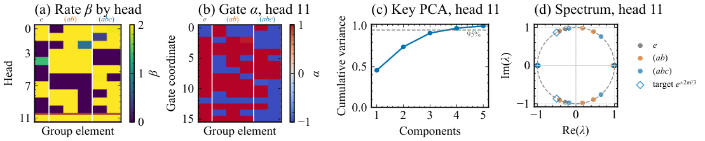
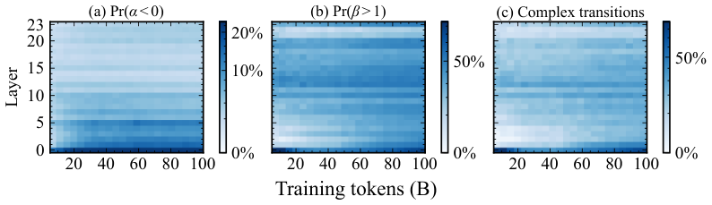

# Complex KDA 精读：理解并增强 Kimi Delta Attention 的表达力

> **论文**：Complex KDA: Understanding and Enhancing the Expressivity of Kimi Delta Attention
> **作者**：Julien Siems*、Riccardo Grazzi*、Korbinian Pöppel*、Arber Zela、Jaisidh Singh、Timur Carstensen、Aaron Klein、Antonio Orvieto、Jenia Jitsev、Volkan Cevher、Frank Hutter（OpenEuroLLM：弗莱堡大学 / MPI-IS Tübingen / EPFL 等；\* 共同一作）
> **arXiv ID**：2609.24797（v1）
> **发表时间**：2026-09-21
> **代码仓库**：https://github.com/OpenEuroLLM/ComplexKDA（MIT；模型：https://huggingface.co/collections/openeurollm/complexkda）

## 第 1 章 概述

### 1.1 一句话定位

本文证明 Kimi Delta Attention（KDA）的通道级 gate 在扩展到符号区间后可以提供第二个反射，与 delta-rule 的 Householder 反射复合出平面旋转——无需像 DeltaProduct2 那样每 token 复合两次 delta 更新，即可达到同级的状态跟踪表达力。

### 论文图表总览

| 编号 | 内容 | 所在章节 |
|------|------|---------|
| **Figure 5** | 内核吞吐对比（H100）：CKDA 保留约 96–97% 的 KDA 吞吐 | 第 5 章 |
| **Figure 7** | 成功训练的 CKDA head 的机制：β 逼近 2、gate 符号化、复特征值 | 第 5 章 |
| **Figure 8** | 周期波形延拓：CKDA 唯一准确外推的 KDA 设置 | 第 5 章 |
| **Figure 10** | 1.3B 训练中负 gate / β>1 / 复转移的逐层涌现 | 第 5 章 |
| **Table 1** | 线性循环模型表达力对比矩阵（深度需求） | 第 4 章 |
| **Table 2** | 1.3B/100B 语言建模主结果 | 第 5 章 |
| **Table 6** | 340M/15B Nemotron-CC + 45B FineWeb 消融 | 第 5 章 |
| **Table 7** | RULER 长上下文检索 | 第 5 章 |

### 1.2 核心贡献

1. **CKDA 结构与谱论证**：CKDA = KDA + 两个既有范围扩展的组合——通道级符号 gate $\alpha_{t,i} \in [-1,1]$（Sarrof et al. 2024）与 Householder 系数 $\beta_t \in [0,2]$（Grazzi et al. 2025）。论文首次刻画 GDN 与 KDA 的表达力差异：标量 gate 与一切矩阵交换、KDA 的正 gate 相似于对称阵，两者谱全为实数；符号 gate + 扩展 $\beta$ 打破该限制，产生复特征值（平面旋转 = 两个反射的复合，旋转角为镜像线夹角 $\theta$ 的两倍）。
2. **转移矩阵的完全刻画（Theorem 1、Proposition 2）**：每个正交 diagonal-plus-rank-one（DPR1）矩阵恰是某个 CKDA 转移矩阵（signed-Householder 形式 $A = (I - 2\mathbf{k}\mathbf{k}^\top)S$）；RWKV-7 的非对称 rank-one 项在正交情形不增加任何可达转移。Proposition 2 给出符号-幅度分解（缩放 + 单平面旋转）。
3. **状态跟踪表达力（Theorem 3/4/5）**：单层 CKDA 跟踪所有同构于 $SO(3)$ 有限子群的有限群（循环群 $\mathbb{Z}_n$、二面体群 $D_n$ 在 $d=2$；$A_4$、$S_4$ 在 $d=3$；$A_5$ 用 $d=4$ 多对一解码器）；非扩张 + 单复对谱限制下（含 CKDA 与 DeltaProduct $k \le 3$）单层无法跟踪 $S_5$（有限可达性假设）；3 层 CKDA 解决任意有限群词问题，$\beta>2$ 时 3 层识别全部正则语言 / 模拟 WFA（PP 精度），比 DeltaNet / GDN 的 4 层少 1 层。
4. **谱上限与乘积普适性（Theorem 8/9、Proposition 10）**：CKDA 及一切非扩张 DPR1 转移至多含 1 个非实共轭特征值对，且两个范围扩展均必要；任意 $n$ 维非扩张矩阵可写成至多 $\max\{1,2n-2\}$ 个 CKDA 因子之积，正交矩阵至多 $\max\{1,n-1\}$ 个因子（该界最优，$n$-循环置换矩阵是紧例）。
5. **大规模实验**：S3 / S4 / A5 词问题外推最强（单层表达力覆盖 $SO(3)$ 有限子群，与 DeltaProduct k=2 相当）；音频周期波形延拓；语言建模 Nemotron-CC 340M / 15B 上 CKDA spread 52.30% vs KDA 51.32%，FineWeb-Edu 1.3B / 100B 上 54.06% vs 54.09%（持平）；RULER 非混合下显著强于 KDA bounded gate；scaling law 上 CKDA / KDA 全尺度优于 Transformer 基线，无交叉点。
6. **高效内核**：三种实现——PyTorch gauge 变量替换（不改 kernel）、Triton 融合、TileLang 混合——保留约 96–97% 的标准 KDA 吞吐；对 DeltaProduct2 的吞吐竞争力论文不做内在优势声明。
7. **可解释性（Figure 7/10）**：训练中模型自发使用负 gate（主要前层）与 $\beta>1$（前两层为主），复特征值对集中在前两层；1.3B 标准初始化（gate 接近 1）下仍学到利用扩展范围。

### 1.3 关键结果速览

- **状态跟踪**：S3 / S4 / A5 群词问题长度外推为全部对比方法中最强；单层表达力覆盖 $SO(3)$ 全部有限子群，与每 token 复合两个 Householder 的 DeltaProduct k=2 相当。
- **音频周期延拓**：外推至训练长度 136 之外的长度 264 仍保留高 SNR；Transformer 退化，GRU 仍最优。
- **语言建模（Nemotron-CC 340M / 15B，Avg）**：CKDA spread 52.30% vs KDA（$\alpha \in [0,1]$、$\beta \in [0,1]$）51.32%（+0.98 pp），为该实验块最高；对照 Dense Attention 50.90%、GDN 49.79%、DeltaProduct k=2 48.44%。
- **语言建模（FineWeb-Edu 1.3B / 100B）**：CKDA 平均下游精度 54.06% vs KDA bounded gate 54.09%（持平，−0.03 pp）；CKDA 领先 GDN-2（53.11%）0.95 pp、SWA-hybrid Transformer（50.86%）3.20 pp。
- **RULER（非混合）**：S-NIAH-1 4K 100.0% vs KDA bounded 94.0%，8K 87.8% vs 68.8%；CKDA+attn 混合在 MK-NIAH 2K/4K 达 94.4% vs KDA+attn 60.2%/63.8%。
- **Scaling law**：CKDA / KDA 在全部测试尺度优于 Transformer 基线，无交叉点（仓库含 180 个 scaling-ladder 单元格结果，无 GPU 即可复现表格）。
- **内核效率**：三种实现保留约 96–97% 的标准 KDA 吞吐。

## 第 2 章 研究背景与动机

### 2.1 Delta-rule 线性 RNN 谱系

线性 RNN 通过叠加的仿射状态更新处理序列，单头递归写作 $H_i = A(x_i)H_{i-1} + B(x_i)$，$H_i \in \mathbb{R}^{n \times d_v}$。架构差异主要在转移矩阵 $A$ 的结构：GLA、Mamba-1/2、mLSTM 用对角（或标量×单位）转移，计算快但无跨坐标混合；DeltaNet 引入 delta-rule 的秩一修正（unit key 下给出投影 / Householder 反射）；Gated DeltaNet（GDN）加标量衰减 $\alpha(I - \beta kk^\top)$；KDA 把标量衰减升级为通道级正对角 gate $(I - \beta kk^\top)D(\alpha)$。两者都保持 diagonal-plus-rank-one（DPR1）转移和 WY 分块的 chunk-wise 高效实现。GDN 已被多家前沿模型采用，KDA 同样进入 Kimi Linear 等量产模型——理解「标量 gate → 全对角 gate」到底增加了什么表达力，是本文的出发点。

### 2.2 对称性：为什么标准 KDA 的谱全是实数

关键观察是一个对称性论证：KDA 转移是两个对称矩阵之积，$A = (I - \beta kk^\top)D(\alpha)$ 对称当且仅当两因子交换，逐元素条件为 $\beta k_i k_j(\alpha_i - \alpha_j) = 0$。

- **标量 gate（GDN）**：$\alpha_i = \alpha_j$ 恒成立 → 交换条件恒真 → $A$ 对称、实谱。且多步递归中标量 gate 完全析出：$\prod_t \alpha_t (I - \beta_t k_t k_t^\top)$——扩展到负标量只能改变整体符号和尺度，无法提供独立定向的第二个变换。
- **正对角 gate（标准 KDA）**：交换条件可破坏（$A$ 非对称），但严格正 gate 时 $A$ 相似于对称阵 $D^{1/2}(I-\beta kk^\top)D^{1/2}$ → 谱仍全实；部分 gate 为零由连续性归入同结论。
- **符号 gate + 扩展 β（CKDA）**：允许 $\alpha$ 变号才移除该限制。2D 情形（$\alpha = \mathrm{Diag}(-1, 1)$）下判别式 $(1-\alpha)^2\cos^2 2\theta + 4\alpha < 0$ 在 $\alpha < 0$ 时可满足 → 复共轭对。在 $\alpha = -1$、$\beta = 2$ 端点，$A$ 恰为两个反射之积（$\mathrm{Diag}(-1,1) = I - 2e_1e_1^\top$ 与 $H_k$），镜面线夹角 $\theta$ → 旋转 $2\theta$。

### 2.3 状态跟踪与群词问题

表达力研究通过状态跟踪（state tracking）展开：给定状态空间与逐输入更新，模型能否从隐状态解码出累积状态。有限群词问题（输入为群元素，预测累积乘积）是标准测试床——$S_5$ 词问题经 Barrington 定理与 NC1 相连。已知阶梯：1D 反射足够做 parity，2D 旋转足够做模加法（$S_3 \cong D_3$），更高维正交表示覆盖更大的群。DeltaProduct 用每 token 复合 $k$ 个 Householder 控制该复杂度（$k=2$ 达旋转），代价是秩与成本翻倍。本文证明 KDA 的通道 gate 本身就能提供第二个反射——「可表示 ≠ 可学习」的鸿沟（如 $A_5$）也在此框架下被明确刻画。

### 2.4 相关工作脉络

复数/旋转递归并非新想法：S4、LRU 用复对角表示，RotRNN 用旋转递归，Mamba-3 引入复动力学，Selective RoPE 给门控注意力加输入相关旋转——但 RoPE 型旋转固定在 block-diagonal 坐标平面内，乘积无法重定向旋转平面（Prop 10 的对照）。MDN 加动量态产生二阶复共轭特征值，SFDA 用显式相位/衰减 gate。CKDA 的独特之处：保持一阶、实数、DPR1、非扩张的 KDA 递归，仅靠两个既有参数范围扩展（Sarrof 2024 的符号 gate、Grazzi 2025 的 $\beta \in [0,2]$）的组合就获得旋转。RWKV-7 / GDN-2 用非对称秩一项 $D(\alpha) - k(v \odot k)^\top$，Theorem 1 表明这在正交情形不增加任何可达转移。

## 第 3 章 Complex KDA：从对称性破缺到平面旋转

### 3.1 KDA 回归形式

单头递归 $H_t = A_t H_{t-1} + B_t$，KDA 的转移为

$$A_t = (I - \beta_t \mathbf{k}_t \mathbf{k}_t^\top)\,\mathrm{Diag}(\boldsymbol{\alpha}_t)$$

其中 $\mathbf{k}_t$ 为归一化 key，$\beta_t \in [0,1]$ 为 delta-rule 学习率（Householder 系数），$\boldsymbol{\alpha}_t \in [0,1]^n$ 为通道级遗忘 gate。转移是「自由定向的广义 Householder 反射 × 轴对齐的逐坐标缩放」。对角分解视角（论文式 (3)）：$D(\alpha) = \prod_i (I - \beta_i e_i e_i^\top)$，每个因子是法向 $e_i$、学习率 $\beta_i = 1 - \alpha_i$ 的轴对齐广义 Householder 变换；$\beta_i = 1$（即 $\alpha_i = 0$）时为精确坐标反射。

### 3.2 对称性论证

如 2.2 节：标量 gate 与一切矩阵交换 → 实谱；正对角 gate 相似于对称阵 → 实谱；符号 gate 才能破坏。非交换仅是必要条件——严格正 gate 下 $A$ 与 $D^{1/2}(I-\beta kk^\top)D^{1/2}$ 相似，谱仍实。

### 3.3 2D 几何构造

取 $\alpha = \mathrm{Diag}(-1, 1)$，展开 $(I - \beta kk^\top)\alpha$ 得 2D 转移，其特征值为非实当且仅当判别式

$$(1-\alpha)^2\cos^2 2\theta + 4\alpha < 0$$

其中 $\theta$ 为 key 的方向角。$\alpha \ge 0$ 时谱必实；$\alpha < 0$ 时适当 $\theta$ 出现复共轭对，特征值之积为 $-\alpha$，随 $\alpha \to -1$ 移向单位圆。端点 $\alpha = -1, \beta = 2$ 处转移为两个反射 $H_{e_1} H_k$ 之积——旋转 $2\theta$。

### 3.4 CKDA 定义

$$\text{CKDA} = \text{KDA with } \boldsymbol{\alpha}_t \in [-1,1]^n,\ \beta_t \in [0,2]$$

实现用 $\beta_t = 2\sigma(b_t)$、符号 gate $r_{t,i} = 2\sigma(a_{t,i}) - 1$（幅度下限与反向约定见论文附录 E）。转移保持 diagonal-plus-rank-one 和非扩张性（$\|A\|_2 \le 1$）。

### 3.5 谱结构与完全刻画

- **Theorem 1（DPR1 与 CKDA 等价）**：每个正交 DPR1 矩阵 $A = D + \mathbf{u}\mathbf{v}^\top$（$D = D^\top$ 对角）都可写成 signed-Householder 形式 $A = (I - 2\mathbf{k}\mathbf{k}^\top)S$（$\|\mathbf{k}\|_2 = 1$、$S = \mathrm{Diag}(s_i)$、$s_i \in \{\pm 1\}$），即 $\alpha \in \{\pm 1\}$、$\beta = 2$ 的 CKDA 转移。2D 直觉：正交矩阵的列是正交单位向量对，先用一个过原点的反射把第一列对齐到坐标轴，第二列必然落到另一坐标轴上；高维中 DPR1 结构保证单个反射仍能对齐整个标架。
- **Proposition 2（符号-幅度分解）**：任意 CKDA 转移 = 逐坐标缩放 × 一个仅在单个 2D 子空间内可为旋转的变换。复特征值三必要条件：(i) 至少两个 gate 坐标符号相反；(ii) key 横跨异号坐标；(iii) $\beta > 1$。
- **Theorem 8**：任何 CKDA 矩阵至多 1 个非实共轭特征值对（要求 $\beta > 1$ 且存在负 gate 项）——两个范围扩展缺一不可。
- **Theorem 9**：推广到一切非扩张 DPR1：$A = D + R$（$\mathrm{rank}(R) \le r$、$\|A\|_2 \le 1$）在单位圆上至多 $r$ 对非实共轭特征值（代数重数计）。秩一即 ≤1 对——这是结构性上限。
- **Proposition 10（乘积普适性）**：单个转移虽限于单平面旋转，CKDA 转移的乘积可表示任意 $n$ 维非扩张矩阵（至多 $\max\{1, 2n-2\}$ 个因子）；正交矩阵至多 $\max\{1, n-1\}$ 个因子且该界最优（$n$-循环置换矩阵无法用少于 $n-1$ 个 CKDA 因子表达）。对比：RoPE / Selective RoPE 的旋转固定在同一组坐标平面内，乘积无法重定向旋转平面。

### 3.6 状态跟踪表达力

- **Theorem 3（单层群跟踪）**：单个 CKDA 层（单头）跟踪所有同构于 $SO(3)$ 有限子群的有限群：循环群 $\mathbb{Z}_n$ 与二面体群 $D_n$（含 $S_3 \cong D_3$）在 $\mathbb{R}^2$ 中实现（faithful realization），$A_4$ 与 $S_4$ 在 $\mathbb{R}^3$ 中实现，$A_5$ 在 $\mathbb{R}^4$ 中用多对一解码器跟踪。证明梗概：平面旋转加反射给出循环群与二面体群；$SO(3)$ 中每个旋转都是两个 Householder 反射之积，但除 identity 与 180° 旋转外，CKDA 要求旋转轴含一个零坐标——重定向立方体可满足 $S_4$ 及其子群 $A_4$，而二十面体旋转群 $A_5$ 无可行定向，需升至 $d=4$ 借助多对一解码。
- **Theorem 4（$S_5$ 跟踪的谱障碍）**：若每个头转移 $A$ 满足 $\|A\|_2 \le 1$ 且单位圆上至多一对非实共轭特征值（按代数重数计），则带任意有限个独立头的单层循环网络在有限可达性（finite reachability）假设下**无法跟踪 $S_5$**。该谱条件覆盖 CKDA（由 Theorem 8）与 (Gated) DeltaProduct$_k$（$k \le 3$）。证明梗概：有限可达性与非扩张性允许去掉加性项、把各头限制为正交更新且保持谱界；由一个五元环及其被一个对换共轭的像构造两个转移矩阵积 $R_1, R_2$，其换位子 $C = R_1 R_2 R_1^{-1} R_2^{-1}$ 满足 $C^{10} = I$，但 $C$ 解码到一个三元环，其十次幂不是 identity——矛盾。注意与 Theorem 3 的对照：**被排除的是 $S_5$，而 $A_5$ 恰恰是单层可跟踪的**。
- **Theorem 5（多层表达力）**：3 层 CKDA 解决任意有限群词问题（固定精确数据类型）；允许 $\beta > 2$ 时，3 层识别全部正则语言、在多项式精度下计算 $\mathbb{Q}$ 上的任意 WFA（含时钟与归一化 key 参数的固定代数数域、精确算术）。构造改编自 clock–buffer–accumulator 框架：CKDA 用单层平面旋转实现时钟，比 DeltaNet/GDN 的 4 层省 1 层。

## 第 4 章 表达力对比：CKDA 在线性 RNN 谱系中的位置

### 4.1 与 DeltaProduct 的关系

CKDA 与 DeltaProduct2 的单层表达力等级相同，但实现路径不同：DeltaProduct2 每 token 复合两次 delta-rule 更新（两个 identity-plus-rank-one 因子）实现 2D 旋转，秩与更新成本翻倍；CKDA 用单次 delta-rule 更新 + 通道级符号 gate 提供的第二个反射实现同样的旋转，转移保持 DPR1 和非扩张。论文明确不声称 CKDA 对 (Gated) DeltaProduct2 有内在计算优势——未门控 DeltaProduct2 基线吞吐有竞争力（其 identity-plus-rank-one 因子免去通道级 gate 计算，但每 token 处理一个额外 value 输入）。

### 4.2 表达力对比表（论文 Table 1）

四种模型的转移形式与深度需求（✓L = L 层足够；×L A = 假设 A 下 L 层不可能；$L_q$ = 依赖语言 DFA 状态数的足够深度）：

| 项目 | CKDA | GDN | Gated DeltaProduct | RWKV-7 / GDN-2 |
|:-----|:-----|:---|:-------------------|:---------------|
| 转移形式 | $(I - \beta kk^\top)D(\alpha)$ | $\alpha(I - \beta kk^\top)$ | $\alpha\prod_{j=1}^k(I - \beta_j k_j k_j^\top)$ | $D(\alpha) - k(v \odot k)^\top$ |
| 参数范围 | $\beta \in [0,2]$，$\alpha \in [-1,1]^d$ | $\alpha \in [0,1]$，$\beta \in [0,2]$ | $\alpha \in [0,1]$，$\beta_j \in [0,2]$ | $\alpha \in [0,1]^d$，$v \in [0,2]^d$ |
| 复特征值对 | ≤1（Thm 8）；$\beta \le 1$ 或 $\alpha \ge 0$ 时 0 | 0 | ≤⌊k/2⌋ | 0 |
| $S_2$（parity） | ✓ 1 [U3]† | ✓ 1 [U3] | ✓ 1（k≥1）[U3] | ✓ 1 [RL1]‡ |
| $\mathbb{Z}_n, D_n$（n>2） | ✓ **1**（Thm 3）† | ✓ 2 [D7]；×1 FP[U2] | ✓ 1（k≥2）[D7] | ✓ 2 [D7]‡；×1 FP[U2] |
| $S_4, A_5$ | ✓ **1**（Thm 3）† | ✓ 4 [D1]；×1 FP[U2] | ✓ 1（k≥2）[D4] | ✓ 4 [D1]‡；×1 FP[U2] |
| $S_n$（n≥5） | ✓ **3**（Thm 5）；×1 FR（Thm 4） | ✓ 4 [D1]；×1 FP[U2] | ✓ 1: k≥n−1 [D1]；✓ 3: 2≤k≤n−2；×1 FR: k≤3 | ✓ 4 [D1]‡；×1 FP[U2] |
| 正则语言 | ✓ $L_q$ [D2] | ✓ $L_q$ [D2] | ✓ $L_q$（k≥1）[D2] | ✓ $L_q$ [D2]‡ |

† CKDA 构造用 $\beta \in \{0,2\}$、$\alpha \in \{\pm 1\}^d$（parity 用 $\alpha = \mathbf{1}$）。‡ RWKV-7/GDN-2 构造用 $D(\alpha) = \gamma I$、$v = \gamma\beta\mathbf{1}$（稳定构造 $\|A\|_2 \le 1$；反射用 $\gamma=1, \beta=2$），默认允许扩张转移。FP = 固定精度（精确数据类型）；FR = 精确仿射更新下每头有限可达性；U/D/RL/R/M 为引用来源（Grazzi 2025 / Siems 2025 / Peng 2025 / Merrill 2026a）。

关键读法：① GDN 标量 gate 谱恒实，跟踪 $\mathbb{Z}_n/D_n$ 需 2 层、$S_4/A_5$ 需 4 层，而 CKDA 全部 1 层——「channel-wise gate 提供第二个反射」的直接收益；② Theorem 4 的谱障碍（×1 FR）覆盖 CKDA 与 $k \le 3$ 的 DeltaProduct，是结构性上限而非构造技巧不足；③ Gated DeltaProduct 每个 token 复合 $k$ 个 Householder 因子，$k \ge 2$ 即可 1 层覆盖 $S_4/A_5$、$k \ge n-1$ 覆盖 $S_n$，但复特征值对上限为 ⌊k/2⌋——CKDA 以单因子 + 单复对达到 $k=2$ 的覆盖面。

### 4.3 与其他复动力学路线的对比（论文 Table 3 要点）

MDN（动量态二阶动力学）与 SFDA（显式相位/衰减 gate + chunk-WY）也能产生复特征值，但分别引入辅助递归状态和显式相位 gate；CKDA 保持一阶、实数、DPR1 递归，是「零结构成本」的复动力学来源。Mamba-3 的 SISO/MIMO 复动力学、Adaptive Unitary SSM 的输入相关酉转移则属于对角/可对角化族，与 DPR1 族的对比维度不同。

## 第 5 章 实验结果与分析

### 5.1 实验设置总览

论文在四个维度验证：有限群状态跟踪（$S_3$/$S_4$/$A_5$ 词问题，单层，训练长度 32、评估到 512，3 种子取最优，acc 从 chance(0) 到 perfect(1) 缩放）、周期音频波形延拓（单层，8 帧 half-bar cue 后零输入延拓）、语言建模（340M/15B Nemotron-CC、1.3B/100B FineWeb-Edu、6 级 scaling ladder）、RULER 检索。训练配置：340M 用 AdamW、lr $5 \times 10^{-4}$、全局 batch 64、WSD 调度（2000 步 warmup、末 20% cooldown）、wd 0.1、$(\beta_1,\beta_2)=(0.9,0.95)$；1.3B 遵循 GDN-2 配方；状态跟踪实验用 Muon（2D 序列层参数）+ AdamW（适配器）。混合模型用 3:1（循环:注意力）full gated attention 无 RoPE（NoPE），与基线报告值的 1:1 SWA 配方不同，不可直接对比。关键实验细节：DeltaNet 遗留的 SiLU 激活（key/query 投影）会把 key 推向正值、与需要跨符号 key 的旋转机制冲突——状态跟踪实验全部移除 SiLU，语言建模做了消融。

### 5.2 状态跟踪与长度外推

单层模型在 $S_3$/$S_4$ 上，CKDA（$\alpha \in [-1,1]$、$\beta \in [0,2]$）是四种 KDA 范围设置中唯一长度外推成功的配置，与 Theorem 3 一致。只扩展 gate 或只扩展 $\beta$ 的配置，$S_3$ 长序列 scaled accuracy 接近 0.2——只保留了 $A_3$ 两个陪集的 parity 判别。成功学到的 CKDA head 呈现理论预测的机制：$\beta$ 逼近反射极限 $\beta = 2$、gate 近符号值、复共轭特征值靠近单位圆（Figure 7）。$A_5$ 在标准训练下随机初始化学不到（可表示但不可学习）；在论文四元数构造（附录 C.4.2）附近初始化的小型全可训练模型可达长度外推，训练仍用普通 next-state cross-entropy + 标准 MLP readout——把障碍定位在优化/表示发现而非解码器或损失；但该对比的架构与训练调度亦有差异，未单独隔离初始化效应。



*图1：论文 Figure 7——成功训练的 CKDA head 学到的机制：(a) 逐 head 的学习强度 $\beta$，head 11 逼近反射极限 $\beta=2$；(b) 通道 gate 近符号值（坐标接近 $\pm 1$）；(c) key 的前三个主成分解释约 95% 方差；(d) 转移谱出现复特征值。与第 3 章的理论构造一致。*

音频延拓实验（合成 groove 124 BPM、4096 Hz、32 帧循环移位、64 波形值/帧）：长度 264（超过训练长度 136）时 CKDA 是四种 KDA 范围设置中唯一准确延拓波形的配置，因果 Transformer 退化；非线性 RNN 基线 GRU 在该任务上仍最准确。论文强调该任务对单一 groove 循环移位过拟合，诊断的是相位保持动力学而非通用音频生成。

### 5.3 语言建模主结果（1.3B / 100B FineWeb-Edu）

**纯循环模型：**

| Model | Wiki ppl | LMB ppl | LMB acc | PIQA | Hella. | Wino. | ARC-e | ARC-c | OBQA | SIQA | BoolQ | Avg | SQuAD | SWDE | FDA |
|:------|:---:|:---:|:---:|:---:|:---:|:---:|:---:|:---:|:---:|:---:|:---:|:---:|:---:|:---:|:---:|
| Mamba-2 | 16.79 | 12.38 | 45.24 | 72.58 | 55.51 | 55.33 | 70.68 | 35.26 | 31.00 | 40.63 | 60.19 | 51.82 | – | – | – |
| Gated DeltaNet | 16.40 | 11.89 | 49.62 | 72.31 | 56.50 | 56.75 | 68.81 | 35.15 | 30.20 | 40.53 | 58.78 | 52.07 | – | – | – |
| KDA | 16.81 | 11.68 | 48.13 | 72.09 | 55.75 | 55.72 | 70.83 | 35.92 | 30.40 | 40.99 | 60.67 | 52.28 | – | – | – |
| Mamba-3 (SISO) | 16.30 | 12.99 | 45.06 | 72.31 | 55.58 | 56.20 | 70.45 | 34.56 | 31.00 | 41.76 | 55.90 | 51.42 | – | – | – |
| Mamba-3 (MIMO) | 16.45 | 11.66 | 47.82 | 72.36 | 56.49 | 55.78 | 72.38 | 38.07 | 30.00 | 40.89 | 57.74 | 52.39 | – | – | – |
| Gated DeltaNet-2 | 15.90 | 11.41 | 48.09 | 72.80 | 56.84 | 57.85 | 72.43 | 38.23 | 31.60 | 40.58 | 59.54 | 53.11 | – | – | – |
| KDA, bounded gate (ours) | 15.73 | 10.53 | 50.46 | 72.85 | 59.32 | 61.33 | 73.23 | 38.40 | 28.80 | 41.35 | 61.10 | 54.09 | 38.17 | 49.59 | 30.40 |
| CKDA (ours) | 15.78 | 10.08 | 51.66 | 73.12 | 59.23 | 58.88 | 73.99 | 39.08 | 28.60 | 41.61 | 60.34 | **54.06** | 39.68 | 48.42 | 31.49 |

**混合模型（ours 用 3:1 full NoPE gated attention；基线为 1:1 SWA 报告值，配方不同）：**

| Model | Wiki ppl | LMB ppl | LMB acc | PIQA | Hella. | Wino. | ARC-e | ARC-c | OBQA | SIQA | BoolQ | Avg | SQuAD | SWDE | FDA |
|:------|:---:|:---:|:---:|:---:|:---:|:---:|:---:|:---:|:---:|:---:|:---:|:---:|:---:|:---:|:---:|
| Transformer (SWA-hybrid) | 19.22 | 13.72 | 48.32 | 70.21 | 56.12 | 55.85 | 69.23 | 33.84 | 25.00 | 39.74 | 59.42 | 50.86 | – | – | – |
| Mamba-2 (hybrid) | 17.46 | 11.29 | 48.05 | 71.47 | 57.52 | 56.17 | 70.50 | 34.73 | 29.80 | 40.35 | 59.31 | 51.99 | – | – | – |
| Gated DeltaNet (hybrid) | 16.00 | 10.82 | 48.71 | 70.06 | 57.50 | 56.83 | 70.41 | 35.15 | 30.60 | 40.97 | 60.00 | 52.25 | – | – | – |
| KDA (hybrid) | 16.01 | 10.66 | 49.21 | 71.06 | 56.89 | 57.77 | 71.59 | 35.07 | 30.00 | 40.53 | 62.03 | 52.68 | – | – | – |
| Mamba-3 (SISO, hybrid) | 15.54 | 10.65 | 49.19 | 71.01 | 58.75 | 57.30 | 70.54 | 36.35 | 32.00 | 41.20 | 57.86 | 52.69 | – | – | – |
| Mamba-3 (MIMO, hybrid) | 15.81 | 10.92 | 49.82 | 71.98 | 58.19 | 57.06 | 70.54 | 38.48 | 29.40 | 40.99 | 57.98 | 52.72 | – | – | – |
| Gated DeltaNet-2 (hybrid) | 15.62 | 10.43 | 50.90 | 72.20 | 58.46 | 58.56 | 71.89 | 36.69 | 33.00 | 41.50 | 62.57 | 53.97 | – | – | – |
| KDA + attn 3:1 (ours) | 15.04 | 9.93 | 51.60 | 73.88 | 59.57 | 60.62 | 72.69 | 37.20 | 27.00 | 42.43 | 60.31 | 53.92 | 42.69 | 64.81 | 64.79 |
| CKDA + attn 3:1 (ours) | 15.34 | 9.90 | 52.57 | 73.56 | 59.68 | 60.14 | 72.56 | 36.86 | 28.20 | 42.58 | 63.15 | **54.37** | 37.77 | 63.91 | 58.89 |

关键读法：

- CKDA（54.06%）与 KDA bounded gate（54.09%）平均下游精度持平（−0.03 pp）；CKDA 在 LMB ppl（10.08 vs 10.53）、LMB acc（51.66% vs 50.46%）、ARC-c（39.08% vs 38.40%）领先，WinoGrande 落后（58.88% vs 61.33%）。
- CKDA 优于其他全部纯循环基线：比 GDN-2（53.11%）高 0.95 pp，比 KDA 原版（52.28%）高 1.78 pp，比 SWA-hybrid Transformer（50.86%）高 3.20 pp。
- 「KDA, bounded gate (ours)」与「KDA」两行的差异来自训练配方（Kimi safe sigmoid gate）与复现设置，非架构差异；ours 混合行与基线混合行的配方差异同理。

### 5.4 小模型消融（340M/15B Nemotron-CC + 45B FineWeb）

Nemotron-CC 块（Avg %）：Dense Attention 50.90、DeltaProduct k=2 48.44、DP k=2 β[0,2] 48.08、GDN 49.79、GDN β[0,2] 49.64、KDA(α∈[0,1], β∈[0,1]) 51.32、KDA(α∈[0,1], β∈[0,2]) 50.58；CKDA(α∈[-1,1], β∈[0,2]) 消融：standard 51.10、**spread 初始化 52.30（该块最高）**、spread+no-SiLU 51.87、spread+β∈[0,1] 51.39。

FineWeb 45B 块（Avg %）：KDA(α∈[0,1], β∈[0,2]) 51.60 / no-SiLU 51.85；CKDA：standard 51.81、no-SiLU 51.90、spread 51.60、spread no-SiLU 51.94、**spread+β-spread 52.21（该块最高）**。

两点结论：① CKDA 的收益依赖符号 gate 的 spread 初始化（正负各半）——standard 初始化下 gate 接近 1，收益缩水；② 单独扩展 β 而不加符号 gate（GDN β[0,2] 49.64 < GDN 49.79；KDA β[0,2] 50.58 < KDA 51.32）在该规模不带来收益，复特征值需要两个扩展同时在场，与理论一致。

### 5.5 RULER 长上下文检索（1.3B/100B，acc%，500 样本/格）

| Model | S1-1K | S1-2K | S1-4K | S1-8K | S2-1K | S2-2K | S2-4K | S2-8K | S3-1K | S3-2K | S3-4K | MK-1K | MK-2K | MK-4K |
|:------|:---:|:---:|:---:|:---:|:---:|:---:|:---:|:---:|:---:|:---:|:---:|:---:|:---:|:---:|
| KDA bounded (ours) | 32.2 | 65.8 | 94.0 | 68.8 | 73.6 | 100.0 | 97.6 | 21.0 | 7.4 | 46.6 | 9.8 | 48.6 | 26.2 | 26.0 |
| CKDA (ours) | 100.0 | 100.0 | 100.0 | 87.8 | 100.0 | 99.8 | 88.6 | 33.2 | 94.4 | 88.2 | 51.0 | 56.0 | 46.6 | 37.0 |
| KDA+attn 3:1 | 100.0 | 100.0 | 100.0 | 100.0 | 99.8 | 99.2 | 99.2 | 70.2 | 99.4 | 98.0 | 95.8 | 73.8 | 60.2 | 63.8 |
| CKDA+attn 3:1 | 99.8 | 96.8 | 81.2 | 53.4 | 93.2 | 98.6 | 83.2 | 62.0 | 97.6 | 91.0 | 86.8 | 95.0 | 94.4 | 94.4 |
| Mamba-2（报告值） | 100.0 | 100.0 | 97.0 | 55.8 | 99.6 | 99.6 | 62.6 | 21.0 | 59.2 | 38.6 | 14.4 | 29.0 | 21.2 | 21.4 |
| Gated DeltaNet（报告值） | 99.8 | 100.0 | 100.0 | 97.6 | 100.0 | 100.0 | 87.2 | 32.0 | 89.8 | 54.2 | 60.6 | 58.0 | 37.0 | 27.8 |
| KDA（报告值） | 100.0 | 100.0 | 99.2 | 70.6 | 100.0 | 100.0 | 89.0 | 30.6 | 77.4 | 63.2 | 26.2 | 54.0 | 44.2 | 28.0 |
| Gated DeltaNet-2（报告值） | 100.0 | 100.0 | 100.0 | 97.8 | 100.0 | 100.0 | 93.0 | 39.2 | 92.0 | 89.8 | 31.8 | 72.6 | 51.4 | 37.8 |

（S1/S2/S3 = S-NIAH-1/2/3，MK = MK-NIAH-1；ours 混合行只评估 ≤4K——attention 层训练长度；报告值来自 Hatamizadeh et al. 2026。）

非混合设定下 CKDA 对 KDA bounded gate 全面优势：S-NIAH-1 4K 100.0% vs 94.0%、8K 87.8% vs 68.8%；S-NIAH-3 1K 94.4% vs 7.4%；MK-NIAH-1 2K 46.6% vs 26.2%。论文对「为何无扩展 gate 的 KDA 在其复现中 RULER 明显更差」保留为开放问题（S-NIAH 对 prompt 格式敏感，差值部分来自指令遵循不足）。混合设定下 CKDA+attn 的 4K 内 S-NIAH 读数低于 KDA+attn，但 MK-NIAH 2K/4K（94.4%/94.4% vs 60.2%/63.8%）大幅领先——多 key 检索上符号 gate 优势明显。

### 5.6 Scaling Laws 与可解释性

基于 Nemotron-CC 的 6 级 scaling ladder（180 个训练单元）：CKDA 与 KDA 在全部尺度上对 Transformer 基线（含 QK-Norm）保持 nats 优势，未观察到 favoring Transformer 的交叉点（对照 xLSTM 报告的 over-training 交叉现象），但小模型行为显示进入高 over-training 比区间时优势略有收窄；1.7B/50BT 留出集验证了拟合可靠性（缺失 100B/300B token 档的 ~10× 计算量 regime，拟合 offset 与 Ajroldi et al. 2026 略有差异）。



*图2：论文 Figure 10——1.3B 非混合 CKDA（standard 初始化）训练过程中每层负 gate 比例（a）、$\beta > 1$ 比例（b）、复特征值转移比例（c）。三者均在训练中自发涌现：负 gate 集中在前层，$\beta > 1$ 出现在每一层但前两层最多，复特征值对集中在前两层（FineWeb-Edu 验证集，序列长度 4096）。*

这组可解释性结果直接回答「扩展范围是否被实际使用」：尽管 standard 初始化 gate 接近 1，模型在训练早期就学会在前层使用负 gate 和 $\beta > 1$。gate 与 $\beta$ 的具体功能角色留作未来工作。

### 5.7 内核效率

CKDA 实现为 FLA KDA recurrence kernel 的小修改。KDA 在 log-space 存 gate 幅度，符号 gate 需分离符号与幅度——同一符号变换以三种方式落地：(1) 编译版 PyTorch 算子把累积符号吸收进 key/query（gauge 变换，不改 kernel）；(2) Triton kernel 把符号融合进归一化及其反向；(3) TileLang 混合方案。内核实现保留约 96–97% 的标准 KDA 吞吐（H100、BF16、16 heads、$d_k = d_v = 128$、32k tokens/step，Figure 5；PyTorch-gauge 参考实现来自更早的无归一化融合配置，非完全对齐的消融）。未门控 DeltaProduct2 吞吐有竞争力——其每 token 两次 delta 更新各带独立 value，计时区域包含该额外 value 输入的递归工作。

## 第 6 章 代码实现详解

[以下内容来自 GitHub README 与论文附录 E 描述，非论文正文]

### 6.1 仓库结构

官方实现位于 https://github.com/OpenEuroLLM/ComplexKDA（MIT 许可），权重发布在 https://huggingface.co/collections/openeurollm/complexkda。仓库 vendored 了一份 Flash Linear Attention (FLA) 快照，CKDA 层在 `fla/` 内实现；三个实验包对应论文三组实验：

| 组件 | 内容 |
|:-----|:-----|
| `fla/` | FLA kernels、layers、模型实现（含 CKDA） |
| `group_word_problems/` | 单层有限群状态跟踪（S₃/S₄/A₅），驱动 `reproduce_state_tracking.py` |
| `audio_toys/` | 周期波形延拓 + 谱分析 + WAV 导出，驱动 `reproduce_periodic_waveform.py` |
| `lm_scaling/` | 1.3B/100BT FineWeb-Edu（torchtitan）+ 6 级 scaling ladder（Megatron-LM）+ 全部评测 |
| `evidence/` | claim→artifact 索引、音频测量存档、来源清单 |

### 6.2 核心修改：符号 gate 的 gauge 变换

论文附录 E 的变量替换允许**不改现有 KDA kernel** 实现符号 gate：把累积符号吸收进 key 和 query（gauge 变换），编译版 PyTorch 路径即可工作；Triton/TileLang 路径把符号融合进归一化与前向/反向 pass。优化 kernel 通过环境变量选择：`FLA_KDA_BACKEND=triton_optimized` 或 `hybrid_optimized`（NVIDIA Hopper；hybrid 需 TileLang）。参数化（论文正文）：$\beta_t = 2\sigma(b_t)$、gate $r_{t,i} = 2\sigma(a_{t,i}) - 1$。

### 6.3 可复现性设计

语言建模的测量结果（180 个 scaling-ladder 单元、4 个 1.3B arm、RULER 运行、gate 谱统计）直接提交在 `lm_scaling/harvest/`，论文全部表格可无 GPU 复现：

```bash
git clone https://github.com/OpenEuroLLM/ComplexKDA && cd ComplexKDA
pip install -e ".[cpu,benchmark]"
lm_scaling/reproduce_tables.sh --check   # 重新生成表格并与提交值 diff
```

CPU 冒烟测试端到端跑通两个实验包：`reproduce_state_tracking.py --mode smoke --device cpu`、`reproduce_periodic_waveform.py --mode smoke --device cpu`。完整复现用 `--mode paper --device cuda`（状态跟踪 = 4 种 KDA 范围组合 × 3 种子；音频含 Transformer/GRU 基线与谱测量）。检查点与原始训练日志不入库；参考指标以 JSON 形式提供。Megatron-LM / oellm-autoexp 栈按 commit pin 在 `lm_scaling/megatron_stack.lock`（`feat/complex-kda` 分支，两个自有 commit 分别给 Megatron-LM 加 `complex_kda` attention 变体、给 oellm-autoexp 透传配置字段，默认惰性）。训练用 Muon（内部 2D 序列层参数）+ AdamW（其余参数）；语言建模仅用 AdamW 保持可比性。

## 第 7 章 局限性与延伸阅读

### 7.1 局限性

- **秩一结构上限**：非扩张 + 秩一修正的转移至多 1 个持续复共轭特征值对（Theorem 8/9）。CKDA 无法在单转移内实现多平面旋转——那是 Gated DeltaProduct $k \ge 4$ 或更高维正交表示的领地。
- **可表示 ≠ 可学习**：$A_5$ 在 Theorem 3 意义下单层可表示（$d=4$、多对一解码），但标准训练设置下随机初始化学不到；只有靠近四元数构造（附录 C.4.2）初始化的小模型实现了长度外推，且训练仍用普通 next-state cross-entropy 与标准 MLP readout——障碍在优化与表示发现，而非解码器或损失函数。该对比的架构与训练日程亦有差异，未单独隔离初始化的影响。
- **WFA 构造牺牲稳定性**：一般 WFA 模拟要求 $\beta > 2$，放弃非扩张保证，且需固定代数数域上的精确算术。
- **对 DeltaProduct2 无内在效率优势**：结构差异（单因子 + 符号 gate vs 双因子）不构成计算优势声明，DeltaProduct2 基线在 kernel 基准中吞吐有竞争力。
- **功能角色未明**：训练中扩展范围确实被使用（负 gate / $\beta>1$ / 复转移逐层涌现），但其功能角色留作未来工作。

### 7.2 延伸阅读

| 方向 | 代表工作 | 与本文关系 |
|:-----|:---------|:-----------|
| KDA 出处 | Kimi Linear / Kimi K3（Moonshot AI） | CKDA 的基线架构；本文核心思想诞生于作者阅读 K3 报告之后 |
| 分离 erase/write | Gated DeltaNet-2（Hatamizadeh et al. 2026） | 未来工作：与 CKDA 组合（CKDA 保持加性更新结构未动） |
| Householder 组合 | DeltaProduct（Siems et al. 2025） | 表达力对齐对象；Thm 4 的谱障碍共同适用（k≤3） |
| 负特征值 | Grazzi et al. 2025 | $\beta \in [0,2]$ 扩展的出处；U 系构造 |
| 复动力学 | Mamba-3、MDN、SFDA、Adaptive Unitary SSM | 对比路线（论文 Table 3） |
| 多层构造 | Peng et al. 2025、Merrill et al. 2026a | clock–buffer–accumulator 框架与 WFA 适配 |
| Scaling laws | Ajroldi et al. 2026（OpenEuroLLM）、Beck et al. 2026（xLSTM） | CKDA/KDA 无交叉点 vs xLSTM 报告的 over-training 交叉 |
