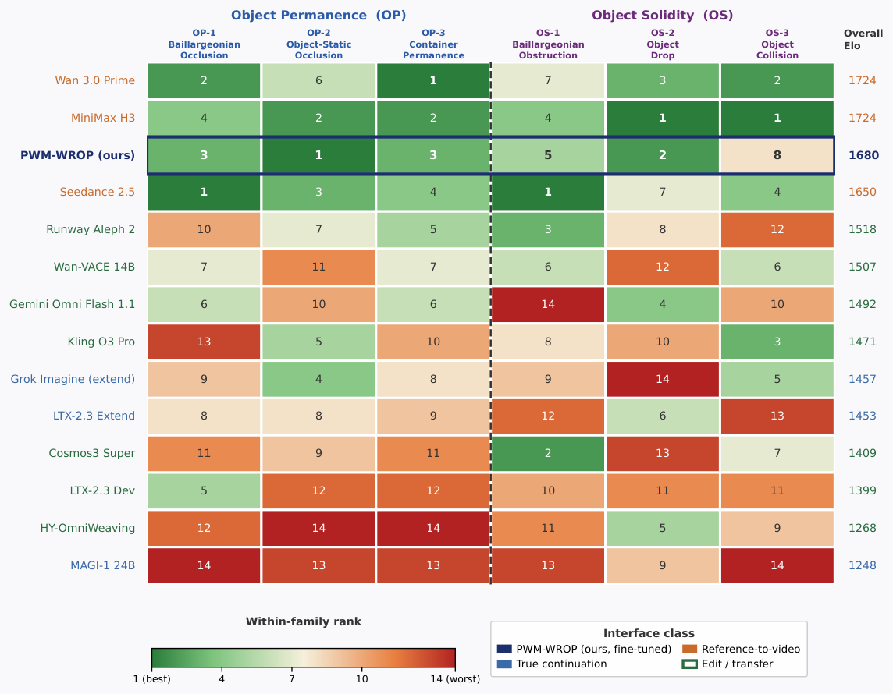

# Training Object Permanence in World Models 精读

> **论文**：Training Object Permanence in World Models
> **作者**：Carnegie Mellon University（AWS Trainium for Research 计划支持）
> **arXiv ID**：2609.28654（v1）
> **发表时间**：2026-09-25
> **代码仓库**：https://object-permanence.world（Data / Code / Benchmark / Model / Leaderboard 全开源）
## 第 1 章 概述

### 1.1 一句话定位

WROP（World Reasoning with Object Permanence，arXiv:2609.28654，Carnegie Mellon University，2026）是一项面向客体永久性与固体性的数据基础设施与评测体系：150 个 Blender 认知任务生成器构成 1.5M 样本训练语料与 300 题固定考试，在该语料上微调的 16B 真延续模型 PWM-WROP 在 14 模型盲测成对偏好研究中位列真延续模型第一、总榜第三，仅落后于两个 reference-to-video 模型的统计平局。

### 论文图表总览

| 图表 | 内容 | 所在章节 |
|---|---|---|
| Figure 2 | 六任务族分类图（OP×3 + OS×3，覆盖 150 个生成器） | §3 Dataset |
| Figure 5 | 总榜 Elo 森林图（14 模型，95% rater-clustered bootstrap CI） | §5.1.1 |
| Figure 6 | 分族排名热图（六任务族内 Bradley–Terry 名次） | §5.1.2 |
| Table 1 | 14 个评测模型的接口类别与分辨率 | §4.2 |
| Table 2 | 总榜（Elo、95% CI、胜率、判决数） | §5.1.1 |
| Table 3 | 自动指标（LPIPS/MS-SSIM/SSIM/PSNR/MSE/CLIP/FID） | §5.3 |
| Table 5 | Trainium2 吞吐优化记录（15.1 s/step → 5.71 s/step） | 附录 B |
| Table 6 | 分族 Elo 与族内名次（14 模型 × 六族） | 附录 C |

### 1.2 核心贡献

- **WROP 数据基础设施**：150 个手作 Blender 生成器按六认知任务族组织，结构参数（物体数/轨迹/遮挡配置/接触时序）与表层参数（颜色/材质/光照/相机）分离随机化，产出 1.5M 训练样本与 300 题固定考试，每样本附带自然语言 prompt、逐帧轨迹与场景元数据。
- **PWM-WROP 模型**：以 Cosmos3-Nano（16B）为基座，架构与 tokenizer 不变、仅改训练信号的 V2V 契约训练（输入半段为条件、目标半段为预测），是研究中唯一用 WROP 数据训练的模型，也是盲测人评中排名最高的真延续模型。
- **人评 + 自动指标的评测框架**：14 模型三类接口（真延续/reference-to-video/编辑迁移）统一推理 harness，20 名 rater 盲测成对偏好经 Bradley–Terry 拟合成 Elo（1000 次 rater 聚类 bootstrap），辅以 320×192 对齐的七项全参考指标与六个代表性定性案例。
- **Trainium2 原生训练栈（PWM）**：AWS Trainium2 上原生 PyTorch 实现（无 XLA 图追踪），TP4 × FSDP2(16) 覆盖 64 NeuronCores，含 fp32 master + bf16 计算、bit-exact 断点恢复与完整工程记录，训练吞吐经三次优化从 15.1 s/step 降至 5.71 s/step（12,454 tokens/s）。
- **全开源发布**：数据、考试、模型答案、分数、权重与训练栈全部开源（项目页 object-permanence.world）。

### 1.3 关键结果速览

- **总榜前三（Table 2）**：Wan 3.0 Prime 1723.6 Elo 与 MiniMax H3 1723.6 Elo 统计平局居首，PWM-WROP 以 1679.5 Elo、73.1% 胜率列第三；Top-1 概率分别为 46.8%、36.4%、12.3%。
- **真延续类内部**：PWM-WROP 领先次好真延续模型 Grok Imagine（1457.0 Elo）224 Elo；其余真延续模型 LTX-2.3 Extend 1453.4 Elo、MAGI-1 24B 1248.0 Elo。需注意各模型架构不同，差距不能全部归因于训练数据。
- **自动指标（Table 3，320×192 对齐）**：PWM-WROP LPIPS 0.081（次优 MiniMax H3 0.105）、MS-SSIM 0.921（次优 0.877）、MSE 2.97×10⁻³ 均为最优，CLIP 0.956 第二；720p 尺度末帧 LPIPS 0.166、FID 20.444 反映 320×192 原生分辨率 4 倍上采样的劣势。
- **分族表现（Table 6）**：PWM-WROP 在 OP-2（object-static occlusion）族内第 1，OP-1/OP-3 第 3，OS-2 第 2，OS-1 第 5，OS-3 仅第 8——微调对遮挡追踪比对接触动力学更有效。
- **规模数字**：150 生成器 × 10,000 样本 = 1.5M 训练样本；300 题考试（每生成器 2 题）；14 评测模型；20 名 rater；361 对跨模型判决（每模型 50–52 判决）。

## 第 2 章 研究背景与动机

### 2.1 视频生成模型作为世界模型

现代视频生成格局发端于去噪扩散概率模型（DDPM，Ho et al., 2020）及其 transformer 化扩展（Peebles & Xie, 2023；Blattmann et al., 2023）。前沿专有系统——Sora（OpenAI, 2025）、MovieGen（Polyak et al., 2024）、Veo 3.1（Google DeepMind, 2026）、Kling 2.6（Kuaishou, 2025）——已展示出高感知保真度与时序一致性；开源对应物 Wan2.2、HunyuanVideo、CogVideoX-1.5、LTX-2 达到了可比能力。一系列工作开始 probing 这类模型的推理能力（迷宫求解、时间归纳、抽象规则遵循等），使视频生成模型成为"可模拟结构化物理环境的世界模型"（LeCun, 2022）日益可信的候选。

然而一类特征性失败持续存在：**物体在遮挡物后消失，并在不可能的位置重新出现；或无偏转地穿过固体屏障**。这两类失败恰好对应人类物理智能的两个基础方面——客体永久性与固体性。论文进一步指出其结构性上游地位：允许物体互穿的模型不可能生成物理有效的碰撞或支撑移除事件，任何高层场景构造或因果推理都会继承这些错误。后续 §5.2 定性分析归纳的典型失败形态还包括：物体穿过孔径小于自身的挡板（最普遍的失败）、支撑移除后物体悬浮数帧才坠落、碰撞过程中物体凭空增减或消失（如台球开球时球数从 7 个增至 12+、被撞球消失）。

### 2.2 认知科学基础

客体永久性思想兼有哲学与发展科学根源：Kant（1929）将对象的持续存在视为经验的形式前提；Wittgenstein（1976）主张因果直觉植根于原始知觉觉察而非习得推断。

**Piaget（1954）** 将客体永久性视为感知运动期的标志性认知成就，认为它经由基于动作的经验渐进发展。后续实验工作细化并提前了这一时间表：

- **Baillargeon（1986）的 violation-of-expectation（VoE）范式**表明，婴儿最早在 **3.5 个月** 即表征被遮挡物体的持续存在与位置；containment（容器内包含）期望在一岁末之前形成（Hespos & Baillargeon, 2001）；对期望违反事件婴儿表现出可测量的定向与探索行为（Stahl & Feigenson, 2015）。
- **固体性以相当的早熟性出现**（Sanford, 1967）：婴儿在**出生后半年内**即可区分遵守与违反固体表面不可穿透性的事件（Baillargeon et al., 1985；Hespos & VanMarle, 2012），将该约束扩展到有生命主体（Saxe et al., 2006），并用其预测支撑移除事件的结果（Hood et al., 2000）；Falck et al.（2020）进一步表明固体性约束在成人视觉认知中仍以自动、非推理的反应形式存在。

**Spelke & Kinzler（2007）的核心知识框架**将 OP 与 OS 归入核心知识系统：领域特定的表征系统，在发展早期即投入运作，为后续物理推断提供脚手架（Carey, 2009）。WROP 的六任务族（OP-1 Baillargeonian_Occlusion、OP-2 Object_Static_Occlusion、OP-3 Container_Permanence、OS-1 Baillargeonian_Obstruction、OS-2 Object_Drop、OS-3 Object_Collision，任务数 26/29/35/20/21/19）正是按 OP/OS 两个认知维度对这一框架的直接操作化。

### 2.3 现有基准的缺口

尽管对视频模型推理能力的考察已有相当积累，现有研究在评测对象上共享三个缺口：

1. **覆盖以二维环境为主**，缺乏三维场景中的 OP/OS 评测；
2. **仅覆盖 image-to-video 设定**，不涉及 video-to-video（V2V）——一个有大量真实用例、且正是 OP/OS 推断发生的关键接口；
3. **没有任何基准针对物体身份、物理约束与因果后果的结构化物理推断**——即类人世界模型的基础能力——提供专项评测。

此外，现有基准还有结构性限制：每任务总规模小、缺少或仅有极小的训练 split、普遍依赖 VLM 打分。最后一点对直觉物理基准尤为致命：多模态语言模型被证明存在系统性的核心知识缺陷（Li et al., 2025）、无法推理物理变换（Luo et al., 2026）、缺乏可靠的知觉恒常性（Sun et al., 2025）——即 VLM 裁判恰恰在被测能力上不可靠。

WROP 的应对是核心认知路线：以严格操作化的认知科学任务范式（VoE 遮挡、容器永久性、固体阻挡、坠落、碰撞）构建大规模三维 Blender 训练数据仓库，配套固定 300 题考试与人类盲测偏好作为主指标，从数据、评测与训练三方面同时补齐上述缺口。
## 第 3 章 WROP 数据基础设施

### 3.1 认知分类学：六任务族

WROP 的 150 个生成器按两个认知维度组织成六族（论文 Figure 2）——三族探客体永久性（OP：遮挡下维持并复原物体表征），三族探固体性（OS：生成固体边界的力学后果）。每族脱胎于发展心理学的经典实验范式：

| 族 | 任务数 | 认知探针 | 范式来源 | 结构参数 |
|:---|:---:|:---|:---|:---|
| OP-1 Baillargeonian Occlusion | 26 | 目标物过遮挡物后须以原身份/尺寸/方向重现（隧道、屏风、栏杆） | Baillargeon 1986 | 物体数、轨道拓扑（直/曲/多程）、遮挡不透明度、遮挡时长 |
| OP-2 Object Static Occlusion | 29 | 移动遮挡物撤走后静态物体配置（数量/身份/排列）不变 | Stahl & Feigenson 2015; Wynn 1992 | 遮挡运动型（平移/旋转/分板）、覆盖率、物体数、揭示动力学 |
| OP-3 Container Permanence | 35 | 容器内隐藏物随容器位移/旋转/交换更新位置（抽屉、壳游戏、转盘） | Hespos & Baillargeon 2001 | 容器状态、闭合机制、容器数与交换次数、路径复杂度 |
| OS-1 Baillargeonian Obstruction | 20 | 孔径小于物体→阻挡，大于→通过（尺寸闸门、闸落、漏斗） | Baillargeon et al. 1985; Hood et al. 2000 | 障碍型（平面/斜角/复合/多层）、孔径比、接近速度 |
| OS-2 Object Drop | 21 | 支撑撤除→立即坠落（活板门、抽桌布、炸弹舱门） | Hespos & VanMarle 2012 | 撤除机制、物体型、因果链可见性、尺寸过滤配置 |
| OS-3 Object Collision | 19 | 碰撞后所有物体守恒且沿发散轨迹散开（台球、牛顿摆、跷跷板） | Sanford 1967 | 物体数、碰撞几何（正碰/擦碰/链传）、冲击对称性 |

每个生成器内参数分两层随机化：**结构参数**（物体数、几何、轨迹、遮挡配置、接触时序）定义物理与认知挑战，系统变化防止记忆固定答案；**表层参数**（颜色、材质、光照、相机视角）独立随机，在不改变物理问题的前提下最大化视觉多样性。关键设计：**关键物理事件起于或晚于时间中点**——输入半段建立事件前场景，目标半段捕捉事件及其后果，与 V2V 评测协议对齐。

代表性设计如 `Marked_Boxes_Swap`（OP-3）：两个带标记的盒子分别盖住不同物体后交换屏幕位置再打开，每个物体仍与原标记盒对应——模型无法用最终位置作答，必须透过运动与遮挡追踪盒子身份与隐藏内容。

### 3.2 数据规模与样本结构

- **训练语料**：150 生成器 × 10,000 样本 = **1,500,000 样本**
- **评测考试**：固定 **300 题**（每生成器 2 题）
- 每样本 = 五元组：60 帧输入视频 + 60 帧目标视频 + 自然语言 prompt + 逐帧物体位姿轨迹 + 场景状态元数据
- 源自动画：每样本渲染为 120 帧 @1280×720、24 fps，在关键事件起切于第 60 帧对齐拆分
- ⚠️ **无物理引擎**：全部轨迹为 Blender 关键帧手作动画（解析式编写），遮挡、接触、重现发生在受控帧；物理合理性由场景作者负责而非模拟器——保证认知结构精确受控，但数据分布限于作者的设计空间

### 3.3 生成管线与质量保障

三阶段流水线：(1) 每任务实现为自包含、参数化的 Blender 生成器（对象语义角色、场景几何、初始条件、关键帧运动与接触事件、相机、prompt、期望物理结果）；(2) 共享驱动经统一渲染后端（**Blender 4.4.3、EEVEE Next**）执行，记录随机种子控制表层变化、保留 authored 几何与物理机制，产出 120 帧动画在第 60 帧拆分；(3) 并行 worker 大规模生成（失败渲染自动重试并记录），每个样本过自动校验后准入：五元组齐备可读、两段帧率一致、恰含 60 帧且在第 60 帧无缝衔接、轨迹与元数据字段完整（生成器 ID/样本索引/种子/渲染配置可溯源）。发布前每生成器抽样人工复检任务定义与切分边界。

## 第 4 章 PWM-WROP：在 Cosmos3-Nano 上微调

### 4.1 训练设定

PWM-WROP 从 **Cosmos3-Nano**（NVIDIA 2026）微调，仅改变训练信号——架构与 tokenizer 与基座完全一致。训练直接使用 WROP 的 V2V 契约：样本输入半段为条件 clip、目标半段为预测目标，关键物理事件总是落在模型须生成的帧内；不使用任何任务标签、族名或 clip+prompt 之外的监督。

| 配置 | 值 |
|:---|:---|
| 基座 | Cosmos3-Nano（16B，36 层） |
| 训练数据 | 1.5M 样本 1 epoch（同 150 生成器的早期一批渲染） |
| 训练几何 | 117 帧打包 @320×192（57 条件帧 + 60 预测帧） |
| 文本条件 | 每样本自然语言 prompt |
| 评测几何 | 与训练一致（UniPC 35 步、guidance 6.0、shift 10.0、固定种子） |

### 4.2 接口类：榜单的结构性变量

14 个被评模型分三类接口（论文 Table 1），这是理解全部结果的前提：

| 接口类 | 定义 | 模型 |
|:---|:---|:---|
| 真延续（True continuation） | 源 clip 为前缀，合成其后的帧 | PWM-WROP、MAGI-1 24B（1280×720/77 帧）、LTX-2.3 Extend（1080p/145 帧）、Grok Imagine extend（720p/132 帧） |
| 参考到视频（Reference-to-video） | 源为视觉参考，按 prompt 在自己的时间轴上重建整个事件 | Seedance 2.5、Wan 3.0 Prime（720p/30fps/90 帧）、MiniMax H3（1344×768/124 帧） |
| 编辑/迁移（Edit/transfer） | 逐帧重绘源区间，输出与输入占同一时间窗 | Wan-VACE 14B、HY-OmniWeaving、LTX-2.3 Dev（IC-LoRA）、Cosmos3 Super、Kling O3 Pro、Gemini Omni Flash 1.1、Runway Aleph 2 |

编辑模型在结构上无法描绘遮挡边界之后展开的事件——输出区间与输入重合；参考到视频模型则无需从 clip 末帧延续，可整体重造物理连贯的场景，代价是可能偏离输入的物体身份与空间布局。

### 4.3 统一推理协议

所有模型经一个 harness 评测：prompt 逐字传递（无 CoT 包装、无任务标签）、能关的服务端 prompt 扩写全部关闭、ffprobe 校验输出几何后才准入。开权重模型按上游推荐分辨率/采样设置本地隔离运行（MAGI-1 24B 与 Cosmos3 Super 需多卡节点）；专有模型走托管 API（除 Runway 外均经同一聚合商）。短于 provider 最小长度的输入以前帧重复前垫（保持事件时序，垫充时长逐次记录）；拼接型输出在评估前裁剪到预测段（LTX-2.3 Extend 弃前 3.25s、Grok 弃前 60 帧、Kling 弃 0.5s 前垫）。90 帧题目的延长请求按时长推导（3.75s 而非 2.5s）。

### 4.4 人评设计与自动指标

**人评（主指标）**：盲测成对比较。clip 统一归一化到 1280×720、24 fps、静音、同码率；rater 看输入视频 + prompt 后在两个匿名随机排序的延续（A/B）中选择或判「约同」，判据三条合并：文本对齐、运动自然与物理合理、客体永久性（物体不消失/不凭空出现/不穿墙/遮挡后不改色形数）。**20 名众包 rater**（资格线 8/10，中位 9/10）：注意力检查通过率 90.0%、重复项自一致 93.5%（Cohen's κ=0.891）、无位置偏置（左置偏好 51.4%，p=0.615）。120 个候选模型对 × 4 题调度，得 476/480 判决、361 对落异模型（每模型 50-52 判决）；Bradley–Terry 聚合（tie=半胜，Elo 均值 1500），1000 次 rater 聚类 bootstrap 出 CI。

**自动指标（次指标）**：全参考指标对目标视频计算，各模型预测段重采样到目标帧数、统一 320×192（评测池最低原生分辨率）以等化空间尺度：像素级（MSE/MAE）、信号保真（PSNR/SSIM/MS-SSIM）、感知（LPIPS）、时序（temporal-difference L1）、末帧变体与 CLIP/FID。⚠️ 论文明确这些指标衡量**参考贴合度而非物理推理正确性**——忠实重绘事件前静态场景的编辑模型可刷高 SSIM 而从不生成物体重现。

## 第 5 章 实验结果与分析

### 5.1 总榜：接口类型压倒模型规模

**Table 2 盲测偏好总榜**（Bradley–Terry Elo，均值 1500；95% CI 为 rater 聚类 bootstrap）：

| Rank | Model | 接口类 | Elo | 95% CI | 胜率 | 判决数 |
|:---:|:---|:---|:---:|:---|:---:|:---:|
| 1 | Wan 3.0 Prime | Ref-to-video | 1723.6 | [1629.2, 1864.9] | 77.9% | 52 |
| 2 | MiniMax H3 | Ref-to-video | 1723.6 | [1644.5, 1837.6] | 77.9% | 52 |
| 3 | **PWM-WROP (ours)** | True cont. | **1679.5** | [1603.5, 1781.5] | 73.1% | 52 |
| 4 | Seedance 2.5 | Ref-to-video | 1649.6 | [1554.2, 1751.5] | 69.6% | 51 |
| 5 | Runway Aleph 2 | Edit/transfer | 1518.3 | [1425.1, 1621.6] | 52.9% | 51 |
| 6 | Wan-VACE 14B | Edit/transfer | 1506.7 | [1429.9, 1590.8] | 51.0% | 52 |
| 7 | Gemini Omni Flash 1.1 | Edit/transfer | 1492.5 | [1404.1, 1572.9] | 49.0% | 52 |
| 8 | Kling O3 Pro | Edit/transfer | 1471.3 | [1404.0, 1534.0] | 46.2% | 52 |
| 9 | Grok Imagine (extend) | True cont. | 1457.0 | [1362.7, 1555.1] | 44.2% | 52 |
| 10 | LTX-2.3 Extend | True cont. | 1453.4 | [1363.6, 1545.8] | 43.1% | 51 |
| 11 | Cosmos3 Super | Edit/transfer | 1409.2 | [1318.2, 1488.7] | 37.3% | 51 |
| 12 | LTX-2.3 Dev | Edit/transfer | 1398.9 | [1297.7, 1482.3] | 36.5% | 52 |
| 13 | HY-OmniWeaving | Edit/transfer | 1268.5 | [1159.4, 1344.2] | 21.0% | 50 |
| 14 | MAGI-1 24B | True cont. | 1248.0 | [1137.2, 1315.6] | 19.2% | 52 |

三个关键读数：

1. **参考到视频双雄并列第一**（1723.6），且与 PWM-WROP 构成统计上未分胜负的前三；bootstrap top-1 概率 Wan 46.8% / MiniMax 36.4% / PWM-WROP 12.3% / Seedance 4.5%，其余模型为 0。
2. **PWM-WROP 领先次好真延续模型 224 Elo**（1679.5 vs Grok Imagine 1457.0），且以 320×192 原生分辨率对抗对手的 720p/1080p——认知数据微调是真延续类内提升的主因（但模型架构混杂，不能全归训练）。
3. **接口类型比规模更能解释榜单**：第 5-11 名中 7 个编辑模型挤在 109 Elo 内（CI 重叠难以区分）——逐帧重绘使其结构上难以生成输入结束之后的事件，无论个别模型强弱。专有模型（Gemini Omni Flash 1.1、Kling O3 Pro）混在开权重模型中间。

### 5.2 分族拆解：OP 与 OS 需要不同表征

**Table 6 分族 Elo 与族内排名**（Elo，括号内为族内名次）：

| Model | 总榜 | OP-1 | OP-2 | OP-3 | OS-1 | OS-2 | OS-3 |
|:---|:---:|:---:|:---:|:---:|:---:|:---:|:---:|
| Wan 3.0 Prime | 1723.6 | 1670(2) | 1559(6) | 1730(1) | 1558(7) | 1749(3) | 1915(2) |
| MiniMax H3 | 1723.6 | 1614(4) | 1689(2) | 1707(2) | 1625(4) | 1868(1) | 1925(1) |
| PWM-WROP (ours) | 1679.5 | 1616(3) | **1785(1)** | 1692(3) | 1604(5) | 1825(2) | 1394(8) |
| Seedance 2.5 | 1649.6 | **1710(1)** | 1644(3) | 1656(4) | **1687(1)** | 1489(7) | 1714(4) |
| Kling O3 Pro | 1471.3 | 1373(13) | 1580(5) | 1412(10) | 1543(8) | 1405(10) | 1757(3) |
| Cosmos3 Super | 1409.2 | 1426(11) | 1464(9) | 1354(11) | **1660(2)** | 1263(13) | 1395(7) |
| MAGI-1 24B | 1248.0 | 1231(14) | 1214(13) | 1264(13) | 1280(13) | 1448(9) | 1013(14) |

（完整 14 行见论文 Table 6；此处列总榜前四 + 接口类代表；分族 CI 较宽，模式以跨族一致者为可靠。）



*图2：论文 Figure 6——14 模型 × 六任务族的族内 Bradley–Terry 排名热图。PWM-WROP 在 OP-2（静态遮挡）族内第一，OP-1/OP-3 第三，OS-2 第二，但 OS-3（碰撞）跌至第八。*

三条模式：

- **PWM-WROP 的 OP 强于 OS**：OP-2 第 1、OP-1/OP-3 第 3、OS-2 第 2，但 OS-1 第 5、OS-3 第 8——遮挡追踪（维持表征）与接触动力学（力学后果推演）可能需要不同内部表征，当前微调对前者更有效。
- **参考到视频的优势主要来自 OS**：MiniMax H3 在 OS-2/OS-3 双第一（各 100% 胜率）；Wan 3.0 Prime OP-3 第一、OS-3 第二。其 OP 排名相对温和——重建自由度对固体性任务有利（可整体重造力学连贯场景），对遮挡追踪不利（须严格保持输入的物体与布局）。
- **例外模式**：Seedance 2.5 总榜第四但在 OP-1 与 OS-1 双第一，显示逐族剖面与总榜的分化；Cosmos3 Super 总榜 11 名却在 OS-1 第二，其边缘控制接口可能利于阻挡类任务。

### 5.3 定性分析：两类系统性失败

论文对每族选一个代表性生成器做同任务同样本对比（六个案例的关键对照）：

| 案例 | 任务 | PWM-WROP | 对手失败 |
|:---|:---|:---|:---|
| G43 三球平行隧道 (OP-1) | 三球过不透明隧道后原车道/颜色/数量复出 | ✅ 三球正确复出 | Gemini Omni Flash：多出第 4 个球+车道错乱 |
| G19 滑屏遮挡 (OP-2) | 屏移开后三物体原排列复原 | ✅ 原样复原 | Seedance 2.5：屏尺寸错位+物体在屏移开后凭空出现 |
| G66 旋转转盘杯 (OP-3) | 转盘 180° 后开对原前杯（现后位） | ✅ 球随杯更新 | Seedance 2.5：按转盘位置而非杯身份追踪，开错杯 |
| G10 尺寸闸门 (OS-1) | 半径孔径挡板应挡球 | ✅ 球减速停在挡板 | Seedance/MiniMax/Wan：穿墙而过（评测中最普遍失败） |
| G27 支撑移除 (OS-2) | 板抽走后球应立即坠落落地 | ✅ 连续坠落落地 | Seedance 2.5：球悬浮数帧才缓落+拆掉整个支撑结构 |
| G137 台球开球 (OS-3) | 七球散射守恒 | ✅ 无增减正常散射 | Gemini Omni Flash：碰前加球（7→12+）、碰后紫球消失 |

归纳出**两类跨 OP/OS 的系统性失败**：**表征脱落**（representation dropout）——画面合理但丢失「what is where」的追踪（球不回原道、物体凭空出现、开错杯、穿墙）；**因果脱钩**（causal decoupling）——单个事件看着合理但物理关系未连接（支撑消失球不落、碰撞后数量改变）。分族 Elo 与之一致：遮挡追踪强者可在阻挡/碰撞任务上弱，反之亦然。

### 5.4 自动指标：目标贴合而非物理正确

**Table 3 全参考指标**（320×192 统一尺度，预测段裁剪后；†Runway n=297，API 拒 3 条超长 prompt，其余 n=300）：

| Model | LPIPS↓ | MS-SSIM↑ | SSIM↑ | PSNR↑ | MSE(×10⁻³)↓ | CLIP↑ | FID↓ |
|:---|:---:|:---:|:---:|:---:|:---:|:---:|:---:|
| Wan 3.0 Prime | 0.115 | 0.861 | **0.942** | 27.15 | 4.48 | 0.948 | 15.1 |
| MiniMax H3 | 0.105 | 0.877 | 0.938 | **27.51** | 9.09 | **0.962** | 14.8 |
| **PWM-WROP (ours)** | **0.081** | **0.921** | 0.917 | 26.45 | **2.97** | 0.956 | 20.4 |
| Seedance 2.5 | 0.282 | 0.616 | 0.770 | 18.37 | 28.55 | 0.928 | 24.6 |
| Runway Aleph 2† | 0.181 | 0.789 | 0.918 | 24.98 | 9.71 | 0.918 | 19.7 |
| Wan-VACE 14B | 0.349 | 0.744 | 0.842 | 17.88 | 24.21 | 0.872 | 33.0 |
| Gemini Omni Flash 1.1 | 0.151 | 0.830 | 0.937 | 26.81 | 3.88 | 0.943 | 17.0 |
| Kling O3 Pro | 0.163 | 0.818 | 0.933 | 26.10 | 4.73 | 0.932 | 18.0 |
| Grok Imagine | 0.125 | 0.852 | 0.932 | 26.98 | 5.52 | 0.956 | **13.6** |
| LTX-2.3 Extend | 0.183 | 0.789 | 0.886 | 23.14 | 11.08 | 0.931 | 21.5 |
| Cosmos3 Super | 0.340 | 0.594 | 0.768 | 15.03 | 40.59 | 0.853 | 46.3 |
| LTX-2.3 Dev | 0.289 | 0.726 | 0.824 | 21.09 | 10.06 | 0.869 | 73.7 |
| HY-OmniWeaving | 0.247 | 0.716 | 0.874 | 22.41 | 17.61 | 0.875 | 43.8 |
| MAGI-1 24B | 0.260 | 0.681 | 0.853 | 21.59 | 20.66 | 0.923 | 26.6 |

PWM-WROP 在 LPIPS（0.081，次优 0.105）、MS-SSIM（0.921，次优 0.877）、MSE/MAE、末帧 MSE 全部最优，CLIP 第二——证明其 320×192 低分辨率输出在等尺度对比下不损失像素保真。PSNR/SSIM 偏低，720p 尺度的末帧 LPIPS（0.166）与 FID（20.444）因四倍上采样处于劣势。论文的定位明确：全参考指标是视觉与几何一致性的诊断工具，不是物理推理质量的主度量——正确追踪遮挡物的真延续模型若轨迹时序与真值不同，像素误差仍会偏高。

## 第 6 章 训练基础设施：AWS Trainium2 上的原生 PyTorch 栈

PWM（post-training world-model stack）是随论文一并开源的训练栈，在 AWS Trainium2 上以原生 PyTorch 训练与采样 Cosmos3-Nano，全程不经过 XLA 图追踪。它承载了 PWM-WROP 的全部训练，其完整的工程记录（吞吐测量、步时分解、八条工程发现与正确性门）本身构成论文贡献之一。

### 6.1 栈设计

**分片与编译。** 栈直接加载公开 diffusers 布局权重，经 DTensor 在一个二维设备网格（张量并行 × FSDP2）上分片；每个 Mixture-of-Transformers 块以静态形状编译一次。计算用 bf16，FSDP2 之下维护 fp32 master 权重；断点按 rank 写出，支持 bit-exact 恢复，并可合并回 diffusers 布局。

**硬件与生产布局。** 实验在单台 trn2.48xlarge 上进行：16 颗 Trainium2 芯片经 NeuronLink 互联、暴露为 64 个逻辑 NeuronCore。36 层模型的生产布局为张量并行度 4 × FSDP 度 16，恰好覆盖 64 核。推理仅需张量并行组（bf16 权重 29 GB，每核 7.3 GB），因而也能装进 4 核的 trn2.3xlarge。

**配置与预检。** 单个 YAML 文件声明几何与并行布局，CLI 将自身重启为 torchrun 下的 tp×fsdp 个进程。所有可检测的误配置在第一步训练前即被拒绝，共八项：

| 预检项 |
|---|
| 非整数 patch 形状 |
| 张量并行度不整除注意力头数 |
| 空的 checkpoint 目录 |
| bf16 训练却无 fp32 master |
| 进程数与设备网格不一致 |
| clip 几何与声明配置不符 |
| 恢复运行的配置与断点不同 |
| checkpoint 目录容量小于本次运行所需 |

配置片段（示意）：

```yaml
# 示意：几何与并行布局
geometry:
  frames: 30            # latent 帧数（117 视频帧）
  resolution: [288, 512]
  batch_size: 16
parallel:
  tp: 4                 # 张量并行度，须整除注意力头数
  fsdp: 16              # 4 × 16 = 64 NeuronCores
precision:
  compute: bf16
  master: fp32          # bf16 训练必须带 fp32 master，否则预检拒绝
checkpoint:
  per_rank: true        # 按 rank 写出，支持 bit-exact 恢复
```

### 6.2 吞吐优化历程

在 288×512、30-latent 帧几何（对应 117 视频帧；每样本 4,448 token：128 文本 + 4,320 视觉；batch 16）下，经两次优化步时从 15.1 s 降至 5.71 s，每次优化都验证了 loss 轨迹逐步不变：

| 配置 | s/step | tokens/s |
|---|---|---|
| 首个可用的 64 核运行 | 15.1 | 4,705 |
| + reduce-scatter copy-in 重写（行拼接） | 6.74 | 10,564 |
| + multi-tensor AdamW（每步一次同步）；FSDP2 prefetch 深度 2 | 5.71 | 12,454 |

两步优化各针对一个被 profiling 暴露的瓶颈：第一步把 FSDP2 reduce-scatter 的默认 chunk 拼接 copy-in 换成行拼接变体（输出经验证逐位一致）；第二步把逐参数的单 tensor AdamW 换成 multi-tensor 实现，并将 FSDP2 预取深度设为 2，让通信与下一块计算重叠。

### 6.3 步时分解

在 6.74 s/step 的中间配置上，块前向与反向合计 3.4 s，其余由集合通信与优化器阶段构成（各阶段之间存在重叠）：

| 阶段 | 耗时 |
|---|---|
| 块前向 + 反向 | 3.4 s |
| FSDP2 all-gather（75 次调用） | 1.8 s |
| reduce-scatter | 1.4 s |
| root 单元 all-gather（嵌入 + 头 + 损失） | 1.25 s |
| 优化器 | 1.25 s |
| 梯度裁剪 | 0.37 s |

关键判断来自"降 FSDP 度是否提速"的反例：不会。集合通信是**延迟束缚**的——200 MB 的载荷 24 ms 完成——所以收益来自**消除集合通信本身，而非减小其载荷**。这解释了 6.4 中两条最大优化（重写 copy-in、合并优化器 kernel）都作用于"减少/合并操作次数"而非数据量。

### 6.4 八条工程发现

附录 B 记录的工程发现适用于在该后端上以原生 PyTorch 训练大模型的广泛场景：

| # | 发现 | 关键数字 |
|---|---|---|
| 1 | load-then-shard 碎片化显存：先物化完整 fp32 张量并行分片再交给 FSDP2 切分，会挤掉 root 单元的 reduce buffer，首次反向即失败；须边加载边交错分片 | 14.6 GB 分片 vs 2.5 GB reduce buffer |
| 2 | FSDP2 reduce-scatter 的 copy-in 是主瓶颈：默认 chunk 拼接实现单步耗 7.9 s（15.9 s 步中的近半）；换行拼接变体（输出逐位一致）后步时降 2.25× | 7.9 s / 15.9 s 步；2.25× |
| 3 | 张量并行下复制参数的梯度会漂移：跨 TP 组复制的参数 100 步后相对漂移 5.9×10⁻⁵；现改为每步显式同步其梯度 | 5.9×10⁻⁵ / 100 步 |
| 4 | 单 tensor AdamW 是 launch-bound 的：默认实现每参数约 10 次 kernel launch、22 次主机同步；multi-tensor 实现每步仅一次同步，优化器耗时从 1,324 ms 降至 126 ms，且参数与动量五步内逐位相等（单 rank 662 个张量） | 1,324 ms → 126 ms |
| 5 | 复制的词表嵌入阻塞下一步优化：前后向之间保持块不分片会撞上 root 单元 2.49 GB 的 fp32 reduce buffer（151,936×4,096 嵌入跨 TP 组复制）；候选修复是跨组切分词表或微调时冻结文本嵌入——撰写时仍未决 | 2.49 GB；151,936×4,096 |
| 6 | 融合注意力核有几何约束：NKI flash-attention 路径反向限制序列 ≤8,192 token，排除 720p 几何；尚未与编译版 SDPA 做端到端 A/B，发布默认仍是后者 | ≤8,192 token |
| 7 | 编译块禁止回退主机执行：任一算子回退主机就会把亚秒级块膨胀到数秒级 | 亚秒 → 数秒 |
| 8 | 输入 pad 到统一形状：文本 prompt pad 到训练文本长度（pad 部分从视觉 token 中 mask 掉），使每个输入编译为单一形状——这是静态形状编译（发现 7）得以成立的前提 | — |

### 6.5 正确性门

吞吐测量之前，移植先通过一组正确性门：

- **CPU 位级前向一致**：与上游参考实现逐位一致；两层真实权重下误差 7×10⁻⁷。
- **64-rank bit-exact 恢复**：断点恢复在全部 64 rank 上逐位重现；全量 64-rank 断点占 162 GiB。
- **过拟合检验**：上游 6 个示例 clip 上 sample-to-source cosine 0.979；在本研究物理渲染的 64 个 clip 上按 V2V 协议过拟合，延续半段 cosine 0.993–0.999（基座模型 0.85–0.995），条件半段锁定 1.000。
- **跨移植同种子一致**：与早期独立移植的同种子采样 latent cosine 0.88–0.97（5 个 prompt），残余差异归因于核级数值差异在 35 步采样器上的累积。

这组门的含义是：6.2 的三次吞吐配置在数值上互认——优化只改执行方式，不改训练动力学。

## 第 7 章 局限性与延伸阅读

### 7.1 局限性

论文对自身证据强度的限制相当坦率，可归纳为六点：

1. **bootstrap 置信区间宽**。主榜拟合仅 361 对跨模型判决（每模型 50–52 判决），95% rater 聚类 bootstrap 区间普遍宽（如 PWM-WROP [1603.5, 1781.5]）；分到六族后每族判决更少，附录 C 明言分族模式只有在跨族一致或被定性分析佐证时才可靠。
2. **架构混杂，训练归因不纯**。PWM-WROP 领先次好真延续模型 224 Elo，但各模型架构亦不同，差距不能全部归因于 WROP 训练数据——支持"认知原则化合成数据有效"的证据是初步的（preliminary evidence）。
3. **自动指标受接口类混淆**。全参考指标衡量的是与目标视频的贴合而非物理正确性：编辑模型重绘事件前场景即可刷高 SSIM/LPIPS，而正确追踪遮挡物的真延续模型可能因轨迹（尤其时序）与真值不同而在像素空间失分；故七项指标定位为视觉与几何一致性的诊断，不用于排名。
4. **320×192 原生低分辨率**。PWM-WROP 与 720p/1080p 竞品同榜；对齐尺度下最优（LPIPS 0.081），但 720p 尺度末帧 LPIPS 0.166、FID 20.444，反映 4 倍上采样的分辨率劣势。
5. **VLM 裁判不可用，人评成本高**。多模态语言模型恰在被测能力上不可靠（系统性核心知识缺陷、无法推理物理变换、缺乏知觉恒常性），迫使主指标采用 20 名众包 rater 的盲测——资格筛选（阈值 8/10）、注意力检查、重复项自一致等质控环节均是不可省略的固定开销，且判决量受人力约束（即第 1 条的根源）。
6. **关键帧手作动画而非物理引擎**。全部运动以 Blender 关键帧解析式编写，不用刚体求解器；遮挡、接触与重现发生在受控帧上，但物理合理性由场景作者而非模拟器负责——检查中发现互穿等物理违规时靠人工修订场景几何、轨迹与接触时序，真值的"物理正确"上限是作者的质量把关而非仿真保证。

### 7.2 延伸阅读

| 主题 | 代表文献 | 与本文的关系 |
|---|---|---|
| 核心知识（认知科学） | Piaget (1954)；Baillargeon (1986)；Baillargeon et al. (1985)；Spelke & Kinzler (2007)；Carey (2009)；Hespos & Baillargeon (2001)；Hespos & VanMarle (2012)；Hood et al. (2000)；Stahl & Feigenson (2015)；Sanford (1967)；Wynn (1992)；Falck et al. (2020)；Saxe et al. (2006) | 六任务族的实验范式来源；OP/OS 作为核心知识系统的发展心理学与成人视觉认知证据 |
| 视频世界模型 | LeCun (2022)；Ho et al. (2020)；Peebles & Xie (2023)；Blattmann et al. (2023)；Sora (OpenAI, 2025)；MovieGen (Polyak et al., 2024)；Veo 3.1 (Google DeepMind, 2026)；Kling 2.6 (Kuaishou, 2025)；Wan2.2 (WanTeam, 2025)；HunyuanVideo (Kong et al., 2024)；CogVideoX-1.5 (Yang et al., 2024)；LTX-2 (HaCohen et al., 2026)；Cosmos3 (NVIDIA, 2026) | 被测对象与基座谱系；DDPM→DiT→视频生成的技术线索；Cosmos3-Nano 即 PWM-WROP 基座 |
| 视频推理评测 | Xu et al. (2026)；Wang et al. (2026)；Guo et al. (2025)；Liu et al. (2025)；Cai et al. (2025)；Wiedemer et al. (2025)；Yang et al. (2025)；He et al. (2025) | 视频生成模型推理能力考察（迷宫求解、时间归纳、抽象规则遵循）；WROP 补齐其三维、V2V、结构化物理推断三个缺口 |
| VLM 物理推理缺陷 | Li et al. (2025)；Luo et al. (2026)；Sun et al. (2025) | 排除 VLM 裁判的直接依据：核心知识缺陷、物理变换推理失败、知觉恒常性缺失 |
