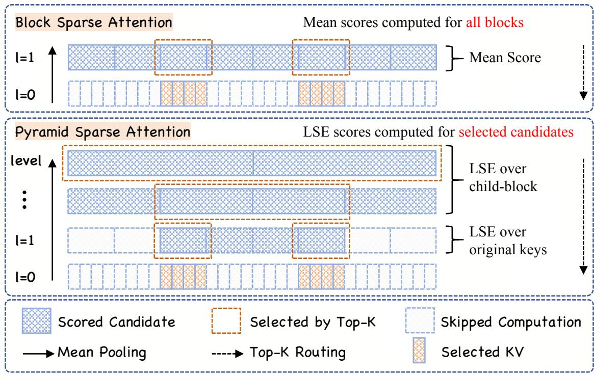
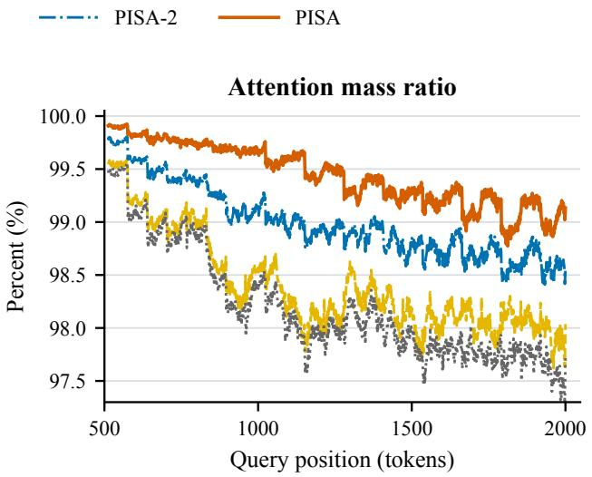
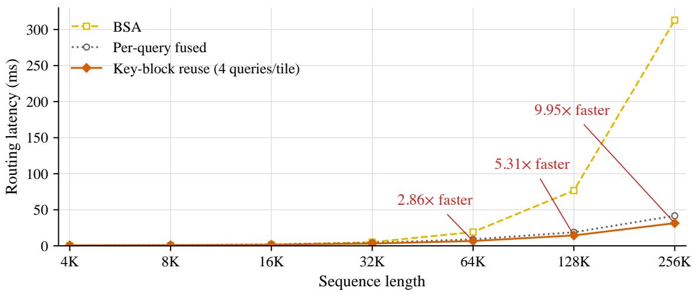

# Block Sparse Attention with Log-Linear Complexity 精读

> **论文**：Block Sparse Attention with Log-Linear Complexity
> **作者**：Bohao Tang, Zhen Qin, Yuqi Pan, Zheng Li, Pengfei Liu（Shanghai Jiao Tong University / Shanghai Innovation Institute / ByteDance Seed）
> **arXiv ID**：2609.31093
> **发表时间**：2026-09-25
> **代码仓库**：项目页 https://github.com/qqtang-code/PISA-Project-Page（无代码发布）

## 第 1 章 概述

### 1.1 一句话定位

PISA（Pyramid Sparse Attention）指出块稀疏注意力（Block Sparse Attention, BSA）的真正瓶颈不在对所选块的注意力计算（线性），而在对全部 query–block 对打分的 Top-K 块选择阶段（$O(N^2 d/C)$）：它在由细到粗均值池化构建的 $O(\log N)$ 层 key 金字塔上做由粗到细的层级 Top-K 选择，每层只用 LogSumExp（LSE）分数对不超过 $gK$ 个有界候选打分并逐层扩展，从而把块选择复杂度降为 prefill $O(N\log N)$、decode 每步平均 $O(\log N)$，并配套训练/prefill（两阶段）与 decode（单阶段）两套 Triton kernel；在 418M/1.47B/2.67B 三个规模上，语言建模与常识推理性能与 BSA/NSA/HiLS 相当，检索类任务（containment、RULER）更好，长序列块选择延迟显著低于 BSA。

### 论文图表总览

| 编号 | 内容 | 所在章节 |
|---|---|---|
| Figure 1 | BSA 与 PISA 两种 Top-K 块选择方法对比：BSA 先对每个 key 块打分再 Top-K；PISA 由细到粗均值池化构建层级，选择时由粗到细只扩展所选候选，中间块用子 summary 的 LSE 打分、叶块用原始 key 的精确 LSE 打分 | §3.1–3.2（Method） |
| Figure 2 | 块选择质量：100 条 FDA prompt 上用同一 Full-Attention 检查点的 query/key 重放各选择器，按 query 位置画平均 Recall@8 与 attention mass ratio 曲线（$K=8$，含强制块） | §4.4（Ablation Studies） |
| Figure 3 | prefill 块选择延迟（4K–256K，$C=64$，$K=8$），含 mean-summary 构建与全部选择阶段，标注 PISA（$Q_{\text{tile}}=4$）相对 BSA 的加速比 | §4.5（Block-selection efficiency） |
| Table 1 | 代表性稀疏注意力方法的训练设置（trainable / training-free）与 prefill/decode 复杂度对比 | §2（Related Work） |
| Table 2 | 100B token @4K 预训练后三规模（418M/1.47B/2.67B）的最终训练 loss、困惑度（WikiText/LAMBADA）、8 项多选任务与 6 项 containment 任务 | §4.2 |
| Table 3 | 10B token @16K CPT 后 2.67B 模型在 RULER 四类 needle-in-a-haystack 任务（1K–16K 五个长度）上的准确率 | §4.3 |
| Table 4 | 固定长度块选择延迟明细：per-query / Q1 / Q2 / Q4 / BSA 五种实现，4K–256K | Appendix B |
| Table 5 | 从头训练配置：三规模的层数、模型维度、头数、序列长度、优化器与 LR 计划 | Appendix C.1 |
| Table 6 | 16K CPT 后（$K=32$）1.47B 与 2.67B 的训练 loss 与下游表现 | Appendix D.1 |
| Table 7 | 块选择质量诊断：100 条 FDA prompt 上的 Recall@8 / captured mass / attention mass ratio | Appendix D.2 |

### 1.2 核心贡献

1. **问题定位与算法**：明确指出 MoBA/NSA/HiLS/BSA 这类（可训练）块稀疏注意力的公共瓶颈是 Top-K 块选择——每个 query 必须对全部 $M=\lceil N/C\rceil$ 个块摘要打分，选择阶段总代价 $O(N^2 d/C)$，仍是序列长度的二次函数。PISA 用金字塔式层级 Top-K 选择替代单层全局打分：由细到粗均值池化建 key 层级（$g_0=C=64$，此后 $g=2$，共 $L=O(\log N)$ 层），选择时从最粗层出发、每层只对 $\le gK$ 个候选打 LSE 分、保留 $K$ 块后扩展其子块。选择复杂度降为 prefill $O(N\log N)$、decode 每步平均 $O(\log N)$；在 Table 1 的对比中，PISA 是唯一同时做到 prefill $O(N\log N)$ 与 decode $O(\log N)$ 的可训练方法（HiP 达到同样复杂度但 training-free）。
2. **打分设计与理论分析**：选择分数采用 LogSumExp（Eq.21）：叶块对块内 $C$ 个原始 key 的 logit 做精确 LSE，中间块对至多 $g$ 个子 summary 的 logit 做 LSE。Appendix A.1 用 Jensen 不等式证明归一化 LSE 分数夹在均值分数与 raw-key LSE 之间（Eq.39）；A.2 给出 PISA-1（一阶 Taylor，即均值 $\bar z$）与 PISA-2（二阶，$\bar z+\tfrac12\mathrm{Var}(z)$）两个消融变体的推导。
3. **硬件感知 kernel**：为训练/prefill 设计两阶段 kernel（中间层选择 fused 成单 kernel + 叶块打分按 KV head 聚类、每程序一次加载 key tile 跨 $Q_{\text{tile}}=4$ 个 query 复用），为 decode 设计单阶段 fused kernel；全程不物化 query–key 分数矩阵。IO 分析（Eq.25–31）给出两阶段占优的条件 $G_Q + C/Q_{\text{tile}} < C$，在实现配置（$G_Q=16$、$Q_{\text{tile}}=4$、$C=64$）下 $16+64/4=32<64$ 成立。
4. **系统实验验证**：418M/1.47B/2.67B 三规模、100B token @4K 预训练 + 10B token @16K CPT，与 Full Attention / BSA / NSA / HiLS 对齐训练设置比较：语言建模与常识推理相当，三规模 containment 平均精度在稀疏方法中最高（41.77/49.83/52.14%），RULER 长上下文检索显著优于 BSA（2.67B Avg 62.80% vs 54.99%）；块选择延迟在 64K/128K/256K 上相对 BSA 加速 2.86×/5.31×/9.95×；Full-Attention 检查点重放诊断中 Recall@8 达 90.95%（BSA 85.91%）。

### 1.3 关键结果速览

以下数字均需结合"规模 + 训练阶段 + 超参"口径阅读；除注明外稀疏方法均用 $C=64$。

| 结果 | 口径 | PISA | 对比 |
|---|---|---|---|
| RULER Avg（四族 × 1K–16K） | 2.67B，10B token @16K CPT 后，$K=32$ | **62.80%** | BSA 54.99%、NSA 61.07%、PISA-2 62.92%、Full Attention 66.24%；PISA 比 BSA 高 7.81 个百分点，稀疏中仅次于 PISA-2 |
| 块选择延迟加速比 | $C=64$、$K=8$、batch 1、32 query heads / 2 KV heads、head dim 64、BF16 随机张量 | Q4 实现 6.704 / 14.452 / 31.441 ms（64K/128K/256K） | BSA 19.144 / 76.682 / 312.956 ms，即 **2.86× / 5.31× / 9.95×**；4K–16K 上 BSA 反而更快（4K：BSA 0.167 ms vs Q4 0.701 ms） |
| Recall@8 | 418M Full-Attention 检查点重放（100 条 FDA prompt，$C=64$、$K=8$，含 3 个强制块） | **90.95%** | BSA 85.91%、PISA-1 84.75%、PISA-2 88.24%；attention mass ratio 99.46%（亦为最高） |
| Containment 六任务平均 | 100B token @4K 预训练后，418M / 1.47B / 2.67B | 41.77% / 49.83% / 52.14% | 三规模均为稀疏方法最高（BSA 38.18% / 48.54% / 51.13%），但仍低于 Full Attention（45.15% / 52.13% / 53.01%） |
| 最终训练 loss | 100B token @4K 预训练，418M / 1.47B / 2.67B | 2.5630 / 2.3162 / 2.2151 | 三规模均低于 BSA（2.5684 / 2.3179 / 2.2184）及其变体；但三档稀疏最低 loss 均为 HiLS（2.5596 / 2.3084 / 2.2047） |

要点：PISA 的收益集中在"检索/长上下文"类任务与"长序列选择效率"，恰是其方法动机（更准的 Top-K 块选择 + 更低的选择复杂度）的直接体现；常识推理与困惑度则与基线持平。代价是 4K–16K 短中长度上选择延迟高于 BSA（金字塔构建的固定开销），256K 时差距拉开到约 10×。

## 第 2 章 方法：金字塔 Top-K 块选择

*图1：上：BSA 对每个 key 块摘要逐一打分后再做 Top-K（选择阶段仍为二次复杂度）；下：PISA 先由细到粗均值池化构建 key 块金字塔，选择时从最粗层出发由粗到细，仅对被保留候选的子块打分，中间块用子 summary 的 LSE、叶块用原始 key 的精确 LSE。*

### 2.1 BSA 形式化与选择瓶颈

记 $q_t, k_j, v_j \in \mathbb{R}^d$ 为位置 $t$ 的 query 与位置 $j$ 的 key/value，块大小为 $C$，块数 $M=\lceil N/C\rceil$。第 $i$ 个 key 块及其摘要为

$$
K_i = \left[ k_{(i-1)C+1}, \ldots, k_{\min(iC,N)} \right],
\tag{1}
$$

$$
\bar{k}_i = f(K_i) \in \mathbb{R}^d,
\tag{2}
$$

其中 $f$ 为块映射，如均值池化（MoBA）或可学习线性投影（NSA）。BSA 对每个 query 计算它与全部 $M$ 个块的分数

$$
\mathbf{s}_t = [s_{t,1}, \ldots, s_{t,M}],
\tag{3}
$$

$$
s_{t,i} = \frac{q_t^\top \bar{k}_i}{\sqrt{d}},
\tag{4}
$$

然后取 $K$ 个最大分数对应的块索引

$$
\mathcal{I}_t = \mathrm{TopK}_K(\mathbf{s}_t).
\tag{5}
$$

设 $\mathcal{T}_t$ 为被选块覆盖的 token 位置集合，注意力输出只在这些位置上计算：

$$
o_t = \frac{\sum_{j \in \mathcal{T}_t} \exp\left( q_t^\top k_j / \sqrt{d} \right) v_j}{\sum_{j \in \mathcal{T}_t} \exp\left( q_t^\top k_j / \sqrt{d} \right)}.
\tag{6}
$$

**选择瓶颈推导**：第二阶段（Eq.6）每 query 至多读 $KC$ 个 key，随 $N$ 线性；但第一阶段（Eq.3–4）要求每个 query 对全部 $M=\lceil N/C\rceil$ 个块摘要各做一次 $O(d)$ 点积，单 query 代价 $O(Md)$，整段序列 $N$ 个 query 合计

$$
O(N \cdot M \cdot d) = O\left( \frac{N^2 d}{C} \right),
$$

即尽管除以了块大小 $C$，选择阶段关于序列长度仍是**二次**的。这就是 PISA 要消除的瓶颈：它不改变第二阶段（最终仍是对被选叶块的原始 key/value 做注意力），只把第一阶段的"全量扫描"换成层级化筛选。

### 2.2 由细到粗层级构建

PISA 先从细到粗构建 key 块层级。层级 0 是原始 key 的单例块：

$$
M_0 = N, \qquad K_i^{(0)} = [k_i].
\tag{7,8}
$$

记 $g_\ell$ 为一次聚合中合并的相邻层级 $\ell$ 块的最大个数，取

$$
g_0 = C = 64, \qquad g_\ell = g = 2 \ (\ell \ge 1).
\tag{9}
$$

即第一次聚合把 $C$ 个原始 key 打成叶块，此后每层按 2 合一并（因此层数是对数级的）。记 $\mathrm{Ch}_\ell(i)$ 为块 $K_i^{(\ell+1)}$ 在层级 $\ell$ 的子块索引，层级递归定义为

$$
M_{\ell+1} = \left\lceil \frac{M_\ell}{g_\ell} \right\rceil,
\tag{10}
$$

$$
\mathrm{Ch}_\ell(i) = \left\{ (i-1)g_\ell + 1, \ldots, \min(i g_\ell, M_\ell) \right\},
\tag{11}
$$

$$
K_i^{(\ell+1)} = \mathrm{Concat}_{r \in \mathrm{Ch}_\ell(i)} K_r^{(\ell)}.
\tag{12}
$$

第一步聚合形成叶块（与 §2.1 的 BSA 块划分对齐）：

$$
M_1 = M = \lceil N/C \rceil, \qquad K_i^{(1)} = K_i.
\tag{13,14}
$$

每个块 $K_i^{(\ell)}$ 附带摘要向量 $\bar{k}_i^{(\ell)} \in \mathbb{R}^d$，从 $\bar{k}_i^{(0)} = k_i$ 出发按均值池化递归：

$$
\bar{k}_i^{(\ell+1)} = \frac{1}{|\mathrm{Ch}_\ell(i)|} \sum_{r \in \mathrm{Ch}_\ell(i)} \bar{k}_r^{(\ell)}, \qquad \ell \ge 0.
\tag{15}
$$

分母只计有效子块（序列末尾的块可能不满）。当每步合并的子块等大时，摘要恰等于块内全部原始 key 的均值。整个构建是"下采样 + 均值"的递归，得到一个粗层块覆盖更长序列段、候选块数逐层减半的金字塔；由于每层（$\ell\ge1$）规模按 $g=2$ 缩减，层级数为 $L=O(\log N)$。

### 2.3 由粗到细选择

选择方向与构建相反：从最粗层 $L$ 出发到叶块层 1。对每个 query $q_t$，最粗层候选集初始化为 $\mathcal{A}_t^{(L)} = \{1\}$（最粗层只有 1 个块）。在层级 $\ell$：

$$
\mathbf{s}_t^{(\ell)} = \left[ s_{t,i}^{(\ell)} \right]_{i \in \mathcal{A}_t^{(\ell)}},
\tag{16}
$$

$$
\mathcal{I}_t^{(\ell)} = \operatorname{Select}_K\left( \mathcal{A}_t^{(\ell)}, \mathbf{s}_t^{(\ell)} \right),
\tag{17}
$$

$$
\mathcal{A}_t^{(\ell-1)} = \bigcup_{i \in \mathcal{I}_t^{(\ell)}} \mathrm{Ch}_{\ell-1}(i), \qquad (\ell > 1).
\tag{18}
$$

即打分 → 选 $K$ 块 → 展开为这 $K$ 块的子块作为下一层候选，未选块的整个子树被剪掉。若某层候选数不超过 $K$，则全部保留、无需打分。由于 $\ell>1$ 时每个保留块至多有 $g_{\ell-1}=g=2$ 个子块：

$$
\left| \mathcal{I}_t^{(\ell)} \right| \le K,
\tag{19}
$$

$$
\left| \mathcal{A}_t^{(\ell-1)} \right| \le g \left| \mathcal{I}_t^{(\ell)} \right| \le gK.
\tag{20}
$$

因此**每一层的候选集都是有界的（$\le gK$）**，与序列长度无关；到达叶块层后，$\mathcal{I}_t^{(1)}$ 给出最终选中的原始 key/value 块，用于 Eq.6 形式的稀疏注意力（强制块策略见 §3.5，Appendix B）。这一"由粗到细 + 候选有界"正是把单层 $O(N/C)$ 全扫描换成 $O(\log N)$ 层、每层 $O(gK)$ 次打分的关键。

### 2.4 LSE 打分与 PISA-1/PISA-2 Taylor 近似

**打分函数（Eq.21）**。对 query $q_t$ 与层级 $\ell\ (\ge 1)$ 的候选块 $K_i^{(\ell)}$，PISA 用子块摘要上的 LogSumExp 分数：

$$
s_{t,i}^{(\ell)} = \log \sum_{r \in \mathrm{Ch}_{\ell-1}(i)} \exp\left( \frac{q_t^\top \bar{k}_r^{(\ell-1)}}{\sqrt{d}} \right), \qquad \ell \ge 1.
\tag{21}
$$

每个分数至多归约 $g_{\ell-1}$ 个 logit：叶层（$\ell=1$）是 $C=64$ 个原始 key（因 $\bar{k}_r^{(0)}=k_r$），中间层是 $g=2$ 个子摘要。由此，一个已经完整（历史）的叶块拿到的是其**原始 key 上的精确 LSE 分数**，而中间块只能从子摘要近似打分。

**Taylor 近似消融（Eq.32–34）**。记一个候选的 $m$ 个有效 logit 为 $z_1,\ldots,z_m$，均值为 $\bar z$、方差为 $\mathrm{Var}(z)$，Taylor 展开给出

$$
s_{\text{PISA}} = \log \sum_{j=1}^{m} e^{z_j} = \log m + \bar{z} + \frac{1}{2}\operatorname{Var}(z) + \text{高阶项}.
\tag{32}
$$

去掉与候选无关排序的 $\log m$ 项后截断，得到两个消融变体：

$$
s_{\text{PISA-1}} = \bar{z},
\tag{33}
$$

$$
s_{\text{PISA-2}} = \bar{z} + \frac{1}{2}\operatorname{Var}(z).
\tag{34}
$$

PISA-1 即均值分数（与 BSA 均值池化摘要打分同源，只利用块内平均信息）；PISA-2 额外保留块内 logit 的离散度（方差）项；PISA 则完整计算 LSE。Appendix A.2 通过生成函数 $\phi(\lambda)=\log\left(\tfrac1m\sum_j e^{\lambda z_j}\right)$（$\phi'(0)=\bar z$、$\phi''(0)=\mathrm{Var}(z)$，Eq.43–49）严格导出该截断。实验（Table 2、Table 7）显示完整 LSE 在训练 loss 与 containment 平均上一致优于两个截断版本（困惑度列存在 PISA-2 反例，如 418M Avg ppl 23.04 vs PISA 23.04 持平、1.47B 14.24 vs 14.43 更低），且 PISA-1 的 Recall@8（84.75%）与 BSA（85.91%）接近、完整 LSE 提升到 90.95%——说明块内"峰值/离散度"信息对检索型 Top-K 选择至关重要，而这正是均值打分丢掉的信息。

### 2.5 Jensen 界理论分析

Appendix A.1 回答"用子摘要 LSE 给中间块打分，离 raw-key LSE 有多远"。固定一个 query 与一个 query head，设块 $B$ 有 $g$ 个等大的子块 $C_1,\ldots,C_g$，且此前每步池化也合并等大组（从而每个存储的子摘要等于其原始 key 的均值）。记 $z_t = q^\top k_t/\sqrt d$，定义子块均值 logit 与父块的归一化 raw-key LSE：

$$
m_j = \frac{1}{|C_j|} \sum_{t \in C_j} z_t,
\tag{37}
$$

$$
F_q(B) = \log\left( \frac{1}{|B|} \sum_{t \in B} e^{z_t} \right).
\tag{38}
$$

核心结论是双侧夹逼：

$$
\frac{1}{g} \sum_{j=1}^{g} m_j \;\le\; \widehat{F}(B) := \log\left( \frac{1}{g} \sum_{j=1}^{g} e^{m_j} \right) \;\le\; F_q(B).
\tag{39}
$$

三项分别对应：左——PISA-1 的中间均值分数；中——PISA 分数减 $\log g$；右——父块 raw-key LSE 减 $\log|B|$。这些归一化只是去掉"输入个数"项使三者可比，不改变同输入数量候选间的排序。

- **左不等号**：对 $g$ 个子均值 logit 用指数函数凸性的 Jensen 不等式

$$
\exp\left( \frac{1}{g} \sum_{j=1}^{g} m_j \right) \le \frac{1}{g} \sum_{j=1}^{g} e^{m_j},
\tag{40}
$$

再取对数（对数单调）即得。

- **右不等号**：对每个子块 $C_j$ 内部的 raw logit 分别用 Jensen：

$$
e^{m_j} = \exp\left( \frac{1}{|C_j|} \sum_{t \in C_j} z_t \right) \le \frac{1}{|C_j|} \sum_{t \in C_j} e^{z_t},
\tag{41}
$$

子块等分 $B$（$|C_j| = |B|/g$），对 $g$ 个子块取平均：

$$
\frac{1}{g} \sum_{j=1}^{g} e^{m_j} \le \frac{1}{g} \sum_{j=1}^{g} \frac{1}{|C_j|} \sum_{t \in C_j} e^{z_t} = \frac{1}{|B|} \sum_{t \in B} e^{z_t},
\tag{42}
$$

取对数即完成。

**解读与边界**：式 (39) 说明对同一个块，子均值上的归一化 LSE（PISA）至少与均值分数（PISA-1）一样接近归一化 raw-key LSE——LSE 利用子均值之间的差异，但无法恢复各子块内部的变异。当每个子块内所有 logit 相等时 $\widehat{F}(B) = F_q(B)$（无信息损失）。需要强调论文自己的限定：这只是**单块分数的数值误差**比较，并不保证块排序更准或能恢复全局最高 attention mass 的叶块——排序层面的证据来自实验（Table 7 的 Recall@8 与 mass ratio），而非该定理。

## 第 3 章 Triton Kernel 实现

### 3.1 两阶段 kernel（Algorithm 1）

遵循 NSA，同一 GQA 组内的 query heads 共享同一份所选 key 块；训练/prefill 用**两阶段** kernel 降低 IO，decode 用**单阶段** kernel 避免多次 launch。Algorithm 1 的流程：

**Stage 1（中间层选择，$\ell = L \to 2$，fused）**。并行维度是 query 位置 $t$ 与 KV head $h$；每个程序把该 KV head 对应的全部 query 向量 $\{q_{t,h'} : h' \in \mathcal{H}(h)\}$ 一次性载入，然后顺序处理各中间层。在层级 $\ell$：对候选集 $\mathcal{A}_{t,h}^{(\ell)}$ 中每个需要打分的候选 $i$，用其子摘要算逐 head 的 LSE 分 $s_{h',t,i}^{(\ell)}$（Eq.21 的 per-head 版），跨 head 求和得 $u_{h,t,i}^{(\ell)}$（Eq.22），对其做 $\operatorname{Select}_K$，再把选中块展开成子块形成 $\mathcal{A}_{t,h}^{(\ell-1)}$。**候选索引全程留在程序内部**（不落显存往返）；若有效候选不超过 $K$ 则全部保留、跳过打分。循环结束把 $\mathcal{A}_{t,h}^{(1)}$（大小 $\le gK$）写出。

**Stage 2（叶块打分，按 KV head 聚类 + key tile 复用）**。对每个 KV head $h$ 与叶块 $i$，收集所有满足 $i \in \mathcal{A}_{t,h}^{(1)}$ 的 query 位置 $t$（即"需要给块 $i$ 打分的 query 簇"），把每个簇切成大小 $\le Q_{\text{tile}}=4$ 的不相交组 $I_{h,i,j}$，所有组跨所有簇并行。每个程序**只加载一次**叶块 $K_{i,h}^{(1)}$，与组内 query 联合打分：对 $r \in \mathrm{Ch}_0(i)$ 的原始 key 做 LSE，再跨 $G_Q$ 个 query head 求和，写出 $u_{h,t,i}^{(1)}$。tile 内的计算为

$$
\underbrace{(Q_{\text{tile}} G_Q) \times d}_{\text{query tile}} \times \underbrace{d \times C}_{\text{key tile}} \longrightarrow (Q_{\text{tile}} G_Q) \times C,
\tag{23}
$$

$$
(Q_{\text{tile}} G_Q) \times C \xrightarrow{\ \text{LSE over keys}\ } Q_{\text{tile}} G_Q \xrightarrow{\ \text{sum over heads}\ } Q_{\text{tile}}.
\tag{24}
$$

**最终 Top-K**：一个独立的小 kernel 对每个 $(t,h)$ 在 $\mathcal{A}_{t,h}^{(1)}$ 上做 $\operatorname{Select}_K$，得到最终叶块索引 $\mathcal{I}_{t,h}^{(1)}$。

整体上，多层层级路由与 LSE 打分被融合进 Stage 1 单个 kernel，候选集不物化、不写中间结果，也不构建稠密 query–key 分数矩阵，从而把长序列下的显存流量与中间张量开销压到最小。

### 3.2 GQA 组内共享选择与按 head 求和

$\mathcal{H}(h)$ 是共享 KV head $h$ 的 query head 集合，$G_Q = |\mathcal{H}(h)|$（实现配置 32 query heads / 2 KV heads，即 $G_Q=16$）。PISA 为整组选**一份**块集合，选择分数在 head 维求和：

$$
u_{h,t,i}^{(\ell)} = \sum_{h' \in \mathcal{H}(h)} s_{h',t,i}^{(\ell)},
\tag{22}
$$

Appendix A.3 将其写成块级形式 $U_B = \sum_{h' \in \mathcal{H}(h)} s_{h',B}$（Eq.53）。两个值得注意的细节：

- **与 BSA 的聚合差异**：按 Appendix C.1，BSA 基线在跨 head 求和之前先在每个 query head 内部对候选分数做归一化，PISA/PISA-1/PISA-2 则直接对 LSE 分求和，不做逐 head 归一化。
- **聚合规则的内在错位**：诊断实验（§4.4）中 full-attention 参考用的是"各 head 归一化 mass 再平均"（Eq.54 的 $P_h(B)$），而 PISA 用"LSE 分数求和"；Appendix A.3 指出即便分数本身精确，这两种聚合规则也可能给出不同的块排序——这解释了诊断指标为何不能达到 100%。

### 3.3 两阶段 vs 单阶段 IO 分析

一个自然的问题是：训练/prefill 的 Stage 1 为何不直接做到 $\ell=1$？论文就叶层的 Q/K IO 代价（单 KV head、排除两者共享的初始 query 加载）比较两种设计。

**两阶段**：每 query 至多 $gK$ 个候选叶块，故所有 query–块对的 query 加载为 $O(NgK G_Q d)$。由于 query tile 并行处理，每个 key 块平均被加载

$$
O\left( \frac{NgK}{(N/C)\,Q_{\text{tile}}} \right) = O\left( \frac{CgK}{Q_{\text{tile}}} \right)
\tag{25}
$$

次；共 $N/C$ 个叶块、每块加载 $O(Cd)$，总 key IO 为

$$
O\left( \frac{CgK}{Q_{\text{tile}}} \cdot \frac{N}{C} \cdot Cd \right) = O\left( \frac{NCgKd}{Q_{\text{tile}}} \right).
\tag{26}
$$

合并得两阶段叶层 Q/K IO：

$$
O\left( NgKd\left( G_Q + \frac{C}{Q_{\text{tile}}} \right) \right).
\tag{27}
$$

**单阶段**（Stage 1 一直做到 $\ell=1$）：每 query 在叶层直接加载至多 $gK$ 个原始 key 块、每块 $C$ 个 key：

$$
O(NgKCd).
\tag{28}
$$

两阶段占优的条件是 $G_Q + C/Q_{\text{tile}} < C$，其本质是把"每 query 各自加载整块 key"换成"key 块加载一次、跨 tile 内 query 复用"。在实现配置 $G_Q=16$、$Q_{\text{tile}}=4$、$C=64$ 下：

$$
G_Q + \frac{C}{Q_{\text{tile}}} = 16 + \frac{64}{4} = 32 < 64 = C,
\tag{29}
$$

条件成立，故训练/prefill 用两阶段。

**Decode 为何相反**：解码时每个簇只有一个 query，不存在跨 query 的 key 复用。若仍用两阶段，叶层需加载 $gK C$ 个 key 且 query 向量要加载 $gK$ 次，IO 为

$$
O\left( gK(C + G_Q)d \right),
\tag{30}
$$

而单阶段 fused kernel 复用中间层选择时已加载的 query 向量，叶层额外 IO 仅为

$$
O(gKCd),
\tag{31}
$$

且省去单独的分组 kernel 与最终选择 kernel 的 launch 开销。因此 decode 用单阶段（遵循 Stage 1 流程但一直做到 $\ell=1$，直接对原始 key 块打分）。

### 3.4 复杂度分析

**层数**：金字塔靠下采样构建，第一层合并因子 $g_0=C$、此后每层 $g=2$，故 $L = O(\log N)$ 层。

**计算复杂度**：每层每 query 至多打分 $gK$ 个候选；每个中间候选至多用 $g$ 个子摘要（各一次 $O(d)$ 点积），每个叶候选至多用 $C$ 个原始 key。在 $g, K, C$、head 数与 head 维度固定的条件下，单 query 的选择代价为 $O(\log N)$；训练/prefill 处理全部 $N$ 个 query 为 $O(N\log N)$；decode 每生成一个 token 平均 $O(\log N)$（含偶发缓存扩容的成本）。

**Decode 增量缓存与层级扩容**：解码时缓存整个 mean pyramid，每个 KV head 存储 $O((N/C)d)$ 个元素；每个新 token 只需更新当前叶块的均值及其到根的**祖先路径**（每层 $O(d)$，共 $O(\log N)$）。每层容量按固定比例扩容，序列长度每翻一倍每层只扩常数次；即使每次扩容拷贝整个 summary buffer，到长度 $N$ 的总拷贝成本为每 KV head $O((N/C)\,d\log N)$。均摊到每个生成 token 后仍保持 $O(\log N)$ 的平均解码代价。这也正是 Table 1 中 PISA 取得 decode $O(\log N)$ 的实现基础。

### 3.5 causal mask 与强制块策略

**候选过滤与强制块**（Appendix B "Causal masking"）：越界的候选、以及起点晚于 query 位置的候选一律排除。在此之外，无论分数如何，强制保留 first（序列首块）、previous（紧邻前块）、current（当前块）三个叶块**及其各自在中间层的祖先路径**（三者互异且合格时才计入），实现上遵循 Flash Linear Attention 中的 NSA 默认策略。prefill 阶段当前块路径上的 summary 可能包含未来 key——处理方式是：这些节点照样被保留，但其分数**不参与排序**；其余所有合格节点完全位于 query 的过去，因此未来 key 不影响选择。选出的块内部的未来 token 则由 attention kernel 在块内单独 mask 掉。

**反向传播**：所选块索引在反传中被**固定**，梯度只流过"在被选条目上计算的 attention"，不流过离散的选择决策——即路由本身不可微、当作常数处理，这与 NSA 等前作的处理一致。训练目标是端到端的（选择与注意力在同一前向中完成），但离散 Top-K 处不引入梯度估计。

## 第 4 章 实验设置

### 4.1 模型与训练配置

论文在 418M / 1.47B / 2.67B 三个规模上从头训练，同一规模下各方法的训练数据、decoder backbone 与 attention 投影完全对齐，仅在注意力机制上不同。架构与训练超参见 Table 5：

| 字段 | 418M | 1.47B | 2.67B |
|---|---|---|---|
| 层数 | 24 | 24 | 32 |
| 模型维度 | 1024 | 2048 | 2560 |
| MLP 维度 | 2816 | 5632 | 6912 |
| Query heads / KV heads | 32 / 2 | 32 / 2 | 32 / 2 |
| Head 维度 | 64 | 128 | 128 |
| 序列长度 | 4096 | 4096 | 4096 |
| 单卡 batch / 梯度累积 | 8 / 2 | 4 / 2 | 4 / 2 |
| 训练步数 / warmup | 100K / 1K | 100K / 1K | 100K / 1K |
| 训练预算 | 100B tokens | 100B tokens | 100B tokens |
| 峰值学习率 | 3×10⁻⁴ | 3×10⁻⁴ | 3×10⁻⁴ |

三个规模共享的配置：GPT-2 BPE tokenizer（词表 50,257，embedding 与输出矩阵 pad 到 50,432 行）；decoder 块用 pre-RMSNorm、SiLU-gated FFN、无 dropout；RoPE 施加在每个 attention head 的高频半部分、base 10,000。优化器 AdamW（$\beta=(0.9, 0.95)$，$\epsilon=10^{-8}$，weight decay 0.1），LR 计划为 1K 步线性 warmup → 90K 步平台 → 9K 步平方根衰减至峰值的 0.1×，梯度裁剪 global norm 1.0，seed 42；训练用 FSDP，参数 bfloat16、reduction FP32。三档规模的头配置均为 32 query heads / 2 KV heads（即 $G_Q=16$），与 §3.2 的 GQA 共享选择假设一致。

稀疏方法全程使用块大小 $C=64$、合并因子 $g=2$：预训练阶段块预算 $K=8$，16K CPT 阶段 $K=32$（训练与评测使用相同预算）；强制保留 first / previous / current 三个叶块及其祖先路径（遵循 Flash Linear Attention 中 NSA 的默认实现）。

**继续预训练（CPT）**：从对应 4K 预训练检查点出发，恢复模型参数与 Adam 优化器状态，序列长度扩到 16K、RoPE base 从 10,000 提到 80,000，追加 10B tokens；新 LR 计划为前 10% 步线性 warmup 到 $3\times10^{-5}$、随后 cosine 衰减到 $3\times10^{-6}$；packed 输入保持文档边界、不做跨文档 attention。

### 4.2 对比方法配置口径

对比对象为 Full Attention、BSA、NSA、HiLS 三条稀疏路线加 PISA 家族，各方法在同一规模下对齐训练：

- **Full Attention**：稠密注意力上界参考，块预算不适用。
- **BSA**：采用 NSA 的 selected-attention 分支 + 均值池化 key 摘要 + 非层级（单层全局）块选择。关键口径差异：BSA 在跨 head 求和之前**先在每个 query head 内部对候选分数做归一化**，再对归一化后的分数跨 head 求和；PISA 及其变体则直接对 LSE 分数跨 head 求和、不做逐 head 归一化（详见 §3.2 与 Appendix C.1）。
- **NSA**：保留其可学习压缩分支与 selected-attention 分支。
- **HiLS**：保留其可学习 landmark-based routing。
- **PISA / PISA-1 / PISA-2**：三者共享同一 key 层级、同一候选扩展规则与同一 selected-attention 代码，**仅块分数不同**——PISA 用完整 LSE（Eq.21），PISA-1 用一阶 Taylor 截断（均值 $\bar z$，Eq.33），PISA-2 用二阶截断（$\bar z+\tfrac12\mathrm{Var}(z)$，Eq.34）。因此 PISA-1/PISA-2 是打分函数的干净消融，而非独立系统。

参数量方面（Table 2 标注）：418M 档 NSA 为 420M、HiLS 为 423M；1.47B 档 HiLS 为 1.48B；2.67B 档 NSA 为 2.68B、HiLS 为 2.70B——差异来自各方法额外的摘要/路由投影。

### 4.3 评测协议

**语言建模与多选**：使用 Language Model Evaluation Harness。困惑度报 WikiText（wikitext 任务）与 LAMBADA（lambada_openai 任务）两项，"Avg ppl" 为二者的算术平均。多选共 8 项：BoolQ、PIQA、HellaSwag（acc-n）、WinoGrande、ARC-Easy、ARC-Challenge（acc-n）、OpenBookQA（acc-n）、SocialIQA（acc），"MC Avg"（Acc-8）对 8 项等权平均；CPT 后任务与指标不变。

**Containment（检索式生成）**：6 项任务——SWDE、SQuAD Completion、FDA、TriviaQA、Natural Questions、DROP，任务实现取自 BASED 与 JRT；零样本 greedy 解码，至多生成 48 tokens，遇换行或 EOS 停止；判定规则为 Contains——预测中包含任一 gold answer 的大小写不敏感字面子串即记正确。CPT 后的 Table 6 中 containment 平均只覆盖 SWDE / SQuAD Completion / FDA 三项，与预训练 Table 2 的六项口径不同，比较时须注意。

**RULER 长上下文**：评测 CPT 后模型在 RULER 四个 needle-in-a-haystack 任务族（single-key / multi-key / multi-query / multi-value）上的表现，greedy 解码，上下文长度 1K / 2K / 4K / 8K / 16K 五档；single-key 与 multi-key 各平均 3 个任务模板，multi-query 与 multi-value 各用 1 个模板；Avg 为四族 × 五长度在取整前的平均。

## 第 5 章 实验结果

### 5.1 语言建模与下游（Table 2）

100B tokens @4K 预训练后三规模的汇总对比（Loss 为最终训练 loss； ppl 无量纲；准确率单位 %）：

| 规模 | 方法 | Loss ↓ | Avg ppl ↓ | MC Avg ↑ | Containment Avg ↑ |
|---|---|---|---|---|---|
| 418M | Full Attention | 2.5557 | 23.00 | 49.11 | 45.15 |
| 418M | NSA | 2.5727 | 23.80 | 49.93 | 37.46 |
| 418M | HiLS | 2.5596 | 23.75 | 50.42 | 40.79 |
| 418M | BSA | 2.5684 | 23.25 | 49.63 | 38.18 |
| 418M | PISA-1 | 2.5683 | 23.23 | 49.36 | 39.24 |
| 418M | PISA-2 | 2.5663 | 23.04 | 49.74 | 40.97 |
| 418M | **PISA** | 2.5630 | 23.04 | **50.52** | **41.77** |
| 1.47B | Full Attention | 2.3155 | 14.32 | 55.04 | 52.13 |
| 1.47B | NSA | 2.3142 | **13.82** | **56.57** | 47.30 |
| 1.47B | HiLS | **2.3084** | 14.07 | 55.83 | 48.54 |
| 1.47B | BSA | 2.3179 | 14.29 | 55.58 | 48.54 |
| 1.47B | PISA-1 | 2.3215 | 14.58 | 55.60 | 47.40 |
| 1.47B | PISA-2 | 2.3168 | 14.24 | 55.18 | 49.79 |
| 1.47B | **PISA** | 2.3162 | 14.43 | 55.96 | **49.83** |
| 2.67B | Full Attention | 2.2209 | 12.28 | 58.23 | 53.01 |
| 2.67B | NSA | 2.2098 | 11.83 | 58.46 | 50.20 |
| 2.67B | HiLS | 2.2047 | 11.93 | 58.13 | 51.62 |
| 2.67B | BSA | 2.2184 | 12.11 | **58.61** | 51.13 |
| 2.67B | PISA-1 | 2.2179 | 12.16 | 58.14 | 50.87 |
| 2.67B | PISA-2 | 2.2152 | 12.09 | 58.08 | 52.05 |
| 2.67B | **PISA** | 2.2151 | 12.10 | 58.10 | **52.14** |

（加粗为稀疏方法中该列最优；**PISA 并非 loss 最优**：三档规模的稀疏最低 loss 均属于 HiLS（418M 2.5596 / 1.47B 2.3084 / 2.67B 2.2047），NSA 仅在 1.47B 档以 2.3142 低于 PISA 的 2.3162。PISA 的 loss 优势是相对 BSA 及其消融变体 PISA-1/PISA-2 而言（三档均低于 BSA），论文 §4.4 的原始措辞也仅主张这一比较。）

三个观察：

- **Containment 是 PISA 的一致强项**：三规模的六任务平均分别为 41.77% / 49.83% / 52.14%，均为稀疏方法最高（对比 BSA 38.18% / 48.54% / 51.13%），但仍低于 Full Attention（45.15% / 52.13% / 53.01%）。这与方法的动机吻合：检索式生成直接依赖 Top-K 块选择是否命中真正承载答案的块，而 PISA 的 LSE 打分正是为此设计。
- **语言建模与常识推理"相当"**：Loss、Avg ppl、MC Avg 与 BSA/NSA/HiLS 互有胜负（418M 档 PISA 的 MC Avg 50.52% 甚至超过 Full Attention 的 49.11%；1.47B 档 NSA 的 MC Avg 56.57% 最高；2.67B 档 BSA 的 58.61% 最高），论文对此的措辞是 comparable。
- **打分函数消融方向正确**：三档规模上 containment 平均均呈 PISA > PISA-2 > PISA-1 的排序（418M：41.77 > 40.97 > 39.24；1.47B：49.83 > 49.79 > 47.40；2.67B：52.14 > 52.05 > 50.87），与 §2.4 的 Taylor 展开（方差项逐步补全到完整 LSE）一致，说明块内 logit 的离散度信息确实被均值打分丢掉了。

### 5.2 RULER 长上下文（Table 3）

2.67B 模型在 10B tokens @16K CPT 后（稀疏方法 $C=64$、$K=32$）的 RULER 四族细分（准确率 %）：

| 任务族 | 长度 | Full | NSA | BSA | PISA-1 | PISA-2 | PISA |
|---|---|---|---|---|---|---|---|
| single 1K | 1K | 99.67 | 99.93 | 99.20 | 99.87 | 99.47 | 99.07 |
| single 2K | 2K | 99.60 | 99.53 | 98.40 | 99.73 | 99.33 | 94.60 |
| single 4K | 4K | 99.47 | 99.33 | 93.60 | 97.33 | 99.00 | 96.33 |
| single 8K | 8K | 99.13 | 97.47 | 85.33 | 81.87 | 90.00 | 91.47 |
| single 16K | 16K | 98.80 | 91.67 | 59.67 | 60.27 | 72.40 | 71.27 |
| multikey 1K | 1K | 43.33 | 57.47 | 37.33 | 66.80 | 51.13 | **68.20** |
| multikey 2K | 2K | 38.40 | 52.00 | 32.20 | 53.40 | 40.00 | 52.33 |
| multikey 4K | 4K | 34.67 | 40.67 | 20.87 | 39.40 | 27.20 | 32.47 |
| multikey 8K | 8K | 28.00 | 18.00 | 13.40 | 12.60 | 13.13 | 13.53 |
| multikey 16K | 16K | 23.13 | 15.20 | 7.13 | 9.93 | 9.33 | 10.00 |
| multiquery 1K | 1K | 85.60 | 72.60 | 80.75 | 93.40 | 91.45 | 88.65 |
| multiquery 2K | 2K | 72.45 | 79.85 | 69.85 | 89.90 | 86.95 | 85.35 |
| multiquery 4K | 4K | 50.05 | 32.65 | 66.85 | 73.75 | 77.85 | 79.00 |
| multiquery 8K | 8K | 51.55 | 50.10 | 37.90 | 38.50 | 59.55 | 48.50 |
| multiquery 16K | 16K | 34.85 | 24.20 | 15.10 | 21.70 | 25.20 | 20.85 |
| multivalue 1K | 1K | 90.15 | 83.80 | 83.80 | 83.30 | 89.60 | **93.40** |
| multivalue 2K | 2K | 84.55 | 69.55 | 75.15 | 82.95 | 81.25 | 87.10 |
| multivalue 4K | 4K | 77.05 | 59.85 | 63.45 | 70.50 | 69.60 | 58.60 |
| multivalue 8K | 8K | 57.10 | 48.65 | 38.15 | 38.15 | 52.55 | 43.95 |
| multivalue 16K | 16K | 57.20 | 28.90 | 21.70 | 20.45 | 23.30 | 21.30 |
| **Avg** | — | **66.24** | 61.07 | 54.99 | 61.69 | **62.92** | 62.80 |

（末行 Avg 为四族 × 五长度取整前平均；稀疏方法中最高是 **PISA-2 的 62.92%**，PISA 62.80% 次之，均显著高于 BSA 的 54.99%；所有稀疏方法仍低于 Full Attention 的 66.24%。）

要点解读：

- **对 BSA 的优势幅度大且全谱系**：PISA 的 Avg 比 BSA 高 7.81 个百分点；尤其 multikey 族（干扰 key 最多的任务）1K–4K 上 PISA 为 68.20 / 52.33 / 32.47%，而 BSA 仅 37.33 / 32.20 / 20.87%——多 key 干扰下"块内是否有某个 key 与 query 强匹配"恰是 LSE 峰值敏感、均值打分钝化的场景。
- **PISA 的单项亮点**：multikey 1K 达 68.20%（全列最高，含超过 Full 的 43.33%）、multivalue 1K 达 93.40%（全列最高，甚至超过 Full Attention 的 90.15%）。
- **短板同样清楚**：multikey / multivalue 族在 8K–16K 上各稀疏方法（含 PISA）普遍跌到约 7%–60% 区间（multikey 16K 低至 7.13%–15.20%），明显低于 Full Attention；single 16K 上 PISA 71.27% 也低于 NSA 的 91.67%。即长长度、强干扰的检索仍是所有层级选择的共同难点，PISA 缓解但没有解决。
- **PISA 与 PISA-2 的分工**：PISA-2 在 multiquery / multivalue 的长长度（8K/16K）与总 Avg 上略好，PISA 在 multikey 短长度及 single 8K（91.47% vs 90.00%）上更强——完整 LSE 与二阶近似在检索难度谱系的两端各有侧重。

### 5.3 块选择质量诊断（Table 7 + Figure 2）

为剥离"选择器本身准不准"与"端到端训练耦合"，论文在**同一份** Full-Attention 检查点（418M、100B tokens @4K 预训练、权重冻结、不再训练）的 position-encoded query/key 张量上重放各选择器：全部 24 层、$C=64$、$K=8$，采样 100 条 FDA prompt（seed 0，长度限制 513–4096 tokens，实际采样到 618–2001 tokens），只评零起点 query 位置 $i \ge 512$（此时可有超过 8 个块合格）。参考集由 full-attention 权重构造（用最高 attention mass 的合格块填满 $K$ 个槽位，含相同强制块），指标定义：

$$
\mathrm{Recall@K}_{i,h} = \frac{|I_{\mathrm{sparse}}^{i,h} \cap I_{\mathrm{full}}^{i,h}|}{K},
\tag{35}
$$

$$
\mathrm{MassRatio}_{i,h} = \frac{\sum_{B \in I_{\mathrm{sparse}}^{i,h}} P_{i,h}(B)}{\sum_{B \in I_{\mathrm{full}}^{i,h}} P_{i,h}(B)},
\tag{36}
$$

$$
\mathrm{CapturedMass}_{i,h} = \sum_{B \in I_{\mathrm{sparse}}^{i,h}} P_{i,h}(B).
\tag{57}
$$

其中 $P_{i,h}(B)$（Eq.56）是按共享该 KV head 的 query heads 平均的归一化 full-attention mass。聚合时对每个（prompt, 位置, 层, KV head）决策等权，因此更长 prompt 贡献更多决策。汇总结果（Table 7，单位 %）：

| 选择器 | Recall@8 ↑ | Captured mass ↑ | Attention mass ratio ↑ |
|---|---|---|---|
| BSA | 85.91 | 85.67 | 98.42 |
| PISA-1 | 84.75 | 85.50 | 98.22 |
| PISA-2 | 88.24 | 86.13 | 99.02 |
| **PISA** | **90.95** | **86.47** | **99.46** |

（Recall@8 含 3 个强制块的保底重叠；PISA 三项全部最高。）

*图2：100 条 FDA prompt 上以同一 Full-Attention 检查点的 query/key 重放各选择器，按 query 位置平均的 Recall@8 与 attention mass ratio 曲线（$K=8$、含强制块），PISA 全程高于 BSA / PISA-1 / PISA-2。*

结论与细读要点：

- **Recall@8 的提升幅度最大**（90.95% vs BSA 85.91%，PISA-1 仅 84.75%）：与 full-attention 参考的重合度提高 5 个百分点，直接验证"LSE 打分 > 均值打分"——附录 A 指出对一个 query head，完全可见块的 full-attention mass 正比于其 raw-key LSE 分数的指数，两者给出同一排序，LSE 是与注意力质量天然对齐的选择分数；PISA-1（均值）恰好是把这条信息抹掉的版本，其 Recall@8 甚至略低于 BSA（84.75 vs 85.91）。
- **Mass ratio 99.46% 的含义**：被选块捕获的 attention mass 已达到参考集（full-attention 前 8 块）的 99.46%，captured mass 86.47% 意味着 full-attention 总 mass 的八成六集中在这 8 个块上——选择端几乎没有额外损失，端到端 gap 主要来自剩余 mass 与训练动态，而非选择错误。
- **指标上限的来源**：Recall@8 不可能到 100%——即便分数精确，PISA 的"LSE 分数跨 head 求和"（Eq.53）与参考的"各 head 归一化 mass 再平均"（Eq.54）是两种不同的聚合规则，可能给出不同块排序（Appendix A.3）；这也部分解释了 BSA 为何采用逐 head 归一化。
- 诊断只覆盖 418M 单一检查点与 FDA 分布，是该方法证据链中最"干净"但也最窄的一环。

### 5.4 块选择延迟（Table 4 + Figure 3）

固定长度块选择延迟基准（Appendix B）：随机 BF16 query/key（固定 seed）、batch 1、32 query heads / 2 KV heads、$d=64$、$C=64$、$K=8$、$g=2$，保留强制块；点积与分数归约用 FP32 累加；计时用 Triton benchmark 工具、warm-up 后测量，**包含** mean-summary 构建与全部选择阶段、**不包含**对被选块的稀疏注意力。Per-query 变体把全部选择层级按 query × KV head fused；Q1 / Q2 / Q4 用独立的叶块打分程序，一个叶 key tile 分别跨 1 / 2 / 4 个 query 引用复用。完整延迟表（单位 ms）：

| N | Per-query | Q1 | Q2 | Q4 | BSA |
|---|---|---|---|---|---|
| 4K | 0.573 | 0.716 | 0.703 | **0.701** | **0.167** |
| 8K | 1.028 | 1.176 | 0.909 | 0.865 | **0.463** |
| 16K | 2.050 | 2.296 | 1.696 | 1.581 | **1.461** |
| 32K | 4.243 | 4.685 | 3.429 | **3.185** | 5.099 |
| 64K | 9.041 | 9.717 | 7.183 | **6.704** | 19.144 |
| 128K | 18.813 | 20.467 | 15.467 | **14.452** | 76.682 |
| 256K | 41.733 | 43.365 | 33.522 | **31.441** | 312.956 |

（加粗为该长度最低延迟；4K–16K 为 BSA 最低，32K–256K 为 Q4 最低。）

*图3：4K–256K 的 prefill 块选择延迟（$C=64$、$K=8$），BSA 在 4K–16K 最快，PISA 的 Q4 实现自 32K 起最低，64K / 128K / 256K 相对 BSA 加速 2.86× / 5.31× / 9.95×。*

关键读数：

- **交叉点在 16K–32K 之间**：BSA 在 4K–16K 更快（4K 时 0.167 ms vs Q4 0.701 ms，差约 4.2×）——金字塔构建与多层路由有固定启动开销，短序列下摊不平；从 32K 起 Q4 反超（3.185 vs 5.099 ms），此后差距随长度扩大，64K / 128K / 256K 加速比分别为 **2.86× / 5.31× / 9.95×**。这一形态正是复杂度账本的直接体现：BSA 选择成本随 $N$ 二次增长（4K→256K 延迟涨约 1874×，长度才涨 64×），Q4 近似 $N\log N$（涨约 45×）。
- **key tile 复用有效但温和**：Q4 相对 per-query 在 4K 反而慢（0.701 vs 0.573 ms，聚类分组开销），8K 起转正，64K / 128K / 256K 上为 **1.35× / 1.30× / 1.33×**；说明叶块 key 复用（Eq.29 的 $16+64/4=32<64$ 条件）带来的收益上限受 $C/Q_{\text{tile}}$ 与 $G_Q$ 的比例约束，量级在几十个百分点而非数倍。
- **该基准只测选择阶段**：稀疏注意力本身未被计入，故不能直接换算成端到端 prefill 加速；但选择正是 PISA 定义的瓶颈（$O(N^2d/C)$），其开销随长度二次恶化、占比趋势上升（端到端占比论文未测量），因此 9.95× 的选择阶段加速对超长 prefill 有实际参考意义。

### 5.5 CPT 后结果（Table 6）

10B tokens @16K CPT 后（稀疏方法 $C=64$、$K=32$；containment 平均只含 SWDE / SQuAD Completion / FDA 三项，与 Table 2 六项口径不同）：

| 规模 | 方法 | Loss ↓ | Avg ppl ↓ | MC Avg ↑ | Containment Avg ↑ |
|---|---|---|---|---|---|
| 1.47B | Full Attention | 1.6993 | 11.69 | 54.08 | 66.23 |
| 1.47B | NSA | 1.6990 | 11.55 | 56.11 | 63.84 |
| 1.47B | BSA | 1.7039 | 11.64 | 54.81 | 66.55 |
| 1.47B | PISA-1 | 1.7042 | 11.70 | 54.82 | 63.25 |
| 1.47B | PISA-2 | 1.7007 | 11.59 | 55.25 | 63.99 |
| 1.47B | **PISA** | 1.7010 | 11.68 | 55.73 | 65.33 |
| 2.67B | Full Attention | 1.6312 | 10.04 | 57.91 | 66.94 |
| 2.67B | NSA | 1.6243 | 9.73 | 57.98 | 68.12 |
| 2.67B | BSA | 1.6324 | 9.95 | 57.56 | 68.15 |
| 2.67B | PISA-1 | 1.6331 | 10.00 | 57.92 | 66.68 |
| 2.67B | PISA-2 | 1.6302 | 9.91 | 57.19 | **68.41** |
| 2.67B | **PISA** | 1.6297 | 9.91 | 57.42 | 66.40 |

如实呈现：PISA 的训练 loss 在两个规模上都**略低于** BSA 与 PISA-1（1.47B：1.7010 vs 1.7039 / 1.7042；2.67B：1.6297 vs 1.6324 / 1.6331），困惑度与 MC 平均与 BSA 相当（1.47B 档 PISA 的 MC Avg 55.73% 为稀疏第二，低于 NSA 的 56.11%）；但**两项 loss 最低的其实是 NSA**（1.6990 / 1.6243），且 1.47B 档 PISA-2（1.7007）也低于 PISA（1.7010）。Containment 平均上 PISA 在两个规模均**低于** BSA（1.47B：65.33% vs 66.55%；2.67B：66.40% vs 68.15%），2.67B 档稀疏最高为 PISA-2（68.41%）。也就是说，预训练阶段（Table 2） containment 的稳定优势在 $K=32$、16K CPT 后不再保持，论文正文对此未展开解释——可能因素包括 $K=32$ 下选择质量问题被稀释（候选预算大、选择错误更难暴露）、三任务口径与六任务不同，但论文未给出消融，这是结果部分最值得追问的一处。

## 第 6 章 关键洞察与局限

### 6.1 技术洞察

- **选择瓶颈才是真瓶颈**。块稀疏注意力的注意力计算阶段天然线性（每 query 读 $\le KC$ 个 key），真正随 $N$ 二次膨胀的是"每个 query 对全部 $N/C$ 个块摘要打分"的选择阶段（$O(N^2d/C)$）。Table 4 把这条复杂度账本变成了实测曲线：BSA 的选择延迟从 4K 的 0.167 ms 涨到 256K 的 312.956 ms（约 1874×），Q4 只从 0.701 ms 涨到 31.441 ms（约 45×，近似 $N\log N$）。对一切 MoBA/NSA/HiLS 式方法，这是共同的改进入口：稀疏化注意力本身不够，选择也要稀疏化。
- **LSE 打分与注意力质量有天然联系**。对一个 query head，完全可见块的 full-attention mass 正比于其 raw-key LSE 分数的指数（同一排序）；Appendix A.1 又证明子摘要上的归一化 LSE 被均值分数与 raw-key LSE 双侧夹逼（Eq.39），且至少与均值分数一样接近上界。Table 7 的 Recall@8（90.95% vs BSA 85.91%、PISA-1 84.75%）把这条理论链落实为选择精度。含义超出本文：**块选择分数应当对块内 logit 的峰值敏感，而非只对均值敏感**——均值池化摘要 + 点积打分这一通行组合在多 key 干扰（RULER multikey）下天然吃亏。
- **层级结构对 decoding 的增益是结构性的**。mean pyramid 可以增量维护：每新 token 只更新当前叶均值及其祖先路径（每层 $O(d)$），层级容量按比例扩容使总拷贝成本 $O((N/C)\,d\log N)$、均摊每 token $O(\log N)$——这使 decode 复杂度 $O(\log N)$ 不只是纸面结论而有可实现的 cache 协议支撑。对比之下，二次选择方法 decode 时每步仍需对全部块打分（$O(N)$），长上下文生成的每步开销差距会随上下文累积。
- **GQA 共享选择是一个未闭合的设计权衡**。为省计算，同组 16 个 query heads 共享一份块集合、分数按 head 求和（Eq.22/53）；但诊断参考用的是"各 head 归一化 mass 再平均"（Eq.54），Appendix A.3 明确指出两种聚合即便在分数精确时也可能给出不同排序。BSA 用逐 head 归一化缓解尺度不可比问题，PISA 直接对 LSE 求和——两者的聚合方式不同（Appendix A.3 指出求和与平均即便在分数精确时也可能给出不同排序），其对 Recall 的具体贡献论文未做消融分离；而共享一份折中集合本身是选择上限的理论损失点（组内 head 偏好冲突时无法同时满足）。论文未比较"每 head 独立选择 + 按位取并"的开销收益版本。

### 6.2 与相关工作的定位（Table 1）

| 方法 | Trainable | Prefill 复杂度 | Decode 复杂度 |
|---|---|---|---|
| HiP | 否（training-free） | $O(N\log N)$ | $O(\log N)$ |
| HISA | 否（training-free） | $O(N^2)$ | $O(N)$ |
| MoBA | 是 | $O(N^2)$ | $O(N)$ |
| NSA | 是 | $O(N^2)$ | $O(N)$ |
| HiLS | 是 | $O(N^2)$ | $O(N)$ |
| LLSA | 是 | $O(N\log N)$ | —（diffusion，按单次 attention 计） |
| BSA | 是 | $O(N^2)$ | $O(N)$ |
| **PISA** | 是 | $O(N\log N)$ | $O(\log N)$ |

- **vs HiP**：HiP 同样做到 prefill $O(N\log N)$ + decode $O(\log N)$，但是 training-free——挂在预训练好的稠密模型上做推理期剪枝，选择分数与模型训练动态脱节；PISA 的差异是**可训练**（从头预训练中端到端学习与层级选择共存的表示），并补上了 GQA 共享、强制块、两阶段 kernel 这些训练期必需的工程设计。Table 1 中 PISA 是唯一 trainable + prefill/decode 双 log-linear 的方法。
- **vs LLSA**：LLSA 在 diffusion transformer 上做层级 Top-K 选择，选择复杂度同为 log-linear，但面向的是单次 attention pass 的去噪场景，无自回归 decode 路径；PISA 把同一层级选择思想搬进 causal LM 的训练 + prefill + decode 全链路，并处理了 causal mask、增量缓存等 LLSA 不涉及的问题。
- **vs NSA / MoBA / HiLS / BSA**：这四者（含 HISA）的选择阶段都是对全部候选块的二次扫描（prefill $O(N^2)$、decode $O(N)$），差异只在块摘要形式（MoBA 均值池化、NSA 可学习投影、HiLS landmark routing、BSA 本质是 NSA 去掉压缩分支）。PISA 不改摘要形式（就是均值池化），只改搜索结构：从"全扫描 + 单层 Top-K"换成"层级逐层筛选"。实验显示该收益可以叠加在朴素均值摘要之上（containment、RULER、Recall@8 全面高于 BSA）——这**提示**搜索结构的收益与摘要质量的收益可能正交，但论文未做"金字塔搜索 + NSA/HiLS 可学习摘要"的组合实验，正交性是未验证的假设；若成立，NSA/HiLS 的可学习摘要原则上也能搬进金字塔框架。

### 6.3 局限

- **算力与规模受限**（Appendix E 原文承认）：计算约束限制了实验覆盖的模型规模与预训练预算，两者都可能实质影响性能与相对基线的增益；最大 2.67B、100B+10B tokens 的设置下，结论（尤其 loss 排序在各规模间并不稳定：三档稀疏最低 loss 均为 HiLS，PISA 的优势口径是相对 BSA 及自身消融变体）外推到 7B+ 规模与万亿 token 预算的可靠性未知。
- **无代码发布**：截至论文发表仅有项目页，训练与 kernel 代码未开源，Table 4 延迟、诊断协议均无法独立复现，社区采用成本高。
- **RULER 绝对值仍低于 Full**：最好的稀疏方法（PISA-2 62.92%）与 Full Attention（66.24%）仍差 3.3 个百分点；multikey / multivalue 在 8K–16K 上各稀疏方法跌至约 7%–60% 区间，长长度强干扰检索未被解决。
- **短中长度选择延迟不占优**：4K–16K 上 BSA 选择更快（16K 时 1.461 vs 1.581 ms，4K 时差 4.2×），实际系统需要按长度切换策略或摊销金字塔构建开销；论文未报告端到端（含稀疏注意力）的 wall-clock。
- **CPT 后 containment 优势消失**：Table 6 中 PISA 的 containment 平均在两个规模均低于 BSA，与预训练阶段（Table 2）的稳定优势形成反差，论文未解释也未消融。

### 6.4 对长上下文技术路线的影响

PISA 把"选择阶段的复杂度"从块稀疏注意力的脚注提升为主要设计变量，对后续路线的影响可以概括为四点。其一，**复杂度账本要算全**：MoBA/NSA/HiLS 这一代方法的 $O(N^2)$ 选择阶段在 32K 以上会成为主导开销（Table 4 的实测交叉点在 16K–32K 之间），任何块稀疏方法若不稀疏化选择，长上下文收益会被二次打分吃掉。其二，**层级筛选 + 峰值敏感打分是一个可移植的组合**：均值摘要换成 NSA 式可学习投影、或 HiLS 式 landmark，金字塔搜索与 LSE 打分原则上仍适用，"搜索结构与摘要质量正交"作为未验证假设为混合设计留出空间。其三，**decode 端的 $O(\log N)$ 增量缓存**给长上下文生成提供了一个与 KV cache 压缩 / 量化大体正交的新维度——每步只触碰对数个摘要而非线性扫描块索引。其四，工程上的清醒剂：短中长度下稠密或单层选择仍更划算，实用系统大概率走向"按长度与负载路由"的混合注意力，而非单一稀疏机制通吃。这些判断中前两点直接由本文实验支撑，后两点是基于本文证据的合理外推，尚待更大规模与端到端系统实验验证。

## 总结

PISA 的出发点是一个被普遍忽视的账目：块稀疏注意力的注意力计算已随块预算线性化，真正二次增长的是 Top-K 块选择阶段（$O(N^2d/C)$），每个 query 仍要对全部 $N/C$ 个块摘要打分。其解法是把单层全局 Top-K 换成金字塔式由粗到细筛选——均值池化构建 $O(\log N)$ 层 key 层级，每层只对 $\le gK$ 个有界候选打 LogSumExp 分数、保留 $K$ 块后展开其子块，选择复杂度降为 prefill $O(N\log N)$、decode 每步平均 $O(\log N)$，配合训练/prefill 两阶段与 decode 单阶段的 Triton kernel 及可增量维护的 mean pyramid 缓存，PISA 成为 Table 1 中唯一 trainable 且 prefill/decode 双 log-linear 的方法。LSE 打分不是任意选择：块的 full-attention mass 正比于其 raw-key LSE 的指数，Appendix A 的 Jensen 夹逼与 Taylor 展开进一步说明均值分数（PISA-1）与加方差修正（PISA-2）恰是该分数的逐阶截断。实验上，418M/1.47B/2.67B、100B tokens @4K 的预训练显示 PISA 的六项 containment 平均在三规模均为稀疏最高（41.77% / 49.83% / 52.14%），常识推理与困惑度与基线相当（loss 并非最优：三档稀疏最低 loss 均为 HiLS）；2.67B @16K CPT 后 RULER Avg 62.80%（稀疏最高为其变体 PISA-2 的 62.92%），比 BSA 高 7.81 个百分点，multikey 1K 68.20% 与 multivalue 1K 93.40% 为全列最高；Full-Attention 检查点重放诊断中 Recall@8 达 90.95%（BSA 85.91%）、attention mass ratio 99.46%，三指标全部最高，直接验证了选择质量假设；块选择延迟在 64K/128K/256K 相对 BSA 加速 2.86×/5.31×/9.95×，但 4K–16K 上 BSA 更快。局限同样明确：最大 2.67B 规模与 100B+10B token 预算、无代码发布、RULER 绝对值仍低于 Full Attention 3.3 个百分点、CPT 后 containment 反而低于 BSA 且未获解释。对实践者的建议是：若目标是 32K 以上的 prefill 与长上下文生成，金字塔选择 + LSE 打分是目前可训练稀疏注意力中复杂度与检索质量最平衡的一档；若主要工作长度在 16K 以下，单层选择（BSA/NSA）延迟更低、实现更简单；无论哪种路线，块选择阶段的峰值敏感性（LSE 或等效二阶统计量）值得作为通用设计原则采纳。
