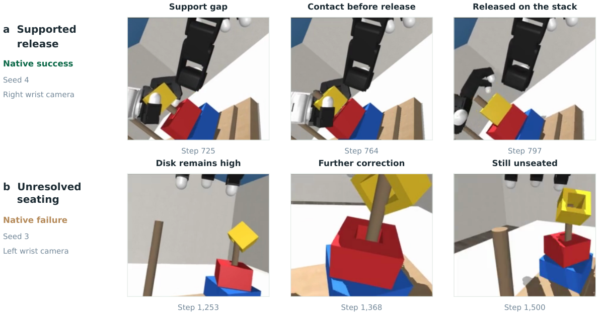
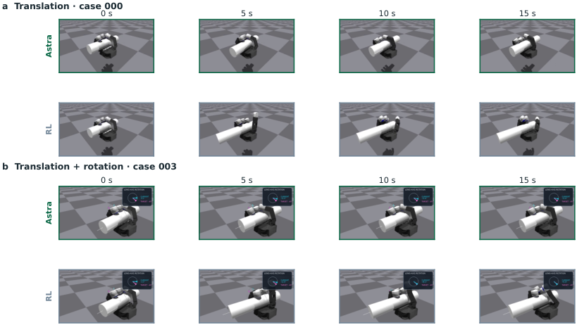
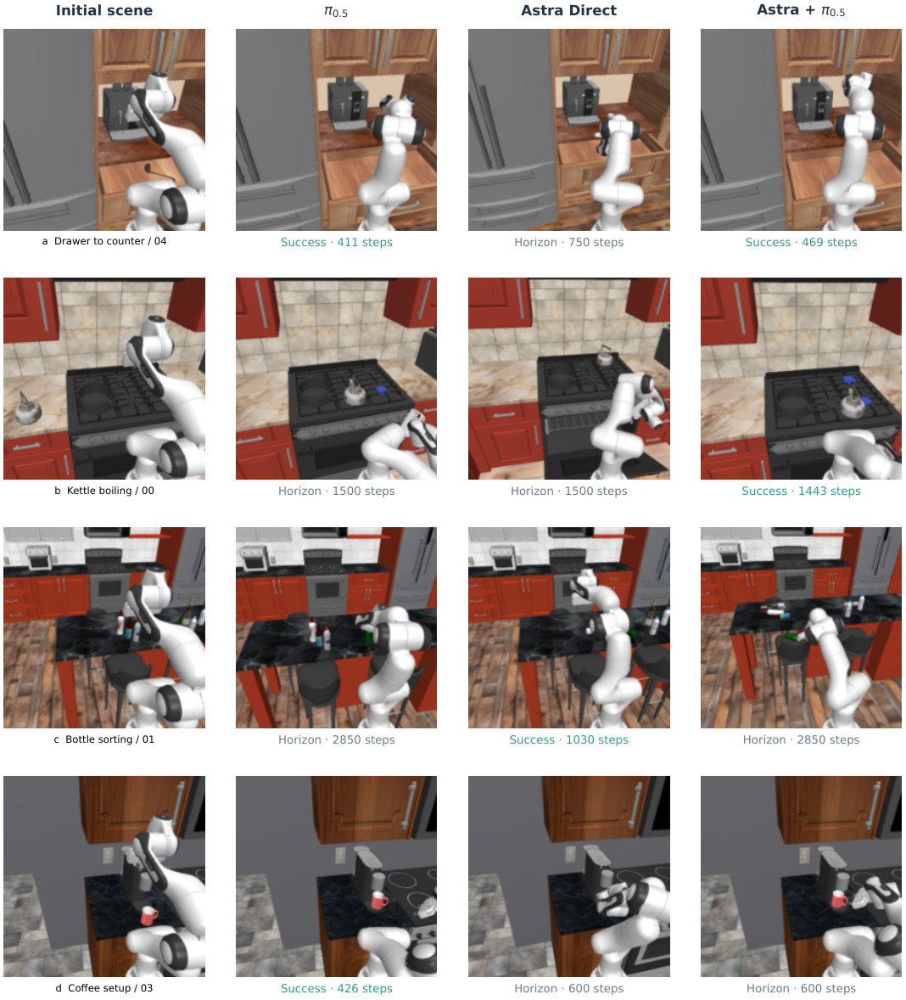
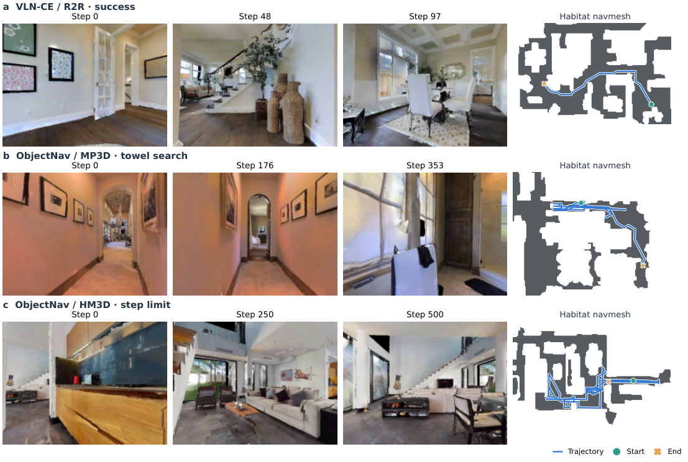
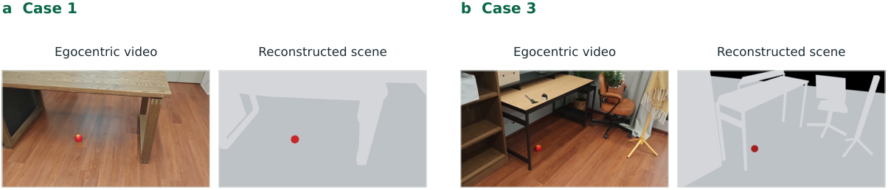
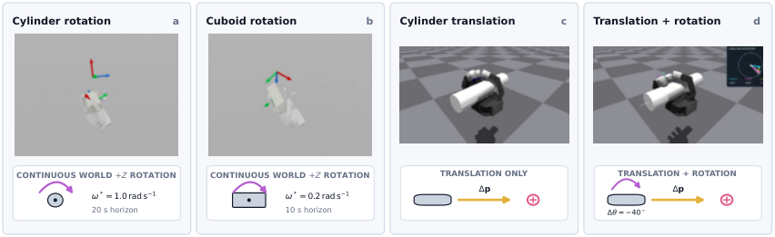

# Systematically Exploring the Capabilities of GPT-6 Astra as Embodied Policies 精读报告

> **论文**：Systematically Exploring the Capabilities of GPT-6 Astra as Embodied Policies
> **作者**：Galbot（Jiayi Su, Yixin Zheng, Mi Yan, Li Yi, Zhizheng Zhang, He Wang 等，共约 30 位贡献者，分组列于论文 Contributors 节）
> **arXiv ID**：2609.38537（v1）
> **发表时间**：2026-09-29
> **代码仓库**：github.com/anonymous-report-421/GPT-as-Policy/（MIT，548 stars，含评测代码 hybrid_rollout/ 与双语技术报告网页）
> **项目页**：galaxygeneralrobotics.github.io/astra-policy/

## 第 1 章 概述

### 1.1 一句话定位

一句话定位：本文将 OpenAI 的 GPT-6 Astra 作为 **embodied policy（具身策略）**——不再只输出"该做什么"的语言建议，而是直接输出数值机器人动作——并在六大具身域上做了首次系统性评测。

六域覆盖了从指尖到全身的完整控制谱系：

- 夹爪操作：RoboDojo（仿真配对评测）、RoboLab（Franka 单臂零样本）；
- 灵巧手操作：Sharpa 10 任务、DexJoCo Hanoi 双臂叠盘、Allegro 掌内操作；
- 移动操作：RoboCasa365（atomic/composite × seen/unseen）；
- 导航：VLN-CE（R2R/RxR）+ ObjectNav（MP3D/HM3D）；
- 运动控制：PASSAGE 场景密集参考（locomotion）；
- 人形 loco-manipulation：HumanoidBench 30 任务 + SIMPLE L2（6 任务 × 10 场景）。

评测沿两条控制路径展开：

- **Direct**：Astra 直接生成机器人控制接口命令；
- **Hybrid**：Astra 与学习策略 π0.5（操作域）或冻结全身控制器（人形域）协同，只承担高层决策。

核心发现是：**"有用的任务决策"与"可靠的物理控制"之间存在鸿沟**。Astra 擅长理解任务语义、改写指令、在高层纠正学习策略的错误（RoboLab 零样本 Direct 98%、导航 RxR SR 92%、SIMPLE 83.3%），但在需要持续低层数值一致性的场景中失效——掌内操作 At-goal 仅 0.51%（RL 为 76.90%）、locomotion 五连试全失败（0/5，final error 6.519 m）。同时论文把推理延迟与 token 消耗（仅 RoboDojo 一域即 624.8M–1,132.3M tokens）量化为实际部署瓶颈，并采用"物理在推理期间暂停"的口径以分离决策质量与算力时延。

术语速览（正文反复出现，先给出口径）：

- **GPT-6 Astra**：OpenAI 通用 VLM，本文统一以 `gpt-6-astra` xhigh 档经 Responses API 调用（900 s 超时）；
- **π0.5**：预训练 VLA 策略，Hybrid 操作形态中的动作提议者，也是多数操作域的对比基线；
- **PASSAGE**：运动控制域的参考规划器（约 0.08 s/次），Astra 参考的对照组；
- **LightNav-0**：导航本地重跑基线，与 Astra 在同一 200 episodes 上对比；
- **Cosmos3-Nano-Policy / DreamZero**：RoboLab 上的 world-model 类零样本基线（36% / 34%）；
- **TD-MPC2 / SAC / DreamerV3**：HumanoidBench 上的强化学习对比方法。

### 论文图表总览

| 编号 | 内容 | 所属章节 |
|------|------|----------|
| Figure 1 | Direct 与 Hybrid 两种控制路径跨域总览（架构图） | 第 2 章 |
| Table 1 | 六域评估设计（任务数/样本量/对比条件） | 第 2 章 |
| Table 2 | RoboDojo 夹爪操作配对评测结果 | 第 3 章 |
| Table 3 | Sharpa 十任务灵巧手操作结果（0–100 部分分） | 第 3 章 |
| Table 4–5 | 掌内操作（At-goal / 成功数 / 终端误差） | 第 3 章 |
| Table 6 | RoboCasa365 移动操作三条件对比 | 第 4 章 |
| Table 7–8 | 导航四子集结果与本地基线对比 | 第 4 章 |
| Table 9–10 | 运动控制（PASSAGE 密集参考 + 紧凑参考诊断） | 第 5 章 |
| Table 11–12 | HumanoidBench 八任务对比 + SIMPLE L2 | 第 5 章 |
| Table 17 | RoboDojo 执行与 token 精确账目 | 第 6 章 |
| Table 35 | RoboCasa 配对 McNemar 检验 | 第 4 章 |
| Figure 9 | RoboCasa 三条件匹配起始对比 | 第 4 章 |
| Figure 11 | 导航本地对比与失败模式 | 第 4 章 |
| Figure 21 | Allegro 掌内 rollout 序列 | 第 3 章 |
| Figure 14 | 第一视角视频场景重建 | 第 5 章 |
| Figure 18 | 掌内操作基准总览 | 第 6 章 |
| Table 13 | 资源消耗（token / 请求次数） | 第 6 章 |

### 1.2 核心贡献

论文的四条贡献可以概括为"一个框架、一个划分、一份边界、一本账"：

1. **首次六域系统评测框架**。
   将 Astra 统一置于从抓取到全身运动的完整控制谱系上评测，覆盖六大域与多个基准平台；
   每域显式给出任务数、样本量与对比条件（Table 1），并配套固定配置协议与统计检验
   （RoboCasa 的 McNemar 精确检验），使跨域结论可复现、可归因。
2. **Direct–Hybrid 控制责任划分**。
   把"谁负责物理控制"变成显式实验变量：Direct 模式下 Astra 直接发命令；
   Hybrid 模式按域分两种形态——操作域对 π0.5 的动作提议做"接受/修改/替换"三选一，
   人形域为冻结全身控制器提供参考。干预步占比
   （RoboDojo 14.4%、Sharpa 11.98%、Hanoi 26.4%、RoboCasa 44.8%）定量刻画协同结构。
3. **失败模式与能力边界分析**。
   逐域识别任务决策与物理控制间的断层：掌内操作的毫米级接触失效（At-goal 0.51% vs RL 76.90%）、
   locomotion 密集参考全失败（0/5）、RoboDojo 上 Direct 抓不住物体但语义分类更强等；
   并以 150 个 Astra sessions 的信息边界审计保证归因干净。
4. **token 与延迟量化**。
   首次为 VLM 具身策略建立资源账本：RoboDojo 50 实例 Hybrid/Direct 总 token 624.8M/1,132.3M
   （Hybrid 省 44.8%）、RoboCasa 7,910–8,941 次模型请求、locomotion 平均 39.86 s/次调用
   ——把"能否得分"与"能否部署"放进同一份讨论。

### 1.3 关键结果速览

| 域 | 关键数字 | 备注 |
|------|----------|------|
| 夹爪操作 RoboDojo | Hybrid 48%（24/50）vs Direct 26%（13/50） | 平均 Score 62.60 vs 37.81；π0.5 重加权基线 15.67%/24.43 |
| 夹爪操作 RoboLab | Direct 98%（49/50） | 零样本；π0.5 36%、Cosmos3-Nano-Policy 36%、DreamZero 34% |
| 灵巧手 Sharpa | Hybrid 61.6 分（0–100 部分分） | π0.5 44.2、Direct 16.6；干预仅占 11.98% Hybrid 步 |
| 移动操作 RoboCasa365 | Hybrid 总体 38.7% | 75 episodes/条件；π0.5 22.7%、Direct 33.3% |
| 导航 RxR | SR 92%（46/50） | SPL 77.25；单目前视相机，无 GPS/地图/深度 |
| 掌内操作 | At-goal 0.51% vs RL 76.90%（圆柱旋转） | 立方体 4.40% vs 63.50%；平移成功 1/5 vs 4/5 |
| 运动控制 PASSAGE | Astra 0/5 全失败 | final error 6.519 m；每次调用需 1,625 个一致数值 |
| 人形 HumanoidBench | 平均 return 581.9（四方法最高） | TD-MPC2 338.2、SAC 42.7、DreamerV3 −41.9 |
| SIMPLE L2 | 总体 83.3%（50/60） | 6 任务 × 10 场景；Tabletop/XMove 90% |
| 资源消耗 | 624.8M / 1,132.3M tokens（RoboDojo） | Hybrid/Direct；Hybrid 省 44.8% |

这组数字本身就是论文论点的证据链：

- **语义主导域强**：RoboLab（98%）、导航（RxR 92%）、SIMPLE（83.3%）中任务成败主要取决于
  "理解指令并规划子目标"，Astra 的通用语义能力直接兑现为高成功率；
- **物理主导域崩**：掌内操作（0.51%）与 locomotion（0/5）要求毫秒级的数值一致性，
  这是自回归离散 token 生成最不擅长的，Astra 接近零分；
- **中间地带 Hybrid 胜**：RoboDojo（48% vs 26%）、Sharpa（61.6 vs 16.6）、RoboCasa 总体
  （38.7% vs 33.3%）上 Hybrid 优于 Direct——把 Astra 放在"决策层"、把物理控制留给学习策略，
  是当前更合理的分工。但该优势并非无条件成立：RoboCasa composite unseen 子组为
  Direct 56% vs Hybrid 36%（Direct 反超），同属夹爪域的 RoboLab 也是 Hybrid 92% < Direct 98%；
- **资源维度不可忽略**：即便 Hybrid 比 Direct 省 44.8% token，RoboDojo 一域仍耗 624.8M；
  39.86 s/次的调用延迟意味着真实闭环控制目前不可行。

## 第 2 章 评估框架与控制路径

### 2.1 Direct 与 Hybrid：两种控制责任划分

评测对象统一为 GPT-6 Astra（`gpt-6-astra` xhigh，Responses API，900 s 超时）。两种模式共享同一模型与观测流，差别只在动作的最终出处——这使跨模式对比可以干净地归因于"控制责任的划分"。

**Direct：动作 = 控制接口命令。** Astra 的输出直接就是机器人控制接口的数值命令，模型完整承担从感知到执行的整条链路。各域接口示例：

- 灵巧手 Sharpa：22 维动作增量，每维限幅

$$a_t \in [-0.1,\, 0.1]^{22}$$

- 掌内操作 Allegro：16 维动作，映射为关节目标增量并支持重复执行 $k \in \{1,\dots,5\}$：

$$q_{\text{target}} \mathrel{+}= 0.04167\,a, \qquad a \in [-1,1]^{16}$$

- 导航：离散原语集（0.25 m 步进 + 30° 转向），单目前视相机 512×384，无 GPS/地图/深度，500 原语预算；
- 决策次数上限：Sharpa 100 步、Allegro 120 步。

**Hybrid（操作形态）：接受 / 修改 / 替换 π0.5 的提议。**
在夹爪、灵巧手、移动操作域，Astra 站在预训练 VLA 策略 π0.5 之上：
每步 π0.5 先给出动作提议，Astra 对其做三选一决策——原样接受、数值修改、或整体替换为自己的命令。
各平台的协同结构差异很大，构成一条可量化的谱系：

| 平台 | 接受/跟随策略 | Astra 干预 |
|------|---------------|------------|
| RoboDojo | 85.6%（36,576/42,750 步） | 14.4%（6,174/42,750 步） |
| Sharpa | — | 11.98% Hybrid 步 |
| DexJoCo Hanoi | 73.6% 未修改 | 26.4% Astra 修正（11,320 步） |
| RoboCasa | 55.2% 接受策略提议 | 44.8% Astra 决定 |

值得注意的是 RoboCasa 中 Hybrid 有 66/75 episodes 用了改写后的指令、条件化 72.6% 的策略提议——说明"修改"不止发生在动作层，也发生在任务指令层：Astra 实际上兼任了任务解释器。

**Hybrid（人形形态）：为冻结全身控制器提供参考。**
在没有现成可提议动作的低层策略的域（运动控制、人形 loco-manipulation），
Astra 的角色从"仲裁者"变为"参考轨迹生成器"，给一个冻结的全身控制器提供运动参考。
此时对输出一致性的要求陡增——locomotion 密集参考每次调用需 **1,625 个一致数值**
（0.5 s @ 50 Hz：root 高度、重力投影、平面速度、yaw 率、29 关节位置 + 速度），
这正是第 5 章 Astra 全失败的直接原因之一。

两种模式的分工小结：

| 维度 | Direct | Hybrid（操作形态） | Hybrid（人形形态） |
|------|--------|--------------------|---------------------|
| 动作出处 | Astra 直接生成 | π0.5 提议 + Astra 仲裁 | Astra 参考 + 冻结控制器执行 |
| Astra 职责 | 感知→规划→控制全链路 | 高层决策与纠错 | 参考轨迹生成 |
| 适用域 | 五域（人形 loco-manipulation 仅 Hybrid，未评测 Direct） | 夹爪/灵巧手/移动操作 | locomotion/loco-manipulation |
| 典型结果 | RoboLab 98%；RoboDojo 26% | RoboDojo 48%；Sharpa 61.6 | HumanoidBench 581.9；locomotion 0/5 |

### 2.2 六域评估设计（Table 1）

Table 1 集中给出六域的任务数、样本量与对比条件：

| 域 | 平台/基准 | 任务设置 | 样本量 | 对比条件 |
|------|-----------|----------|--------|----------|
| 夹爪操作 | RoboDojo（仿真，配对评测） | 10 任务 × 5 次 | 50 episodes/条件 | Hybrid、Direct、π0.5（+重加权 15.67%/24.43） |
| 夹爪操作 | RoboLab（Franka 单臂，零样本） | 10 任务 | 50 episodes | Direct、Hybrid、π0.5、Cosmos3-Nano-Policy、DreamZero |
| 灵巧手 | Sharpa（部分分 0–100） | 10 任务 | 每任务多次 rollout | Hybrid、π0.5、Direct |
| 灵巧手 | DexJoCo Hanoi | 双臂叠盘 10 试 + 5 复盘 | 10 试 + 5 复盘（共 63.60M tokens） | Astra 修正占比分析 |
| 灵巧手 | 掌内操作（Allegro） | 圆柱旋转/立方体/平移/平移+旋转 | 5 试/条件 | Astra vs RL（成功阈值 22.4 mm/10°） |
| 移动操作 | RoboCasa365 | atomic/composite × seen/unseen | 75 episodes/条件 | π0.5、Direct、Hybrid + McNemar 精确检验 |
| 导航 | VLN-CE（R2R/RxR）+ ObjectNav（MP3D/HM3D） | 4 子集 | 50 episodes/子集 | 本地 LightNav-0（同一 200 episodes） |
| 运动控制 | PASSAGE 场景密集参考 | Astra 5 试 + 紧凑参考 12 试/格式 | — | PASSAGE 参考 vs Five-point / WholeBody-14 |
| 人形 | HumanoidBench + SIMPLE L2 | 30 任务；6 任务 × 10 场景 | — | TD-MPC2、SAC、DreamerV3 |

各域设计要点（详细数字留待第 3–5 章展开）：

- **RoboDojo（夹爪）**：10 任务 × 5 次的**配对评测**——同一初始条件下 Direct 与 Hybrid 各跑一遍，
  使模式间差异不被环境随机性淹没；另设 π0.5 输出重加权基线（15.67%/24.43），
  排除"Hybrid 分数其实来自 π0.5"的解释。
- **RoboLab（夹爪）**：Franka 单臂**零样本** 10 任务、五种条件各 50 episodes，
  用于检验语义主导任务上 Direct 的上限（98% 即出自这里）。
- **Sharpa（灵巧手）**：10 任务、0–100 **部分分**制（s=1 全部 subgoal+验证窗……s=0 无进展），
  允许"部分完成"得分，以区分"完全失败"与"接近成功但最后一步失手"。
- **掌内操作（Allegro）**：四项毫米级技能各 5 试，与专项 RL 策略直接对比
  （成功阈值 22.4 mm/10°），这是全文物理难度最高的对照。
- **RoboCasa365（移动操作）**：atomic/composite × seen/unseen 四象限，75 episodes/条件，
  并以 McNemar 精确检验给出显著性
  （Hybrid vs Direct p=0.5235；Hybrid vs π0.5 p=0.0227；Direct vs π0.5 p=0.1849）。
- **导航**：四子集（R2R/RxR/MP3D/HM3D）各 50 episodes；对比基线 LightNav-0 在**同一 200 episodes**
  上本地重跑（SR 领先 20/20/36/16 pp），而非引用他人论文数字，保证观测与接口完全一致。
- **运动控制**：Astra 密集参考 5 试；另设无 Astra 的紧凑参考诊断
  （Five-point 12 试、WholeBody-14 12 试），用于分离"参考格式难度"与"模型能力"。
- **人形**：HumanoidBench 30 任务对比三个 RL 方法；SIMPLE L2 6 任务 × 10 场景检验
  loco-manipulation 泛化。

### 2.3 评估原则

三条原则贯穿全部六域，目的是让"模型能力"与"实验便利"可分离：

1. **固定配置与开发试验分开报告。**
   主表数字全部来自一次性冻结的固定配置（`gpt-6-astra` xhigh、Responses API、900 s 超时、
   Sharpa 100 / Allegro 120 决策上限等）；开发阶段的调参探索单独呈现、不计入主结果。
   典型例子是 Walk 步态校准：gait-clock 从 1.2 Hz 调到 1.8 Hz，return 从 705.72 升至 746.60
   （8 个配对种子、控制器权重不变）——这类开发试验与主评测明确隔离，
   使 581.9 的 HumanoidBench 均值不被调参污染。
2. **进度与时延分开度量。**
   任务进度指标（SR、SPL、Score、progress、final error）与推理时延、token 消耗分开统计：
   locomotion 上 Astra 平均每次调用延迟 39.86 s，而 PASSAGE 参考规划约 0.08 s/次，
   相差约三个数量级——若混在同一指标里，失败将无法归因于"决策差"还是"动作慢"。
   资源维度由第 6 章 Table 13 专门承载。
3. **物理在推理期间暂停。**
   评测将 Astra 的推理时间与物理仿真时间解耦：模型推理期间世界暂停，
   因此延迟本身不会直接导致跌倒或超时。这一口径使结果反映决策质量而非算力时延；
   但论文同时明确：真实部署中物理不会暂停，推理延迟与 token 消耗才是实际控制瓶颈。

此外设有**信息边界审计**：对 150 个 Astra sessions 审计确认无隐藏真值、完整物理状态、参考轨迹或评分函数访问——排除"模型作弊"的解释，保证各域成败可归因于策略能力本身。

本章小结：Direct 与 Hybrid 并非"两种算法"，而是同一个 VLM 在控制栈中两种可选择的安放位置；第 3–5 章的全部结果都将沿这条轴线展开——任务越偏语义，Direct 越可行；任务越偏物理，越需要把低层交给学习策略或控制器，让 Astra 退居决策层。

*Figure 1：GPT-6 Astra 作为 embodied policy 的两种控制路径。Direct 模式中 Astra 直接输出控制接口命令；Hybrid 模式按域分为两种形态——操作域对学习策略 π0.5 的动作提议进行接受/修改/替换，人形域则为冻结的全身控制器提供参考轨迹。*
## 第 3 章 夹爪操作与灵巧手操作

前两个操作域共同回答一个问题：当任务从「语义理解」滑向「物理接触」，Astra 的贡献如何衰减，以及 π0.5 这类学习策略能把下限托到多高。

### 3.1 RoboDojo：配对双臂评测

RoboDojo 是双臂操作基准，覆盖语义分类、序列模仿、装箱、搭建与可变形物体操作。作者按 π0.5 已发表成功率分层抽取 10 个任务（6 个来自最低区间、2 个次低、两个更高区间各 1 个），每个任务 5 次评测，Direct 与 Hybrid 共享任务实例、场景配置与随机种子。Hybrid 使用 RoboDojo 任务微调的 π0.5 权重。

**结果（论文 Table 2，Score 为部分完成度）**：

| 任务 | DM0.5 | Galaxea | Xiaomi R1 | OpenWAM | π0.5 | Hybrid | Direct |
|------|:---:|:---:|:---:|:---:|:---:|:---:|:---:|
| Organize the table | 44.00 | 46.33 | 57.67 | 62.50 | 23.33 | 60.00 | 30.00 |
| Classify by language | 0.47 | 1.07 | 2.00 | 1.33 | 0.60 | 38.00 | 60.00 |
| Imitate a sorting sequence | 1.80 | 1.67 | 2.50 | 2.90 | 1.60 | 53.00 | 0.00 |
| Arrange the largest number | 7.85 | 4.11 | 8.56 | 4.36 | 2.29 | 50.00 | 57.00 |
| Pack objects into a box | 14.72 | 17.12 | 18.69 | 20.83 | 18.36 | 50.00 | 50.00 |
| Classify objects | 26.83 | 10.33 | 17.20 | 5.53 | 24.67 | 71.00 | 100.00 |
| Build a tower | 55.20 | 82.93 | 52.60 | 52.53 | 37.73 | 64.00 | 12.00 |
| Make a Kong in Mahjong | 56.67 | 90.00 | 41.33 | 32.00 | 26.67 | 40.00 | 0.00 |
| Fold clothes | 28.96 | 32.75 | 41.49 | 51.31 | 29.12 | 100.00 | 40.00 |
| Put bottles in a bin | 81.70 | 96.30 | 97.70 | 94.03 | 79.93 | 100.00 | 36.00 |
| **Aggregate** | 31.82 | 38.26 | 33.97 | 32.73 | 24.43 | **62.60** | 37.81 |

三个层次的读法：

- **总量**：Hybrid 成功 24/50（48%），Direct 13/50（26%）；把公开 π0.5 结果重加权到同任务-场景混合后仅 15.67% 成功率 / 24.43 Score——Hybrid 相对裸策略的边际增益（+38.17 Score）远大于策略本身水平；
- **结构**：增益集中在长程协调与接触敏感任务——序列模仿 53 vs 0、塔搭建 64 vs 12、叠衣 100 vs 40、瓶入桶 100 vs 36；而 Direct 在语言分类（60 vs 38）与物体分类（100 vs 71）上反超，说明 Hybrid 优势并非均匀分布，语义判别类任务直接出动作反而更优；
- **机制**：50 条 Hybrid 轨迹中 42,750 个执行控制步里 85.6%（36,576 步）跟随 π0.5，仅 14.4%（6,174 步）由 Astra 生成或修正——Astra 是选择性干预者，不是替代者。

### 3.2 RoboLab：零样本评测与排名反转

RoboLab 用单臂 Franka 评 10 个语义抓放/有序堆叠/杯子重定向任务，策略基线只用 DROID 训练权重做零样本迁移。结果出现彻底反转（Appendix B Table 15）：**Direct 49/50（98%）、Hybrid 46/50（92%）、π0.5 18/50（36%）、Cosmos3-Nano-Policy 18/50（36%）、DreamZero 17/50（34%）**。

论文对此的解释值得注意：RoboLab 任务以单臂语义抓放为主，Direct 从当前观测即可规划完整操作；此时零样本策略的提议（本身只有 36% 成功率）不是有用的先验，Hybrid 反而可能把决策浪费在纠正一个不适配的动作上。**策略协助的价值取决于学习运动先验与任务的匹配度**——这与 RoboDojo（任务微调策略 + 长程接触任务 → Hybrid 大胜）构成一组自然对照。

### 3.3 Sharpa 灵巧手十任务：Hybrid 的黄金场景

十个任务（抓取、取出、放置、插入、堆叠、重排）用仿真 Sharpa 手，单一多任务 π0.5 在每任务 100 条示教（共 1,000 条）上微调，Direct / 裸 π0.5 / Hybrid 在同一批每任务 5 个未见案例上评测（论文 Table 3，0–100 部分分，非成功率）：

| 任务 | π0.5 | Direct | Hybrid |
|------|:---:|:---:|:---:|
| Pot lift and hold | 40.0 | 44.0 | 62.0 |
| Headphones in box | 42.0 | 22.0 | 42.0 |
| Toy retrieval | 100.0 | 22.0 | 100.0 |
| Mug hanging | 62.0 | 4.0 | 82.0 |
| Mahjong tile storage | 48.0 | 18.0 | 88.0 |
| Bottles/cans sorting | 72.0 | 14.0 | 100.0 |
| Upright egg placement | 6.0 | 12.0 | 38.0 |
| Two-bowl stacking | 46.0 | 20.0 | 52.0 |
| Bread-slot insertion | 10.0 | 8.0 | 28.0 |
| Nesting-doll ordering | 16.0 | 2.0 | 24.0 |
| **Overall mean** | 44.2 | 16.6 | **61.6** |

- Hybrid 在全部 10 个任务上高于 Direct；相对 π0.5 在 8 个任务占优、2 个打平（Headphones 42.0、Toy retrieval 100.0）。相对策略增益最大的三个任务：麻将入篮 +40 分、鸡蛋立放 +32 分、瓶罐分拣 +28 分；
- Figure 3(b) 的关键量化：**Astra 干预仅占 Hybrid 执行步的 11.98%**——改动不到八分之一的步数换来 17.4 分的总均分提升，是「少量定向修正撬动大幅增益」的最直接证据。干预类型最常见的是修复漏抓/掉落与放置失败，其次是对齐与抓握稳定；
- 失败仍然集中在两处：抓取建立（手指并拢推走物体、双指弱提起）与完成判别（鸡蛋侧躺时宣布成功）。前者说明灵巧手场景下 Astra 仍重度依赖策略产出可行的动作候选，后者是贯穿全文的「完成验证」短板。

评分采用分级部分分制（论文 Eq. 1 聚合）：内部得分 $s \in [0,1]$——全部 subgoal 且通过连续验证窗 $s=1$；全部 subgoal 但未完成验证 $s=0.8$；部分完成 $s = 0.8k/K_t$（$k$ 为满足的 subgoal 数，$K_t$ 为任务 subgoal 总数）；仅有 5 cm 抬升事件（无 subgoal 达成但执行中曾抬升物体 5 cm）$s=0.1$；无有效进展 $s=0$。任务分与总分为等权平均：

$$S_{t,m} = \frac{100}{5}\sum_{i=1}^{5} s_{t,i,m}, \qquad S_{m} = \frac{1}{10}\sum_{t=1}^{10} S_{t,m}$$

完成两个 subgoal 中的一个通常得 40 分，全部满足但未过验证窗得 80 分——因此 61.6 的总均分意味着大量任务止步于部分完成。

### 3.4 DexJoCo Hanoi 双臂叠盘：反馈引导的开发试验

Hanoi 任务要求双 Franka Panda + Allegro 手完成两次有序转移（右手中盘入位 → 左手小盘叠上）。Astra 审查为该任务训练的固定 π0.5，10 次试验以 5 个连续对组织，对内共享书面指导、对间细化（模型权重不变）。**原生判据下完成 5/10**；11,320 个执行步中 73.6% 为未修改的策略动作、26.4% 为 Astra 修正。10 次试验加 5 次复盘消耗 63.60M recorded tokens（含缓存输入），其中真正用于复盘的仅 0.136M——**token 大头永远在在线控制环里，即使物理动作大部分由策略提供**。

行为层面的两个细节刻画了「合作」的微观结构：成功试验中 Astra 会延迟策略提议的释放动作（小盘仍悬在支撑上方），用短下压修正使盘落稳再交还控制权；失败试验中同样的反复落位修正耗尽步数，甚至有两步腕部调整把盘带离目标、交还策略后才恢复运输的案例——**有效合作既需要及时干预，也需要识别策略可能是更好的恢复者**。

### 3.5 掌内操作：稳定抓握 ≠ 持续运动

掌内（in-hand）对比是全文物理控制差距最惨烈的一节。从已建立的抓握出发，Sharpa 任务要求绕世界系 +Z 持续旋转圆柱（1.0 rad/s，20 s）/立方体（0.2 rad/s，10 s），Allegro 任务要求平移（±组合 −40° 长轴旋转）。Astra 直控 22（Sharpa）/16（Allegro）个关节，与四个冻结任务专用 RL 策略从相同物理起始态对比（观测与决策频率不同）（论文 Table 4/5）：

| 任务 | 控制器 | At-goal ↑ | 误差 (rad) ↓ | Speed MAE ↓ | 终端位置 (mm) ↓ | 成功 |
|------|------|:---:|:---:|:---:|:---:|:---:|
| 圆柱旋转 20 s | Astra Direct | 0.51% | 1.626 | 0.960 | – | – |
| | RL | **76.90%** | 0.173 | 0.276 | – | – |
| 立方体旋转 10 s | Astra Direct | 4.40% | 0.742 | 0.143 | – | – |
| | RL | **63.50%** | 0.096 | 0.063 | – | – |
| 平移 15 s | Astra Direct | – | – | – | 59.05 | 1/5 |
| | RL | – | – | – | 17.29 | 4/5 |
| 平移+旋转 | Astra Direct（120 决策） | – | – | – | 47.35 | 0/5 |
| | RL（匹配步数） | – | – | – | 16.22 | 4/5 |
| | RL（15 s） | – | – | – | 16.08 | 5/5 |

三个诊断性观察：

- **保持 ≠ 推进**：立方体任务中两个控制器都在全部 5 个 horizon 内保住了物体（零掉落），但 Astra 转得不够快——失败不能归因于掉物，而是无法在移动中重组手指接触。保持支撑比重组接触容易得多；
- **周期性误差回落是假象**：旋转目标每转一圈回到等价姿态，误差曲线周期性下降并不代表持续推进，必须与轴向速度联读（Speed MAE 0.960 vs 0.276）。旋转指标的根基是物体与移动目标四元数间的 geodesic 距离（论文 Eq. 5）：

$$e_q(t) = 2\arccos\left(\left|\langle q_o(t), q_g(t)\rangle\right|\right)$$

At-goal 定义为 $e_q(t) < 0.1$ rad 的控制步占比，Speed MAE 为 1 s 滑窗角速度估计对指令速度的平均绝对偏差；
- **更长时间预算不是答案**：平移+旋转任务 Astra 的 120 决策在 6.00–7.65 s 耗尽，而 RL 在同样时长内已显著更优（匹配步数下 4/5）——动作视界更长也解释不了差距。成功阈值：位置误差 < 22.4 mm 且旋转误差 < 10°。

*图21（论文 Figure 21）：Allegro 掌内任务代表性 rollout 序列。Astra 直控下物体被握住但几乎不产生目标方向的运动，接触重构极少，而 RL 基线持续推进重定向（旋转任务）——「稳定抓握、有限旋转」的直观呈现。*

## 第 4 章 移动操作与导航

### 4.1 RoboCasa365：增益不均匀与「丢失的策略成功」

固定子集含 5 个原子 seen、5 个复合 seen、5 个复合 unseen 任务，各 5 个种子，共 75 episodes/条件，三条件共享初始状态指纹、PandaOmron 机器人与原生成功判据（论文 Table 6）：

| 任务组 | π0.5 alone | Astra Direct | Astra Hybrid |
|------|:---:|:---:|:---:|
| Atomic seen | 13/25（52.0%） | 7/25（28.0%） | 13/25（52.0%） |
| Composite seen | 3/25（12.0%） | 4/25（16.0%） | 7/25（28.0%） |
| Composite unseen | 1/25（4.0%） | 14/25（56.0%） | 9/25（36.0%） |
| **All tasks** | 17/75（22.7%） | 25/75（33.3%） | 29/75（38.7%） |

- **Hybrid 在 seen 任务上超 Direct（52% vs 28%、28% vs 16%），在 unseen 组合上反被 Direct 压制（36% vs 56%）**——策略先验覆盖内的任务，协作有价值；组合外的新任务，Astra 自己从头构建反而更好；
- Hybrid 的语言组织能力体现在：66/75 episodes 使用了改写指令，改写条件化了 72.6% 的策略提议；执行步中 55.2% 来自接受的策略动作、44.8% 由 Astra 产出（Figure 8）；
- **配对 McNemar 精确检验**（Appendix I Table 35）：Hybrid vs Direct p=0.5235（不显著）、Hybrid vs π0.5 p=0.0227（显著）、Direct vs π0.5 p=0.1849；原子组 Hybrid vs Direct 名义 p=0.03125 经 Bonferroni 校正后升至 0.09375。总量差距在统计上相当脆弱；
- 最有信息量的失败：CoffeeSetupMug 与 WashLettuce 两任务上两个 Astra 条件全败（各 5 种子），裸 π0.5 却分别完成 3 例和 2 例——**策略访问不保证保留策略本可完成的成功**。16 对双 Astra 成功 episodes 中 Hybrid 平均 1,110.4 步 vs Direct 1,256.6 步，Hybrid 在其中 11 对用步更少。

*图9（论文 Figure 9）：三条件在匹配初始状态上的配对对比——同一起始态下仅 Hybrid 成功（KettleBoiling/00）、仅 Direct 成功（RecycleBottlesByType/01）、Hybrid 与裸 π0.5 同胜（PickPlaceDrawerToCounter/04）的案例并列，直观展示三者的互补与不重叠。*

### 4.2 导航：SR 与 SPL 的剪刀差

四个固定子集各 50 episodes（论文 Table 7/8）。Astra 只看一张 512×384 前视 RGB，无 GPS/罗盘/深度/语义标签/目标坐标，输出 0.25 m 步进与 30° 转向（500 原语预算）， Habitat 执行：

| 任务/数据集 | 成功数 | SR ↑ | SPL ↑ | nDTW ↑ | sDTW ↑ |
|------|:---:|:---:|:---:|:---:|:---:|
| VLN-CE / R2R（Val-Unseen） | 39/50 | 78% | 65.27 | 72.20 | 59.35 |
| VLN-CE / RxR 英文（Val-Unseen） | 46/50 | **92%** | 77.25 | 84.73 | 80.42 |
| ObjectNav / MP3D（Val） | 28/50 | 56% | 22.43 | – | – |
| ObjectNav / HM3D（Val） | 41/50 | 82% | 43.69 | – | – |

本地协议（同一 200 episodes、共享评分与原语预算）下的对比：

| 系统 | 视角数 | R2R SR | R2R SPL | RxR SR | RxR SPL | MP3D SR | MP3D SPL | HM3D SR | HM3D SPL |
|------|:---:|:---:|:---:|:---:|:---:|:---:|:---:|:---:|:---:|
| **Astra** | 1 | **78.00** | **65.27** | **92.00** | **77.25** | **56.00** | **22.43** | **82.00** | **43.69** |
| LightNav-0 | 1 | 58.00 | 54.14 | 72.00 | 64.08 | 20.00 | 8.39 | 66.00 | 37.75 |
| Uni-NaVid 7B | 1 | 30.00 | 27.76 | 34.00 | 25.67 | 8.00 | 5.46 | 30.00 | 20.48 |
| OmniNav Flow | 3 | 56.00 | 53.89 | 72.00 | 56.29 | 4.00 | 2.96 | 6.00 | 2.90 |
| NavFoM | 3 | 44.00 | 40.04 | 58.00 | 51.79 | 18.00 | 13.01 | 42.00 | 30.38 |
| SPAN-Nav | 3 | 70.00 | 61.71 | 72.00 | 56.19 | – | – | – | – |

- 相对 LightNav-0，Astra 的 SR 提升分别为 20 / 20 / 36 / 16 pp；唯一被反超的指标是 R2R nDTW（LightNav-0 72.77 vs Astra 72.20），但 sDTW Astra 更高（59.35 vs 48.89）。注意多视角方法处于不同观测机制（3 视角），单视角组才是同条件对比；
- **SR 与 SPL 的剪刀差是本域核心发现**：ObjectNav MP3D SR 56% 但 SPL 仅 22.43%——SPL 惩罚多余行程，成功终点掩盖了低效搜索。路线指令（VLN-CE）提供空间线索，类别目标（ObjectNav）则要自己发明探索策略，决定「哪里值得去、何处不再值得重访」比「沿地标走」难得多；
- 失败模式三分：视觉观测无法锚定到具体位置、目标完成验证错误、不会利用碰撞反馈或搜索历史改道。「给出一个合理的移动理由」不等于「正确的目标判断或空间推进」——这句话几乎是全文认知短板的总纲。

*图11（论文 Figure 11）：导航成功轨迹（指令跟随、带绕行的搜索）与失败轨迹（预算耗尽）的并列展示；失败案例暴露了视觉-位置绑定、目标验证与碰撞反馈利用三类短板。*

## 第 5 章 运动控制与人形 loco-manipulation

### 5.1 密集参考 locomotion：0/5 的结构性失败

作者把 PASSAGE 的学习运动生成器换成 Astra，保留其场景对齐 25×65 表示与冻结 G1 ScaleTrack 控制器。**每次调用要求 Astra 产出 0.5 s @ 50 Hz 的参考：root 高度、投影重力、平面速度、yaw 率、29 个关节的位置与速度——1,625 个彼此必须一致的数值**。同一障碍课程上五次顺序尝试（首次零样本，后续保留进度/跌落/碰撞的文字摘要，第五次前还给了另一课程的行走片段）（论文 Table 9）：

| 规划器/尝试 | 结果 | 时间 (s) | 推进 (m) | 终点误差 (m) | 跌倒 | 到达 |
|------|------|:---:|:---:|:---:|:---:|:---:|
| PASSAGE | Goal reached | 13.18 | 8.622 | 0.495 | No | Yes |
| Astra 1 | Fall | 9.80 | 1.561 | 7.556 | Yes | No |
| Astra 2 | No progress | 20.28 | −0.024 | 9.141 | No | No |
| Astra 3 | No progress | 8.00 | 0.012 | 9.104 | No | No |
| Astra 4 | No progress | 8.48 | 0.159 | 8.958 | No | No |
| Astra 5 | Time horizon | 30.00 | 2.598 | 6.519 | No | No |

- 五连败的模式：首次前进了 1.561 m 后跌倒；第 2–4 次原地不动（位移 < 0.10 m 持续 8 s 触发无进展终止；其中 Attempt 2 耗时 20.28 s 位移 −0.024 m）；第五次稳定行走 30 s、推进 2.598 m，仍停在主障碍区之前。注意这是**一条适应轨迹而非五次独立试验**；
- 根因在接口的物理一致性：关节限位内的参考未必是连贯运动——root 速度、肢体姿态及其演化必须描述相容的动态，tracker 可以跟上一个参考却产出原地踏步、意外接触或跌倒。供给路线只简化了规划，不提供协调的身体运动；
- **延迟是更硬的墙**：最终 30 s episode 用了 250 次同步调用、平均每次 39.86 s recorded latency（PASSAGE 规划约 0.08 s/次），推理期间物理暂停。真实物理场景不会等待推理。

作为对照的紧凑参考诊断（无 Astra，确定性生成器，12 rollouts/接口）：Five-point（骨盆+双腕+双踝 6 帧链接位姿）严格成功 0/12、Goal+stop 4/12（33.3%）、1 次跌倒、终点误差 3.441 m；WholeBody-14 额外加躯干与双髋膝肩肘后 0/12、3/12（25.0%）、4 次跌倒、5.334 m。两者峰值接触力 1,853 N / 2,293 N——**可跟踪的运动不一定是安全的运动**；低矮天花板课程下仅 1/6 与 0/6 到达终点。

### 5.2 HumanoidBench：命令选择 + 预训练全身控制器

30 个可执行任务（排除两个 Highbar 变体，seed 1/2）。Astra 指挥冻结的 Humanoid-GPT 全身控制器：选行走速度与 yaw 率，或稀疏骨盆/腕部参考；控制器 50 Hz 运行于 500 Hz 物理之上。八任务对比（论文 Table 11）：

| 任务 | DreamerV3 | TD-MPC2 | SAC | Astra | 阈值 |
|------|:---:|:---:|:---:|:---:|:---:|
| Maze | 272.3 | 244.3 | 144.8 | **1358.8** | 1200 |
| Reach | 7580.9 | 7316.1 | 4565.1 | **11430.2** | 12000 |
| Walk | 800.2 | 782.0 | 31.7 | **848.7** | 700 |
| Run | 633.8 | 93.3 | 5.0 | **642.1** | 700 |
| Crawl | 878.8 | 957.4 | 330.0 | 971.9 | 700 |
| Stair | 131.1 | 70.4 | 14.1 | **272.5** | 700 |
| Push | −1251.9 | −258.7 | −97.9 | **877.3** | 700 |
| Door | 213.0 | 274.7 | 39.4 | 142.4 | 600 |

- 30 任务等权平均：**Astra 581.9 > TD-MPC2 338.2 > SAC 42.7 > DreamerV3 −41.9**；超 DreamerV3 16 任务、TD-MPC2 19 任务、SAC 25 任务、超三者最优 13 任务、Kitchen 零平局；**6 个任务均值达原生阈值：Stand 954.2±0.1（800）、Walk 848.7±5.9（700）、Maze 1358.8±7.4（1200）、Crawl 971.9±0.2（700）、Push 877.3±59.6（700）、Sit Simple 793.0±19.1（750）**；
- 但要诚实读这张表：Package −5148.0±1288.1、Balance Simple 53.1±6.7、Basketball 24.0±2.9、Window 6.1±0.7 等任务接近零分——Astra 的优势集中在「全身控制器已提供可用运动基元、Astra 只需选命令」的任务（走、爬、推、迷宫），一旦需要自己发明接触策略（Door、Window、Insert）就崩塌；
- **校准的隐性贡献**：脚本化 Walk 扫频中，gait-clock 从 1.2 Hz 提到 1.8 Hz，8 个配对种子平均 return 从 705.72 升至 746.60——权重、命令速度、反馈规则全部不变。命令 1.25 m/s 实测前进 1.48 m/s。性能是「Astra 决策 × 控制器校准」的联合产物，不能全记在模型头上；
- Push 的接触诊断（seed 5）：entry 与 contact 参考都不改 27.02 cm、只改 entry 36.81 cm、只改 contact 23.11 cm、**两者联改 4.97 cm**——有效的手部偏移依赖于进入接触时的身体构型，接触参数必须与状态联合校准。

### 5.3 SIMPLE：经验改写指导，成功率 83.3% 但 handover 脆弱

官方 SIMPLE 代码库与 L2 协议（G1 + Dex3 手，冻结 ScaleBFM 全身控制器，Astra 用 xhigh 推理在试后修订 Skill/Memory 两份文本文档）（论文 Table 12）：

| 任务 | 成功 | 率 |
|------|:---:|:---:|
| Handover | 8/10 | 80% |
| Mobile pick/place | 7/10 | 70% |
| Tabletop | 9/10 | 90% |
| XMove bend pick | 9/10 | 90% |
| XMove pick | 9/10 | 90% |
| Bend | 8/10 | 80% |
| **Total** | **50/60** | **83.3%** |

handover 的解剖是本节精华：原生成功判据不要求纸箱在完全释放后仍然稳定——**聚合分数掩盖的短板在阶段切换处**。失败中手指闭合或纸箱倾斜可被误判为可靠抓握（桌面或另一只手仍在承重），移动接手会带偏供给侧手腕。固定程序在三个曾成功场景的保持检查中只过 2/3；指令适应试验中出现「成功一次 → 再反思一次 → 失败」的序列；恢复试验三个有效尝试全败。**诊断不必然产出修正或可重复的成功**。

### 5.4 第一视角视频 → 交互场景重建

Astra 还被要求自己组装并修正一条管线：自我中心视频 → 感知与重定向工具 → 交互场景 + 人形运动参考。运动捕捉标定厨房中，图像细化把场景 Chamfer-L1 误差从 35.93 mm 降到 24.73 mm，加入 CAD 尺寸后进一步降到 12.14 mm。三个苹果转移案例中只有 1 个完成完整交互（踩踏板开桶 → 苹果入桶 → 桶盖闭合），另外两个在提升阶段丢果。**该研究在开发、评测与文档上共耗 217M tokens**——逐视频精修的成本量级直观可见。

*图14（论文 Figure 14）：从日常第一视角视频重建的场景与运动参考。几何上合理的重建不保证物理交互成功——支撑面、容器内部与可动机构必须在重建与重定向后保持可用。*

## 第 6 章 讨论与资源消耗

### 6.1 Token 与延迟账本（论文 Table 13 / Table 17）

| 场景 | 记录的资源消耗 | 范围与解读 |
|------|------|------|
| RoboDojo，50 实例/条件 | Hybrid/Direct 总 token 624.8M / 1,132.3M；cached input 607.6M / 1,107.3M；uncached 15.90M / 22.91M；output 1.31M / 2.09M | 不含早期尝试；缓存输入主导总量，Hybrid 总量省 44.8% |
| RoboCasa，75 episodes/条件 | Direct/Hybrid 记录模型请求 7,910 / 8,941 次，中位 85 / 108 次/episode | 覆盖保存的请求日志（含恢复历史），并非全部推理调用 |
| 密集 locomotion（最终尝试） | 30 s 机器人运动用 250 次同步调用，平均延迟 39.86 s/次 | 推理期间物理暂停；PASSAGE 规划约 0.08 s/次 |

RoboCasa 的细账（Appendix I）：三条件各 75 episodes 下，π0.5-only / Direct / Hybrid 执行仿真步 140,958 / 130,665 / 130,549，策略提议 7,072 / 0 / 6,185，Astra 自写动作段 0 / 6,560 / 2,941，Hybrid 接受策略段 3,621；π0.5-only 装载后中位执行 121.6 s。

两条推论：

- **委托运动 ≠ 委托审查**：RoboDojo Hybrid 省 44.8% token 但 uncached input 与 output 仍可观；RoboCasa Hybrid 的 Astra 自写动作段更少，模型请求却比 Direct 更多（8,941 vs 7,910）。推理成本取决于审查频率，不只是动作生成；
- **能力必须带预算陈述**：长输入历史与反复审查推高资源消耗；物理暂停使延迟在实验中可容忍，但真实场景中「决策耗时 ≫ 决策间隔的前一次运动时长」这一比例关系无法靠暂停解决。

### 6.2 能力边界的三条解释轴

1. **控制路径完整性**：动作的物理含义由接口与控制器赋予——导航动作调用离散运动原语，密集参考要求相容的身体与关节目标，全身控制器命令调用学习到的协调。评估 Astra 必须同时指定它构造的命令与其他组件供给的运动。掌内结果揭示「稳定 vs 推进」的张力：保住当前抓握会阻止继续旋转所需的释放与重排；导航则相反——可识别的地标未必确立正确位置或证明该停；
2. **干预与经验证的进度**：检测错误、提出修正、验证效果是三个独立要求。新抓取仍需间隙与支撑，调整后的放置仍需正确的完成检查。「谁供给了命令」的步数比例、修正次数、解释的合理性都不度量修正的价值——**价值只在随后的物理结果里**；
3. **跨试次保持成功**：反馈能改进已知案例上的流程，却不保证跨尝试可靠。Push 开发记录里有「成功一次 → 原样重跑失败」的配对；SIMPLE handover 的指导修订同样不能稳定保持成功行为。权重不变下的「提升」必须区分：指导/接口/校准的变化也会改变系统表现，重复试验检验行为是否持续，新状态迁移检验指导是否泛化。

*图18（论文 Figure 18）：掌内操作基准总览——Sharpa 旋转与 Allegro 平移任务的构型、目标与评价指标，是 Table 4/5 对比实验的舞台。*

## 第 7 章 局限性与结论

### 7.1 局限性

- **评测协议的边界**：导航基线在本地协议下重评（LightNav-0/Uni-NaVid 换用 Astra 的前视相机规格，OmniNav Flow 只评释放的 Flow 策略而非带慢速探索规划器的完整系统），与各自论文的公开数字不直接可比；HumanoidBench 对比引用的是发表平均值（三种子）而非最大值；
- **locomotion 是单课程适应轨迹**：五次顺序尝试共享文字摘要与运动片段上下文，非独立试验，不能给出成功率意义上的结论；紧凑参考诊断的两个生成器不同，无法隔离维度数这一变量；
- **样本量普遍为 5/任务量级**：RoboCasa 的 Hybrid vs Direct 差距 McNemar p=0.5235，原子组校正后 p=0.09375，多数任务级差异不具备统计显著性；论文也如实报告了这一点而非隐藏；
- **物理暂停假设**：RoboDojo/RoboCasa 等 Astra 条件与 locomotion 密集参考评测在 Astra 推理期间暂停仿真（论文多处明确声明，如 Appendix "Simulation time pauses while Astra deliberates"），39.86 s/次的延迟在真实闭环中不可行，相关成功率是「暂停世界」条件下的数字；
- **开发与评测混合报告**：DexJoCo Hanoi、SIMPLE handover 修订、Push 接触诊断属于 development trials（指导/接口随试验演化），与冻结配置评测并列呈现，读者需自行区分证据强度；
- **可复现性**：匿名仓库（anonymous-report-421/GPT-as-Policy，548 stars，MIT）公开评测代码 hybrid_rollout/、双语报告与结果归档（public_results/），但依赖专有模型 gpt-6-astra 与部分专有仿真器/存储的实验无法从公开快照重跑，付费模型与 GPU 实验未在发布中重跑。

### 7.2 结论

这篇报告对「VLM 能否直接当机器人策略用」给出了迄今最系统的分区答案：

- **能用**：语义主导域（RoboLab 零样本 98%、RxR 92%、SIMPLE 83.3%）中，任务成败取决于理解指令并规划子目标，Astra 的通用语义能力直接兑现为高成功率，且在本地导航对比中全面领先专用策略 16–36 pp；
- **要合作着用**：长程接触任务上 Hybrid 一致优于 Direct（RoboDojo 48% vs 26%、Sharpa 61.6 vs 16.6），且干预只需 11.98–14.4% 的步数——把 Astra 放在决策层、把低层物理留给学习策略，是当前合理的分工；
- **不能用在哪**：掌内持续操作（At-goal 0.51% vs RL 76.90%）与密集参考 locomotion（0/5）要求毫秒级数值一致性，是自回归离散 token 生成最不擅长的；策略协助还可能在策略本可完成的任务上引入失败（CoffeeSetupMug、WashLettuce）；
- **代价多大**：RoboDojo 一域 Hybrid/Direct 即 624.8M/1,132.3M tokens，DexJoCo 十次试验 63.60M，视频重建管线 217M；每次调用数十秒的延迟意味着当前只能以「暂停物理」的方式闭环。

一句话收束：**有用的任务决策与可靠的物理控制之间存在系统性鸿沟；学习策略与全身控制器可以垫高下限，但有效合作仍要求 Astra 知道何时干预、何时把控制权还给策略——而这两件事，目前的它都做不稳定。**

### 7.3 代码仓库

官方仓库 github.com/anonymous-report-421/GPT-as-Policy 提供 hybrid_rollout/（含 RoboDojo 提议诊断、prompt 上下文与网络续传等单元/pytest 测试）、public_results/（结果归档）与 report_web/（双语技术报告站点）；CITATION.bib 引用格式为 su2026astra；项目自有代码 MIT 许可，第三方资产条款见 THIRD_PARTY_NOTICES.md。仓库明确声明：需要原始共享存储、专有仿真器或历史操作 fixture 的测试无法仅凭公开快照复现。
