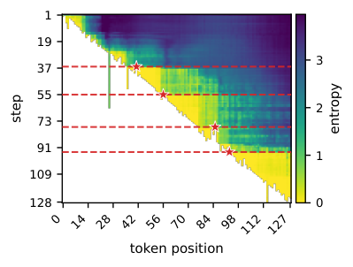
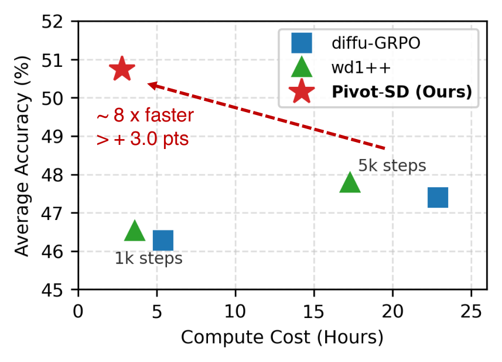

# Pivot-SD：面向掩码扩散语言模型的高效自蒸馏精读报告

> **论文**：Pivot-SD: Efficient Self-Distillation for Masked Diffusion Language Models
> **作者**：Seo Hyun Kim、Sunwoo Hong（共同一作，KAIST AI / 多伦多大学 & Vector Institute 客座）、Younwoo Choi、Chen-Hao Chao、Se-Young Yun（KAIST AI）、Rahul G. Krishnan
> **arXiv ID**：2610.03665
> **发表时间**：2026-10-02（EMNLP 2026 Main, Oral）
> **许可协议**：CC BY 4.0
> **代码仓库**：暂无（论文承诺开源 trajectories 与评测脚本；项目页 sunwoohong.github.io/pivot-sd）

## 第 1 章 概述

### 1.1 一句话定位

Pivot-SD 是面向掩码扩散语言模型（masked diffusion language models, dLM）的离线自蒸馏后训练框架：从冻结基模型一次性采样去噪轨迹，用 information gain（每步 commitment 对剩余掩码位置的平均熵削减量）挑出少数塑造回答的高影响 commitment（pivot），仅在这些 pivot 上施加监督——成功轨迹用 cross-entropy（CE）、失败轨迹用 targeted unlikelihood（UL），其余 token 不产生任何 loss。

### 论文图表总览

| 编号 | 内容 | 章节 |
|:-----|:-----|:-----|
| Figure 1 | 一条 MATH 去噪轨迹（前 128 token）的预测熵热力图，红星标出 information gain 选中的 pivot token | 第 1 章 |
| Figure 2 | 方法总览示意（无图片文件，纯文字描述）：(a) 从 $\theta_0$ 采样的轨迹中，commitment 对剩余掩码位置平均熵削减最大的步被选为 pivot；(b) 重放每个 pivot 提交时的掩码状态 $M_t$，仅 pivot token 受训（答案正确 → CE，错误 → UL），其余位置无 loss | 第 3 章 |
| Figure 3 | 精度-计算量曲线（accuracy vs. compute） | 第 5 章 |
| Table 1 | 主结果：LLaDA-8B-Instruct 在 MATH/GSM8K/HumanEval+/MBPP+（256/512 tokens） | 第 5 章 |
| Table 2 | 消融：pivot 选择策略、正/负分支、监督范围 | 第 5 章 |
| Table 3 | 计算开销：2×L40 GPU wall-clock 小时 | 第 5 章 |
| Table 4 | Dream-v0-Instruct-7B 骨干泛化 | 第 5 章 |
| Table 5 | OOD（跨训练域）平均 | 第 5 章 |
| Table 10 | pivot budget $K$ 扫描 | 第 5 章 |

*图 1：横轴为 token 位置，纵轴为去噪步（自上而下推进），颜色深浅表示各活跃掩码位置的预测熵；红色虚线与星标分别标出熵骤降的关键去噪步及 information gain 选中的 pivot token。*

### 1.2 核心贡献

1. **识别 dLM 特有的 pivot 信号**：以每个去噪步对剩余掩码位置平均熵的削减量（information gain）作为 token 重要性度量。AR 模型生成顺序由位置固定，不存在此信号；dLM 轨迹记录了「哪个 token 在哪一步、哪个位置被提交」（commitment），其中少数 commitment 急剧降低剩余位置的不确定性并塑造回答的大部分。
2. **Pivot-SD 框架**：离线自蒸馏。采样轨迹后存储每个 pivot 提交时的部分掩码状态 $M_t$，训练时重放该状态，使模型在 pivot 最初被提交的确切上下文中预测该 token；最终答案的正确性决定更新方向——正确轨迹的 pivot 用 CE 提升概率，失败轨迹的 pivot 用 $\lambda_{\text{neg}}$ 加权的 unlikelihood 降低概率，失败轨迹的其余部分完全不动。
3. **极端数据与监督效率**：每条轨迹仅监督 $K=10$ 个 token（不足 256-token 响应预算的 4%）；每域仅 200 题 × 4 rollouts = 800 条轨迹，即可在数学与代码基准上超越 full-sequence SFT 与 budget-matched 扩散 RL，并保持领先于 10× 数据、5× 步数的扩展 RL，同时使用比 budget-matched RL 约少 40% 的 FLOPs。

### 1.3 关键结果速览

在 256-token 主设置下，Pivot-SD 使 LLaDA-8B-Instruct 在 MATH、GSM8K、HumanEval+、MBPP+ 四个基准上均取得受控方法中的最高均值，包括与 5,000 步扩展 RL 的比较；相对各基准最强基线，增益从统计意义上的平局（MBPP+，处于 ±1σ 之内）到大幅领先（HumanEval+ 增幅最显著）不等。使用同一 rollout 池、同一数据的 SFT-SD 与 Pivot-SD 之间的差距单独印证了 pivot 选择与负监督本身的贡献，而非数据来源差异。计算开销上，Pivot-SD 在 2×L40 GPU 上总时长最短（一次性离线生成加极短训练段），约为扩展 RL 基线的六分之一到八分之一。方法同时提升第二骨干 Dream-v0-Instruct-7B（四个基准全部超过基模型与两种 SFT），并在 OOD 平均（Overall micro-average）上排名第一。长度迁移到 512 tokens 时三个基准保持最佳，HumanEval+ 为唯一例外（低于基模型与 budget-matched diffu-GRPO）。消融表明增益依赖 token 选择本身：随机选步、随机选 token 或监督全部 token 都会拉低精度。详细数值见第 5 章。

## 第 2 章 研究背景与动机

### 2.1 dLM 与 AR 模型的信用分配差异

Post-training（SFT 与 RL）驱动了大模型推理能力的进步，但输出中并非每个 token 对训练同等重要：少数选择约束了随后的大部分内容，多数 token 基本由上下文决定。选哪些 token 来学习，是 post-training 的中心问题。

AR 模型中这个问题可以在最终文本上解决：生成顺序由位置固定（从左到右唯一确定），因此在最终文本上计算的 token 级统计（如高熵 minority token 筛选、critical token 的对比估计）不丢失任何信息——最终文本本身就是完整的生成记录。

dLM 不同。它从全掩码的响应序列出发，在实践采用的 confidence-based sampler 下按模型变自信的顺序填入位置；一条去噪轨迹因此记录了「哪个 token 在哪一位置、哪一步被写入」，论文称每次这样的提交事件为一个 commitment。关键在于 dLM 的 token 提交是乱序的：一次 commitment 可以重塑许多剩余掩码位置上的分布。最终文本不记录提交顺序、也不记录提交时刻的掩码状态，所以 AR 式 token 统计搬到 dLM 上就丢失了「何时提交、提交时还有哪些位置被掩码」的信息。dLM 特有的信用分配难题由此而来：少数 commitment 急剧降低剩余掩码位置的不确定性并塑造回答的大部分，训练信号理应集中在这些 commitment 上。

### 2.2 现有三类 dLM post-training 方法各丢失了什么信号

1. **最终文本 SFT**：多数 dLM post-training 配方从 AR 借来，训练施加在最终文本上（如 d1 的 masked SFT）。丢失两个信号：其一，提交时刻的状态——在大多数位置仍被掩码时固定整个回答走向的 token，与最后才填入、几乎被上下文决定的 token 获得完全相同的训练权重；其二，失败轨迹中的分辨力——正确中间步骤与真正的错误一起被惩罚，或者失败轨迹被直接过滤丢弃（STaR / 拒绝采样蒸馏式做法），其中的负信号未加利用。
2. **在线 RL**：另一类方法操作中间去噪步（diffu-GRPO、wd1++、DCoLT、AGRPO、GDPO 等），但用于引导在线策略更新，outcome reward 被分配到整个去噪步或去噪区间。丢失的信号：commitment 的个体身份——trajectory-level advantage 平摊到（采样到的）每一步上，而非定位到选定 token；不存在显式的 token 级负目标。此外，在线 RL 在本文的小预算设定下遭遇零 reward batch：wd1++ 无 bootstrap 时梯度相互抵消，step 500 后精度停滞（论文附录 I）。
3. **token 重要性加权**：GIFT 对最终响应的 token 位置按局部预测熵赋重要性权重后做离线加权 SFT，证明强调部分 token 有益。丢失的信号：打分对象是最终序列的位置——最终序列既不记录 token 在哪一步被提交，也无法度量该提交对当时仍被掩码位置的影响，而这恰是 dLM 轨迹特有、且（如下）最具信息量的信号。

### 2.3 pivot 概念的由来

论文的出发点是一个直接观察（Figure 1 的熵热力图）：去噪轨迹中，掩码位置上的熵在少数几步急剧下降，在其余步几乎不变。这些高熵削减步提交的 token 被称为 pivot。每步的打分即 information gain——该步 commitment 引起的、对剩余活跃掩码位置归一化的熵削减：

$$g(t)=\frac{H_{\text{pre}}(t)-H_{\text{post}}(t)}{\left|\mathcal{A}_t\setminus\mathcal{U}_t\right|}$$

其中 $H_{\text{pre}}(t)$、$H_{\text{post}}(t)$ 分别是第 $t$ 步提交前后剩余掩码位置的熵之和，除以剩余位置数使各步跨步可比（排除活跃位置集合发生变化的步；完整定义见第 3 章）。

类似的「不确定性削减」信号此前已在推理时被使用——用来选择下一步解掩码哪个位置（KLASS、Info-Gain Sampler）。Pivot-SD 的转变在于把这个信号从推理时的采样规则变为训练时的 token 选择规则，并给出对称的双向用法：在正确轨迹中，pivot 最塑造了这条成功路径，是最值得学习的 token（CE 正更新）；在错误轨迹中，pivot 最约束了这条失败路径，是负更新的自然目标（UL 负更新）。由此，失败轨迹不再只有「被过滤」或「整段受罚」两种命运。

## 第 3 章 Pivot-SD 方法解析

### 3.1 问题形式化：masked diffusion 生成与 commitment

**生成过程。** masked diffusion language model（dLM）对 prompt 之后的响应位置从全 [MASK] 状态出发做迭代去噪。在去噪步 $t$，模型维护一个部分 masked 状态 $M_t$（含 prompt token、已揭示的响应 token 与仍处 masked 的位置），一次前向即同时给出所有 masked 位置上的类别分布（论文 Eq.2）：

$$P_\theta\!\left(x_0^{(i)} \mid M_t\right)$$

其中 $x_0^{(i)}$ 是位置 $i$ 的干净 token。记 $B_t$ 为 step $t$ 仍 masked 的响应位置集（论文 Eq.1）。本文使用的 confidence-based sampler 以 block length 64 组织响应位置、每个 token 一步——每步恰好 commit 一个 token：采样器读出各 masked 位置分布，按 confidence 选出位置子集 $U_t$（$|U_t| = 1$）并固定其 token，其余位置继续 masked，进入下一步。一条最多 256 token 的轨迹因此至多包含 256 个依次做出的承诺。

**轨迹与 commitment。** 一条去噪轨迹被记录为状态、位置集与提交集的序列（论文 Eq.4）：

$$\tau = \{(M_t, B_t, U_t)\}$$

Pivot-SD 从中抽取的核心对象是 **commitment**（论文 Eq.5）：

$$C(\tau) = \{(t, p, y_p) : p \in U_t\}$$

即（时间步 $t$，位置 $p$，被提交 token $y_p$）三元组。commitment 是 dLM 决策的原子单位且不可逆：一旦 $y_p$ 在 $M_t$ 上被提交，后续所有步的生成条件都以它为前提。所谓 pivot，就是 $C(\tau)$ 中对最终答案影响最大的少数 commitment。

**标准 masked SFT 及其盲点。** 对 dLM 的常规监督后训练（masked SFT，论文 Eq.3）把目标序列 $y$（ground-truth 或模型自生成的成功解）随机 mask 出训练状态 $M_t$，然后对仍 masked 位置全体施加交叉熵：

$$\mathcal{L}_{\text{SFT}} = -\mathbb{E}\left[\sum_{i \in B_t} \log P_\theta(y_i \mid M_t)\right]$$

两个基线均属此类：SFT-GT 用 ground-truth + random masking，SFT-SD 用同一 rollout 池的成功解 + masked SFT，差别只在 $y$ 的来源，结构性盲点是共有的：

1. **位置维同权**：$\sum_{i \in B_t}$ 对所有 masked 位置一视同仁，每个位置贡献同权损失。但 dLM 的信用分配是高度倾斜的——少数 commitment 会急剧降低剩余 masked 位置的不确定性并塑造整个回答，多数 token 只是顺着已定骨架的低信息填空。Eq.3 把监督均匀摊开，关键决策的信号被稀释。
2. **轨迹维无差别**：损失不含结果信息。成功与失败轨迹以同一目标训练；若如 STaR 那样过滤失败轨迹，失败中蕴含的负信号又被整体弃置。

现有 dLM post-training 同样绕开了个别 commitment：diffusion RL 训练最终文本或按整步分配 reward。Pivot-SD 的切入点正是把训练目标从"整段文本/整步"收缩到"个别 commitment"。

论文 Figure 1 的熵热图为这一倾斜提供了直接可视化：把逐位置熵 $h(i \mid M_t)$ 沿去噪步排开，可以看到剩余位置不确定性的坍缩高度集中在少数几个 commitment 时刻——多数时刻的熵场几乎不动，个别时刻整片塌陷。这正是 pivot 信号存在的经验依据。

### 3.2 信息增益 pivot 选择

**dLM 特有的信号。** 信息增益打分依赖的现象为 dLM 独有：每步 commit 一个 token 后，所有剩余 masked 位置的预测分布立即改变；AR 模型的逐步生成中不存在与之对应的对象。于是"commit 前后剩余位置的总熵差"成为每个 commitment 可计算的信息量度量。

**逐位置熵（Eq.6）。** 打分使用冻结的 base policy $\theta_0$（与被训练的 $\theta$ 分离），对状态 $M$ 下位置 $i$ 的预测分布取熵：

$$h_{\theta_0}(i \mid M) = H\!\left(P_{\theta_0}\!\left(x_0^{(i)} \mid M\right)\right)$$

**commit 前后总熵（Eq.7 / Eq.8）。** 设 $A_t$ 为第 $t$ 步参与评分的 active masked 位置集，$U_t \subseteq A_t$ 为该步被 commit 的位置（每步一个），则 commit 前后对同一批"此后仍 masked"的位置 $A_t \setminus U_t$ 分别求总熵：

$$H_{\text{pre}}(t) = \sum_{i \in A_t \setminus U_t} h\!\left(i \mid M_t\right)$$

$$H_{\text{post}}(t) = \sum_{i \in A_t \setminus U_t} h\!\left(i \mid M_t^{[U_t]}\right)$$

其中 $M_t^{[U_t]}$ 表示把 $U_t$ 中位置填入其被提交 token 后的状态。注意两个和式的求和指标集完全相同（都是 $A_t \setminus U_t$）：熵差只衡量这次 commit 对**剩余位置**信念的更新，不包括被 commit 位置自身不确定性的消除，因此是纯粹的信息外溢度量——这个 token 的提交让"别处还该填什么"变得多确定。

**归一化信息增益（Eq.9）。**

$$g(t) = \frac{H_{\text{pre}}(t) - H_{\text{post}}(t)}{\left|A_t \setminus U_t\right|}$$

分母的设计是关键。若直接用总熵削减 $H_{\text{pre}} - H_{\text{post}}$ 打分，其量级天然随剩余 masked 位置数增长：早期步几乎整段响应还 masked，一次 commit 可以在几十上百个位置上各削掉一点熵，总量天然偏大；晚期步只剩少数位置，即便每个位置的削减更 decisive，总量也小。不归一化的打分会系统性偏向早期 commitment，top-K 名单被前几步挤满。除以 $\left|A_t \setminus U_t\right|$ 后，$g(t)$ 是"每剩余位置的平均熵削减"，跨步可比，pivot 得以落在去噪过程中真正 decisive 的位置上，而不是按时间顺序堆在开头。

**排除规则。** 三类步不参与 pivot 选拔：

- $A_t$ 发生变化的步：归一化基数改变，跨步可比性失效，不计 $g(t)$；
- block 边界步；
- EOS / turn-end token 的 commitment（不构成常规内容决策）。

**top-K = 10。** 每条轨迹对合法 commitment 按 $g(t)$ 降序取前 10 个作为 pivot。256-token 预算下即 10/256 ≈ 3.9%——每轨迹只监督不到 4% 的 token。消融显示 K 在 5–20 内平坦（K=40 起 MATH 崩至 22.8，K=80 全面崩溃），且 random-step 选择在同一 K 区间 MATH 仅 17.6–26.6，说明稀疏监督本身不产生增益、增益来自选对位置（详见实验章）。

**零额外前向开销。** 打分完全复用采样器前向：采样时每步本就要对 $M_t$ 做一次前向以读出 confidence，commit 后下一步的前向自然作用于 $M_t^{[U_t]}$。$H_{\text{pre}}$ 与 $H_{\text{post}}$ 所需的两组分布就是采样已经算出的 logits，熵只是一种后处理。因此 pivot 选择不引入任何额外模型前向或反传。

**Figure 2 文字示意**（论文原图无本地图片文件，此处以文字描述）：panel (a) 展示一条去噪轨迹的时间轴，每个 commitment 按 $g(t)$ 标注信息增益，$g(t)$ 最高的 top-10 个 commitment 被高亮为 pivot；panel (b) 展示训练信号的分流——成功轨迹（$s=+1$）的 pivot 施加交叉熵，把 $P_\theta(y_p \mid M_t)$ 拉向 1；失败轨迹（$s=-1$）的 pivot 施加 $\lambda_{\text{neg}}$ 加权的 unlikelihood，把 $P_\theta(y_p \mid M_t)$ 推离 1；所有非 pivot token 不进入损失。

### 3.3 训练目标

**状态重放。** $\mathcal{D}_{\text{pivot}}$ 的元素是 $z = (M_t, p, y_p, s(\tau))$。训练时不看最终完整文本，而是重建 commit $p$ 之前的原部分 masked 状态 $M_t$，把位置 $p$ 当作该状态下的唯一预测目标——在"当时"的上下文条件下重训该位置。这使监督信号精确对应到采样时刻的真实决策点，而非事后在完整答案上做的归因。

**结果符号（Eq.10）。** 轨迹级符号由答案正确性判定：

$$s(\tau) = \pm 1$$

**正支：交叉熵（Eq.11）。** 成功轨迹的 pivot 用标准 CE 强化被提交 token：

$$\ell^+ = -\log P_\theta\!\left(y_p \mid M_t\right)$$

**负支：unlikelihood（Eq.12）。** 失败轨迹的 pivot 用 unlikelihood 抑制被提交 token：

$$\ell^- = -\log\!\left(1 - P_\theta\!\left(y_p \mid M_t\right)\right)$$

其梯度把 $y_p$ 的概率推离 1，其余 token 的概率质量随之自然上升。数值上必须把 $P_\theta(y_p \mid M_t)$ 从 1 处 clip 开（clip away from 1）：否则 $1 - P \to 0$ 时 log 发散、梯度爆炸。

**组合（Eq.13）。**

$$\mathcal{L}_{\text{pivot}}(z) = \mathbb{1}[s = +1]\,\ell^+ + \lambda_{\text{neg}} \cdot \mathbb{1}[s = -1]\,\ell^-$$

$\lambda_{\text{neg}}$ 平衡正负两支的有效梯度贡献，按训练域设定而非学习（Limitations 中列为待改进项）：

| 训练域 | $\lambda_{\text{neg}}$ | 设定逻辑 |
|---|---|---|
| MATH | 1 | base 通过率低（Table 1：31.40），失败轨迹占主导，负支样本充足，无需加权 |
| GSM8K | 5 | base 通过率高（75.13），正负轨迹比约 5:1，负 pivot 稀缺，上调负支权重补偿 |
| AceCode | 0.02 | 训练域与评测（HumanEval+/MBPP+）存在分布偏移，失败归因不可靠、负信号噪声大，需大幅降权；该值在 log 尺度上筛得——held-out 约 100 例、一次性约 2 小时搜索 |

**总体目标（Eq.14）。**

$$\min_\theta \; \frac{1}{\left|\mathcal{D}_{\text{pivot}}\right|} \sum_{z \in \mathcal{D}_{\text{pivot}}} \mathcal{L}_{\text{pivot}}(z)$$

整个目标是普通的监督平均损失：没有 importance ratio、没有组内 advantage 估计、没有 KL 正则项。消融（Table 2）显示定位的价值集中在负支：正负双支都取 pivot 时全 4 benchmark 领先 all-token 变体 2.5–5.1 分，纯正支时两者无一致差异——CE 打在任何正确 token 上都无害，而 UL 打错位置会伤及无责 token，故负信号必须精确落在被选出的 commitment 上。

### 3.4 与 SFT / 在线 RL 的关系

Pivot-SD 处在两者之间，各取一半结构：

**像 SFT 的部分：离线 + 监督损失。** rollout 池一次性离线生成，$\mathcal{D}_{\text{pivot}}$ 随后固定；损失是对单 token 的可微监督项（CE/UL）。训练动态因此与 SFT 同类——teacher-forced 式的稳定监督学习，在线 RL 的不稳定性来源（采样分布随策略漂移、组内 reward 方差）不存在。数据固定的直接好处是超参可离线调优：$\lambda_{\text{neg}}$ 就是在固定 held-out 集上一次性搜索确定的，无需像在线 RL 那样边训边试、按训练曲线回调。

**像 RL 的部分：正负双分支。** 损失按结果符号分流，$s=+1$ 强化、$s=-1$ 抑制；失败轨迹不被过滤（STaR 式）而是转化为 localized negative target。在论文 Table 6 的 credit-assignment landscape 中，Pivot-SD 是唯一同时满足以下两点的方案：① 仅训练 selected realized commitments $(t, p, y_p)$ under $M_t$；② 从失败轨迹构建 localized negative target——对比 PRM 需 process label、GIFT 只用终序列位置熵且无负目标、ATPO / Denoising Process Reward 走在线 RL 且无 token 级 UL。

与 SFT-SD 的对照最能说明结构差异：两者用同一个 rollout 池、同属自蒸馏，SFT-SD 只取成功解做全 token masked SFT（纯正支、全位置），结果 MATH 256 仅 31.73，与 base 的 31.40 基本持平；Pivot-SD 换成"pivot 定位 + 正负双支"后同一数据达到 37.47。数据相同，增益来自监督信号的组织方式。

**不会 zero-reward 停滞。** 在线 step-wise RL 的失效模式被直接绕开。附录 I（Table 13）显示 wd1++ 在 reward 稀疏的 AceCode s200 上、无 bootstrap 时 step 500→1000 完全停滞——组内轨迹 reward 全零或同号，梯度相互抵消；加 reward bootstrap 后才恢复到 MBPP+ 256 = 47.09。Pivot-SD 每条轨迹独立产生监督信号（成功给 CE、失败给 UL），不依赖组内对比，不存在"组内无 reward 差异 → 无有效梯度"的路径。位置敏感性同样来自负支：把 pivot 选择换成 random-step 后 MATH 相对 Pivot-SD 掉 7.5 分、random-token 掉 2.6 分，选错位置的 UL 是净伤害。

### 3.5 Algorithm 1 流水线

Algorithm 1 是一个四阶段离线流水线，训练与生成完全解耦：

1. **采样（rollout）**：冻结 base policy $\theta_0$ 在每个训练域的 200 题上各 rollout 4 条轨迹（confidence-based sampler，block length 64，每步 commit 1 token，max 256 tokens），逐轨迹记录每步的 $(M_t, B_t, U_t)$ 及采样前向产出的 logits。
2. **打分（scoring）**：从记录的 logits 逐轨迹计算 $H_{\text{pre}}(t)$、$H_{\text{post}}(t)$ 与 $g(t)$（Eq.6–9），剔除 $A_t$ 变化步、block 边界步与 EOS 承诺，按 $g(t)$ 取 top-K = 10 个 commitment 为 pivot。
3. **构建 $\mathcal{D}_{\text{pivot}}$**：按答案正确性给每条轨迹赋 $s(\tau)$（Eq.10），组装 $z = (M_t, p, y_p, s)$。单域规模为 200 题 × 4 轨迹 × 10 pivot = 8,000 个 pivot 状态。
4. **微调（fine-tune）**：以 Eq.13/14 在 $\mathcal{D}_{\text{pivot}}$ 上训练 $\theta$ 共 1,000 步、batch 8——8,000 个样本恰好一个 epoch。训练侧开销极小：2×L40 上仅 0.3 小时，远低于生成侧的 2.5 小时。

"自蒸馏"之名即来自数据来源：训练轨迹全部出自 $\theta_0$ 自身的 rollout，无外部 teacher；监督的不是完整序列，而是从中筛出的 pivot 状态。

MATH、GSM8K、AceCode 三个训练域各自独立执行上述完整流水线并各自微调出 checkpoint（Table 5 的 OOD 分析即按训练域分列）；单域流水线的全部计算就是 2×L40 上的 2.8 小时。

### 3.6 训练配置

| 配置项 | 值 |
|---|---|
| 硬件 | 2× NVIDIA L40 |
| 生成 | max 256 tokens；confidence-based sampler，block length 64，每步 commit 1 token |
| 打分模型 | 冻结 base policy $\theta_0$，复用采样前向，零额外前向 |
| 训练数据 | 每域 200 题 × 4 轨迹 = 800 条轨迹；每轨迹 top-K = 10 pivot，$\|\mathcal{D}_{\text{pivot}}\|$ = 8,000 |
| 训练 | 离线方法统一 1,000 步，batch 8（恰为一个 epoch） |
| $\lambda_{\text{neg}}$ | MATH 1 / GSM8K 5 / AceCode 0.02 |
| 监督密度 | 10 token/轨迹 = 256 预算的 3.9%（full-sequence SFT 为 256 token = 100%） |

计算开销（Table 3，2×L40 wall-clock 小时）：

| 方法 | 步数 | 生成 | 训练 | 合计 |
|---|---|---|---|---|
| diffu-GRPO（budget-matched） | 1000 | 0 | 5.4 | 5.4 |
| diffu-GRPO | 5000 | 0 | 22.9 | 22.9 |
| wd1++（budget-matched） | 1000 | 0 | 3.6 | 3.6 |
| wd1++ | 5000 | 0 | 17.3 | 17.3 |
| Pivot-SD | 1000 | 2.5 | 0.3 | 2.8 |

Pivot-SD 把开销重心从训练侧转移到一次性离线生成（2.5 h 生成 + 0.3 h 训练 = 2.8 h，低于所有 budget-matched 在线 RL）。FLOPs 口径（Table 11，L = 512，N = 8×10⁹）下同一图景：生成 1,678 vs 2,819 PFLOPs（1.68×），训练 fwd+bwd 197 vs 274 PFLOPs，总计 1,875 vs 3,093 PFLOPs（约 1.65×）；NFE 为 204,800（800×256）vs 358,080。离线生成的数据固定可复用，使这份前置成本不必随调参或扩步数重复支付。
## 第 4 章 信用分配全景：Pivot-SD 在方法版图中的位置

### 4.1 监督单元的谱系

dLM 后训练的核心问题是「更新施加在哪里」。论文附录 A（Table 6）把现有方法按三个维度切开：**监督的局部单元**、**定位信号**、**训练范式**。Pivot-SD 是表中唯一同时满足以下两点的方法：

1. 仅训练**选定的已实现 commitment** $(t, p, y_p)$（在部分掩码状态 $M_t$ 下）；
2. 从**失败轨迹构建局部化负目标**（token 级 unlikelihood）。

### 4.2 与六类方法的逐项对比

| 方法 | 监督单元 | 定位信号 | 训练范式 | 局部化负目标 |
|:-----|:---------|:---------|:---------|:------------|
| STaR / 拒绝采样蒸馏 | 完整成功推理链 | 最终正确性 | 离线 SFT | ❌（失败轨迹被过滤） |
| 过程监督 PRM | 文本推理步骤 | 人工/构造的 process label | PRM / SFT / RL | ⚠️ 需构造过程标签 |
| GIFT | 最终响应的 token 位置 | 最终序列的局部预测熵 | 离线加权 SFT | ❌ |
| ATPO / Denoising Process Reward | 去噪区间或步骤 | outcome-progress reward | 在线 RL | ❌ 无显式 token 级 UL |
| AGRPO / DiSPO | 采样的 unmasking 步骤 | 轨迹级 advantage / 分支终局奖励 | 在线策略优化 | ❌ 无缓存 realized-pivot UL |
| Info-Gain Sampler / KLASS | 候选推理动作 | 对未来掩码不确定性的影响 | 仅推理阶段 | N/A |
| Horvitz et al. 2025 | 答案块 / 推理轨迹 | 答案熵或 gold-answer 概率 | 推理 / 轨迹自蒸馏 | ❌ |
| **Pivot-SD（本文）** | 选定已实现 commitment $(t,p,y_p)$ under $M_t$ | 已实现步骤跨步的掩码熵削减 | 缓存离线 CE / UL | ✅ |

三点关键区分：

- **对 GIFT**：GIFT 对**最终序列**的位置按熵加权——但 dLM 的最终文本不记录「哪个 token 在哪一步、多少位置还掩着时被写入」。同一 token 晚期写入无关紧要、早期写入决定全局，这个信息只存在于去噪轨迹中。Pivot-SD 的打分发生在 commitment 被做出的那一刻。
- **对过程监督（PRM）**：PRM 打分的是文本推理步骤（句子/推导步），需要人工或自动构造步骤级标签；Pivot-SD 的监督单元是去噪事件本身，定位信号（熵削减）由采样器的前向传播免费给出，无需任何 process reward model。
- **对在线 RL（diffu-GRPO / wd1++ / AGRPO / DiSPO）**：这些方法在训练中持续生成 rollout，将 reward 施加到去噪区间或轨迹上；Pivot-SD 把轨迹结果**一次性转译**为 K 个状态条件化目标（信息增益选位置、verifier 定方向、CE/UL 施加更新），因此能离线训练、能利用失败轨迹、且不会因 zero-reward batch 停滞（wd1++ 在 AceCode 200 题子集上的实际停滞案例见第 5 章 5.6 节）。

### 4.3 与 AR 模型 token 选择工作的不可迁移性

AR 侧的对应工作（高熵 token 策略梯度、critical token 对比估计）在**最终文本**上计算 token 统计量即可——因为 AR 的生成顺序由位置固定，文本顺序=生成顺序。dLM 的生成顺序由模型置信度动态决定，最终文本丢失了「顺序」这一维度。Pivot-SD 的贡献正是把顺序信息重新引入监督信号：$(t, p, y_p)$ 三元组完整记录了哪个 token、在哪个位置、在第几步被提交。

## 第 5 章 实验结果与分析

### 5.1 实验设置

主骨干为 LLaDA-8B-Instruct，第二骨干 Dream-v0-Instruct-7B（第 5.5 节）。训练数据每域 200 题（MATH、GSM8K、AceCode 各一组），每题从冻结基模型生成 4 条去噪轨迹，共 800 条/域；数学用精确答案匹配、代码用单元测试执行判定轨迹成败。评测基准为 MATH500、GSM8K、HumanEval+、MBPP+，生成长度 256 token（与训练一致，主设置）与 512 token（长度迁移）。受控预算下的方法均做 3 次完全重随机化（重采样 200 题训练集、重生成轨迹池、重置训练种子），主表报告均值。基线四条：SFT-GT（ground-truth 解 + 随机掩码）、SFT-SD（同一 rollout 池的成功解 + 普通 masked SFT）、diffu-GRPO 与 wd1++（budget-matched：同 200 题、4 rollout、1,000 步；extended：2,000 题、5,000 步）。评测解码为 top-1 置信度、温度 0（确定性）。

### 5.2 主结果：四个基准全部最佳

LLaDA-8B-Instruct 在 256 / 512 token 生成长度下的准确率（%，‡ 为 256 token 下三次重随机化均值；数据来自论文 Table 1）：

| 方法 | MATH 256 | MATH 512 | GSM8K 256 | GSM8K 512 | HumanEval+ 256 | HumanEval+ 512 | MBPP+ 256 | MBPP+ 512 |
|:-----|:---:|:---:|:---:|:---:|:---:|:---:|:---:|:---:|
| Base | 31.40 | 38.8 | 75.13 | 83.40 | 32.32 | 42.07 | 43.12 | 44.44 |
| SFT-GT‡ | 35.47 | 38.6 | 76.94 | 83.17 | 33.94 | 36.59 | 46.32 | 42.86 |
| SFT-SD‡ | 31.73 | 38.6 | 73.90 | 81.96 | 35.78 | 40.85 | 45.92 | 44.97 |
| diffu-GRPO（matched）‡ | 33.47 | 38.2 | 76.04 | 82.11 | 32.52 | 42.07 | 43.39 | 45.24 |
| diffu-GRPO（5,000 步） | 35.20 | 40.6 | 77.63 | 83.62 | 34.15 | 40.85 | 42.59 | 43.65 |
| wd1++（matched）‡ | 33.27 | 39.2 | 76.93 | 82.71 | 33.54 | 40.24 | 43.12 | 43.92 |
| wd1++（5,000 步） | 35.40 | 39.4 | 76.65 | 82.71 | 34.15 | 38.41 | 44.97 | 44.44 |
| **Pivot-SD（ours）‡** | **37.47** | **42.6** | **79.51** | **84.38** | **40.43** | 41.46 | **47.12** | **48.15** |

在 256 token 主设置下，Pivot-SD 在全部四个基准上均值最高——包括对比用了 10 倍数据（2,000 题）和 5 倍步数（5,000 步）的扩展 RL。相对各基准最强基线的增益：MATH +2.0 pp（vs SFT-GT）、GSM8K +1.9 pp（vs 5,000 步 diffu-GRPO）、HumanEval+ +4.7 pp（vs SFT-SD）、MBPP+ +0.8 pp（vs SFT-GT，处于 ±1σ 内，论文计为平局）。相对未训练基模型，Pivot-SD 将 HumanEval+ 从 32.32% 提至 40.43%（+8.11 pp），是全部方法中最大的单项提升。

512 token 长度迁移下 Pivot-SD 在 MATH、GSM8K、MBPP+ 仍最佳；HumanEval+ 为 41.46%，低于基模型与 matched diffu-GRPO（两者均 42.07）——这是主表中唯一未取胜的格子。

多种子均值 ± 标准差（256 token，论文 Table 7）：

| 方法 | MATH | GSM8K | HumanEval+ | MBPP+ |
|:-----|:---:|:---:|:---:|:---:|
| SFT-GT | 35.47 ± 0.23 | 76.94 ± 1.05 | 33.94 ± 2.32 | 46.32 ± 0.45 |
| SFT-SD | 31.73 ± 0.58 | 73.90 ± 0.89 | 35.78 ± 1.54 | 45.92 ± 1.46 |
| diffu-GRPO（matched） | 33.47 ± 1.03 | 76.04 ± 0.80 | 32.52 ± 1.27 | 43.39 ± 0.27 |
| wd1++（matched） | 33.27 ± 0.50 | 76.93 ± 0.59 | 33.54 ± 2.80 | 43.12 ± 0.27 |
| **Pivot-SD** | **37.47 ± 1.21** | **79.51 ± 1.30** | **40.43 ± 2.75** | **47.12 ± 1.20** |

在 MATH、GSM8K、HumanEval+ 上，Pivot-SD 与最强对手的 1σ 区间不重叠（间隔分别为 2.0 / 2.6 / 4.7 pp）；MBPP+ 区间重叠，计平局。SFT-SD 与 Pivot-SD 共享同一 rollout 池，两者的差距（MATH +5.74 pp、HumanEval+ +4.65 pp）纯粹归因于 pivot 选择与负监督——数据相同、只有「训哪些 token」不同。

### 5.3 计算效率：1/8 时间、1.65× 更少 FLOPs

Wall-clock（2× NVIDIA L40 GPU，小时；论文 Table 3）与 FLOPs 核算（L=512，N=8×10⁹；论文 Table 11）：

| 指标 | Pivot-SD | diffu-GRPO（matched） | wd1++（matched） |
|:-----|:---:|:---:|:---:|
| 训练步数 | 1,000 | 1,000 | 1,000 |
| 生成（h，一次性离线） | 2.5 | 0（训练中在线） | 0（训练中在线） |
| 微调（h） | 0.3 | — | — |
| **总计（h）** | **2.8** | 5.4 | 3.6 |
| 生成（PFLOPs） | 1,678 | 2,819 | 2,819 |
| 训练 fwd+bwd（PFLOPs） | 197 | 274 | 274 |
| **总计算（PFLOPs）** | **1,875** | 3,093（~1.65×） | 3,093 |
| 模型调用（NFE） | 204,800（离线） | 358,080（在线） | 358,080 |
| 监督 token / 轨迹 | 10（3.9%） | 256（100%） | 256（100%） |

扩展 RL（5,000 步）耗时 17.3–22.9 h，Pivot-SD 以约 1/8 于 5,000 步 diffu-GRPO 的时间取得高出 3 pp 以上的平均准确率（论文 Figure 3）。FLOPs 层面：Pivot-SD 的 800 条轨迹 × 256 采样步 = 204,800 次前向，信息增益打分复用采样器在第 t 与 t+1 步已做的前向（零额外 NFE）；matched RL 每 12 步刷新一次 rollout（84 轮 × 16 条 = 1,344 rollout × 256 步），加上策略与打分前向共 358,080 NFE。Pivot-SD 的轨迹相互独立、可跨设备并行；RL 的生成轮必须串行。

*图3：精度-计算量权衡。Pivot-SD 位于左上角——用 2.8 小时取得最高平均准确率，5,000 步 diffu-GRPO 需 22.9 小时仍低 3 pp 以上，是「少样本 + 离线缓存」路线对「在线探索」路线的直接效率证据。*

### 5.4 消融：增益来自哪里

消融设置（论文 Table 2，LLaDA-8B，256 token，‡ 为三次重随机化均值）拆解两个设计选择：训练用的去噪**状态**（State）与接收 credit/blame 的 **token 位置**（Target）：

| 变体 | 状态 | 目标 | 正/负 | MATH | GSM8K | HumanEval+ | MBPP+ |
|:-----|:-----|:-----|:-----|:---:|:---:|:---:|:---:|
| Positive All-token | IG | 全部 | CE − | 31.60 | 74.37 | 36.59 | 39.68 |
| Positive Pivot | IG | Pivot | CE − | 32.20 | 72.48 | 35.37 | 43.65 |
| Entropy pivot‡ | 熵 | Pivot | CE − | 32.27 | 74.75 | 35.57 | 44.80 |
| Pos+Neg All-token‡ | IG | 全部 | CE + 状态级 UL | 35.00 | 74.44 | 36.80 | 44.54 |
| Random-Step Pivot‡ | 随机步 | Pivot | CE + UL | 29.93 | 76.51 | 39.00 | 44.80 |
| Random-Token Pivot‡ | IG | 随机 | CE + UL | 34.87 | 76.47 | 34.78 | 45.24 |
| **Pivot-SD‡** | **IG** | **Pivot** | **CE + pivot-UL** | **37.47** | **79.51** | **40.43** | **47.12** |

三个结论：

1. **定位增益主要来自负分支**。正负双分支都在时，把 loss 限制到 pivot token（Pivot-SD）比施加到选中状态的全部 masked token（Pos+Neg All-token）在四个基准全部领先 2.5–5.1 pp；而纯正更新时（Positive Pivot vs Positive All-token）两种目标无一致优劣。机理：状态级 unlikelihood 会把失败状态的**正确** token 一并压低。
2. **选择标准在引入 unlikelihood 后才关键**。两个随机对照只换选择、不换目标函数：Random-Step Pivot 在 MATH 跌到 29.93（低于未训练基模型的 31.40），相对 Pivot-SD 损失 7.5 pp；Random-Token 损失 2.6 pp。对随机位置施加 UL 的代价远大于对随机位置施加 CE——负更新打错位置的破坏力不对称。
3. **熵选择不能替代信息增益**。Entropy pivot（选轨迹中最高熵的已提交 token）与 Positive Pivot 差距在 2.3 pp 内，但缺少负分支时两种正则选择都远弱于完整 Pivot-SD。

### 5.5 骨干泛化与 OOD 迁移

**Dream-v0-Instruct-7B**（论文 Table 4，基准缩写 HE=HumanEval+）：

| 方法 | MATH | GSM | HE | MBPP |
|:-----|:---:|:---:|:---:|:---:|
| Base（Dream-Instruct-7B） | 37.97 | 79.55 | 54.27 | 60.58 |
| SFT-GT | 35.40 | 61.49 | 54.27 | 59.26 |
| SFT-SD | 40.80 | 70.74 | 48.78 | 61.38 |
| **Pivot-SD** | **42.20** | **81.88** | **58.54** | **61.64** |

Pivot-SD 在第二骨干上四项全部超过基模型与两个 SFT 基线（注意 SFT-GT 在 Dream 上甚至损害 GSM 19.06 pp），配方无需修改即迁移。

**跨域（OOD）平均**（论文 Table 5；MATH/GSM8K 训练模型在其他三个基准上取均值，AceCode 训练模型在 MATH+GSM8K 上取均值；Overall 为全部 source-target 对的 micro-average）：

| 方法 | MATH 训练 | GSM8K 训练 | AceCode 训练 | **Overall** |
|:-----|:---:|:---:|:---:|:---:|
| Base | 50.19 | 35.61 | 53.27 | 45.49 |
| SFT-GT | 53.57 | 39.46 | 51.80 | 47.83 |
| SFT-SD | 51.13 | 35.44 | 51.21 | 45.27 |
| diffu-GRPO（matched） | 50.89 | 36.45 | 55.49 | 46.62 |
| diffu-GRPO | 53.02 | 37.99 | 54.66 | 47.79 |
| wd1++（matched） | 50.71 | 38.06 | 53.76 | 46.73 |
| wd1++ | 52.55 | 37.60 | 53.81 | 47.25 |
| **Pivot-SD** | 52.87 | **39.82** | 55.42 | **48.61** |

Pivot-SD 的 Overall 48.61 为全场最高，且在 GSM8K 训练列第一、AceCode 训练列第二（55.42，距最高 0.07 pp）、MATH 训练列第三（52.87，距最高 0.70 pp），平均排名最佳——跨域迁移最稳定。

### 5.6 训练预算与 pivot 预算扫描

**训练题数扫描**（论文 Table 9，q∈{50, 200, 400, 2000}，单次运行，256 token；q=50/200 配 1,000 步、q=400 配 2,000 步、q=2000 配 5,000 步）：

| 基准 | SFT-GT | SFT-SD | diffu-GRPO | wd1++ | **Pivot-SD** |
|:-----|:---|:---|:---|:---|:---|
| MATH（q=50/200/400/2000） | 36.0/35.6/34.2/35.0 | 31.6/31.4/33.0/31.6 | 34.0/34.6/34.6/35.2 | 32.4/33.8/**39.2**/35.4 | **36.2/38.6**/36.0/**37.2** |
| GSM8K | 76.7/75.8/**77.9**/75.1 | 72.4/74.9/72.7/73.2 | 76.4/75.7/76.4/77.6 | 75.9/77.1/79.0/76.7 | 75.0/**79.5/80.1/78.9** |
| HumanEval+ | 32.9/32.9/32.9/33.5 | 37.8/35.4/37.2/37.8 | 31.7/31.1/32.9/34.2 | 32.3/32.9/31.1/34.2 | **42.1/40.9/40.2/38.4** |
| MBPP+ | 46.6/46.6/45.8/**46.8** | 45.5/45.8/44.7/45.5 | 42.3/43.7/43.9/42.6 | 44.7/43.1/45.8/45.0 | **46.0**/46.0/46.6/47.1 |

最大预算 q=2000（RL 跑满 5,000 步、在线探索空间最大）时 Pivot-SD 仍在四个基准全部最佳。q=200 一档，Pivot-SD 在 GSM8K 与 HumanEval+ 上追平或超过**任何预算**下的任何基线。基线领先的四个格子中三个差距 ≤1.7 pp；唯一较大的是 wd1++ 在 q=400 MATH 的 39.2 尖峰——但 wd1++ 在 q=2000（35.4）与多种子 q=200（33.27）均未复现该值。

**pivot 预算 K 扫描**（论文 Table 10，q=200，单次运行，共享轨迹池）：

| K | MATH | GSM8K | HumanEval+ | MBPP+ |
|:--:|:---:|:---:|:---:|:---:|
| 5 | 37.8 | 79.6 | 39.0 | 45.0 |
| 10（论文采用） | 38.6 | 79.5 | 40.9 | 46.0 |
| 20 | 38.2 | 76.8 | 41.5 | 45.5 |
| 40 | 22.8 | 79.5 | 39.6 | 39.7 |
| 80 | 17.6 | 76.7 | 30.5 | 37.6 |

K∈{5,10,20} 是平坦高原（K=10 在实验前固定，非事后挑选）；K=40 起 MATH 崩至 22.8、K=80 全面退化——大 K 让选择失去选择性，UL 打到并未塑造轨迹的位置。对照 Random-Step Pivot 在 K=5–20 时 MATH 仅 17.6–26.6：**稀疏性本身不解释增益，选对位置才解释**。

### 5.7 wd1++ 的 reward 稀疏停滞案例

论文附录 I 记录了一个对照性观察：在 AceCode 200 题子集上，wd1++ 的基模型常常整批样本全部未通过任何单元测试，组奖励与 advantage 为零，正负梯度抵消，step 500→1000 完全停滞。作者为 wd1++ 加了 bootstrap 结构奖励（语法合规最高 +0.05）才恢复学习，MBPP+ 达 47.09——仍不敌 Pivot-SD 的 47.12（±1.20），HumanEval+ 落后 6.9 pp（33.54 vs 40.43）。Pivot-SD 不依赖 reward shaping：它的数据集固定，失败轨迹同样贡献监督信号。

## 第 6 章 实现细节与复现要素

### 6.1 复现要素清单

论文尚未发布官方代码仓库（附录 J 承诺以 MIT License 开源轨迹数据与评测脚本；项目页 sunwoohong.github.io/pivot-sd）。基于论文正文与附录 C，复现 Pivot-SD 需要以下要素：

| 组件 | 配置 | 来源 |
|:-----|:-----|:-----|
| 硬件 | 2× NVIDIA L40 | 附录 C |
| 骨干 | LLaDA-8B-Instruct（MIT）/ Dream-v0-Instruct-7B（Apache 2.0） | 附录 J |
| 采样器 | 模型默认 confidence-based 采样器，block length 64，每 token 一个去噪步（每步恰好提交 1 个位置） | 附录 C |
| 轨迹生成 | 每域 200 题 × G=4 rollouts，max 256 token，温度 0.9（重随机化协议） | §4 / 附录 D |
| pivot 选择 | K=10，排除 block 边界步与 EOS/turn-end token；g(t) 复用采样器前向，零额外 NFE | §3.2.2 / 附录 C |
| 优化 | 1,000 步，batch size 8，学习率与 adapter 设置沿用 RL 基线 | 附录 C |
| λ_neg | MATH=1；GSM8K=5（按 ~5:1 正负轨迹比设定）；AceCode=0.02（held-out ~100 例上对数尺度筛选，一次性 ~2 h） | 附录 C |
| 评测 | top-1 confidence decoding，温度 0；MATH500 / GSM8K / HumanEval+ / MBPP+；256 / 512 token | 附录 C |

### 6.2 实现关键点

1. **状态重放**：每个 pivot 存储其提交时刻的完整序列状态 $M_t$（prompt + 部分掩码响应），训练时模型在该状态下仅对位置 p 计算 $P_\theta(y_p \mid M_t)$——监督发生在「决策现场」而非最终文本。
2. **数值稳定**：Eq.12 的 $P_\theta(y_p \mid M_t)$ 在训练中被 clip 离开 1，避免 $-\log(1-P)$ 爆炸。
3. **λ_neg 的免搜索设定**：数学域直接按轨迹池正负比设定（两分支贡献量级匹配），唯一需要搜索的是代码域（AceCode→HumanEval+/MBPP+ 的分布偏移下 ratio-matched 值会过度抑制）。这是论文「超参按配置设定」限制的具体含义。
4. **排除规则**：block 边界步被排除是因为 $H_{\mathrm{post}}$ 会跨越不同的位置集合（可比性破坏）；EOS/turn-end token 被排除是因为不携带推理内容。
5. **并行性**：$\mathcal{D}_{\mathrm{pivot}}$ 的 800 条轨迹相互独立，生成阶段可跨 prompt 与设备完全并行；这是 wall-clock 2.5 h 生成 + 0.3 h 微调的来源。

### 6.3 复现成本估算

按论文 Table 11 的核算，完整复现一次 Pivot-SD（单域）约需 1,875 PFLOPs、2.8 小时（2×L40）——对照 matched RL 的 3,093 PFLOPs / 3.6–5.4 小时与 5,000 步 RL 的 17.3–22.9 小时。Pivot-SD 明显落在学术级硬件可承受范围内，这也呼应了论文 Broader Impacts 中「让 dLM 后训练研究在适度硬件上可行」的定位。

## 第 7 章 局限性与延伸阅读

### 7.1 原文限制

1. **超参按配置设定而非学习**：目标函数中 $\lambda_{\text{neg}}$ 等超参逐域手工设定（MATH=1、GSM8K=5、AceCode=0.02，后者在分布偏移下经一次性约 2 小时的 log 尺度搜索、在约 100 例 held-out 上筛得），跨域与跨 backbone 均需调整。作者指出的理想方向是基于 step-wise entropy collapse 的自适应规则，让监督强度跟随任务复杂度而无需这一步。
2. **限于单个 denoising block**：公式化在单个去噪 block 内进行（实验中 block length 64，每 token 一步；block 边界步与 EOS/turn-end token 被排除在候选之外）。跨 block 边界的 step-conditioned credit assignment 留待扩展——长上下文推理需要它。
3. **仅两个同规模骨干**：实验覆盖 LLaDA-8B-Instruct 与 Dream-v0-Instruct-7B 两个规模相当（~8B/7B）的 dLM 骨干；pivot-local 监督在更大规模 dLM 上的 scaling 行为是自然的下一步。

### 7.2 相关工作延伸

按论文附录 A 的 Table 6（credit-assignment landscape，全景对比见本报告第 4 章）定位：

- **diffu-GRPO**（Zhao et al. 2025，d1 框架）：masked SFT 与面向 dLM 的 GRPO 组合。监督单元是去噪步上的 trajectory-level advantage，在线 RL，无局部化失败目标。本文的 budget-matched 与 extended（5,000 步）RL 基线之一。
- **wd1++**（Tang et al. 2026）：wd1 的 step-wise 变体（两者中更强），同时在每个去噪步产生的中间完整补全上训练。其 outcome reward 在小样本下稀疏：无 bootstrap 时 step 500 后停滞，加 bootstrap 后 MBPP+ 接近 Pivot-SD，但 HumanEval+ 仍落后约 7 分（论文 Table 13）。
- **GIFT**（Xu et al. 2025）：对最终响应的 token 位置按局部预测熵赋权重的离线加权 SFT。定位信号是最终序列位置的熵，无负目标，也不在提交时刻打分——与 pivot 的差异即第 2.2 节所述。
- **KLASS**（Kim et al. 2025，NeurIPS；作者含本文共同一作 Seo Hyun Kim、Sunwoo Hong 与 Se-Young Yun）：KL-guided 快速推理，用熵削减类信号引导推理时采样，仅推理阶段。
- **Info-Gain Sampler**（Yang et al. 2026）：training-free，按候选推理动作对未来掩码不确定性的影响选动作，同样仅推理。Pivot-SD 与这两者的关系是把同一族信号从推理时采样搬到训练时 token 选择。

在 Table 6 列出的全部方法中，Pivot-SD 是唯一同时满足两点的方法：仅训练部分掩码状态 $M_t$ 下选定的已实现 commitment $(t, p, y_p)$，并从失败轨迹构建局部化的 token 级负目标。
